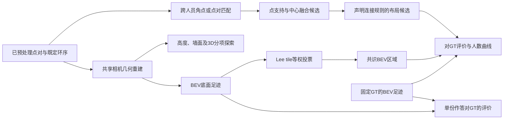

# 当前研究：BEV表示、质量评价与人员共识

更新：2026-10-04。**按用户最新要求，当前先核清连线算法、质量评价和完整共识；人员分类、难度联系、同房预测与简单／困难人数曲线后移。已有下游实验保留，不再作为立即扩展任务。**

当前方法合同仍为 `consensus_research_20260923_v1`。本页给出统一路线，历史过程见[推进台账](研究推进台账_20261003.md)。

[本轮Pro／dot综合审查](../../analysis_results/worker_subtype_review_20261004/REPORT.md)已完成。连续画像、研究者定义的Q/T/S/B粗子类及真实组合并行保留，不要求先证明永久天然类型。Q已补两图人数过程／六人组合及十图方向检查，T/S/B当前接入未完成。Lee区域融合与全员上下点融合继续并行；每次由同图全部当前选中人员形成一个图级结果，整份标注簇仅作辅助。

[人审接入审计](../../analysis_results/review_source_audit_20261004/REPORT.md)确认259图均有审核留痕，修复后101图有明确三档，新N≥8预选52图。旧逐图数值与来源保留，难度分组待重新汇总。缺少三档不等于未审。点方法本轮新增有限并列分区提示，但没有重跑137图，历史ok计数仍属旧诊断。

## 1. 论文主线与当前基线

论文仍研究：**图片的困难与人员差异怎样影响标注结果，以及增加人数后得到的共识。** 前期已推进A线“粗难度与人数曲线”和B线“人员画像与真实组合”；现在先收束表示、评价、融合三项方法基础，再返回两线。人员／图片效应模型按比较需要使用，不替代研究问题。

**BEV是表示，IoU与质心是评价量，区域投票与点融合是两类融合方法，人数曲线是实验结果。** GT提供评价参照，不参与切tile、点匹配、投票或候选选优。现阶段不把所有质量维度和人员变量同时放入一个模型。

## 2. BEV具体是什么，为什么环序有作用

BEV（Bird’s Eye View）在这里指**由标注声明的地面边界形成的俯视足迹**，不是全景图上的墙带，也不是整个房间的三维体积。

已有上下点对沿用预处理坐标；下轮廓视线与假设的水平地面相交，得到共享相机坐标下的底点。按既定环序连接底点，形成二维多边形。当前共用相机高度 `h=1`，长度以h、面积以h²表达；没有真实尺度时不称米或平方米。比较时不分别平移、旋转或缩放去对齐GT，以免消除待测偏差。

- 人员与人工参考：人工确认的环序保留；其余沿用预处理后的共享x默认排序，不再重新平均或配对。
- 原始GT保留来源参考环；原始和人工修订版分别评价。
- 确认排列能改变底边邻接、凹凸结构与足迹，这是排序对BEV和后续3D重建有作用的原因。未确认的默认环不因此成为物理正确的环。
- 底部坐标和邻接决定足迹；顶部支撑高度、墙面和上轮廓研究。现有输入检查仍可能因点对状态而失败，不能理解为任意顶部错误都不会影响可计算性。
- 不可计算、自交或来源缺失保留状态与分母，不静默修复、拟合成Manhattan或当作人员错误。

| 表示 | 描述什么 | 当前用途 |
|---|---|---|
| 声明BEV足迹 | 标注在底面上表达的完整范围 | 当前IoU、Lee融合和人数曲线的统一区域 |
| ERP可见墙带 | 全景图上墙面的投影覆盖 | 投影对照；依赖连线、接缝与遮挡假设 |
| 三维墙面／空间模型 | 底面之外的高度与空间结构 | 逐项研究额外质量信息，尚无完整总分 |

非星形或存在隐藏结构，不等于BEV必然不可计算；可见墙带有另外的适用条件。旧墙带函数会按x重新排序，可能忽略人工确认邻接，不能用它证明“排序没有用”。表示核验见[地基与坐标核验](布局表示地基与坐标核验_20260930.md)。

还需区分两个“曲线”：**几何连线**是在ERP中如何画墙边；**人数曲线**是人数k变化时的评价结果。当前BEV直接算地面多边形面积，不以显示在ERP上的像素曲线填充作为面积来源。环序、坐标映射和地面假设仍会影响结果。

## 3. 质量评价：已采用、下一步与探索项

| 量 | 含义与算法 | 当前地位与限制 |
|---|---|---|
| BEV IoU | 多边形交面积／并面积 | 现有人数曲线与人员研究的共同终点；衡量范围一致性，不覆盖高度或全部局部细节 |
| BEV面积质心距离 | 两个区域面积中心的欧氏距离 | 已完成24人×10图矩阵；保留原值h和除以参考面积平方根的无量纲值，增量效度仍待验证 |
| 边界、上／下轮廓差异 | 墙边移动、遗漏、细节及上下差异 | 逐项验证对应、采样与未匹配部分；不直接合分 |
| 高度、墙面与模型体积差 | 在声明高度／闭合假设下比较空间 | 保留研究价值；当前体积代理不能冒称真实房间体积 |
| 墙高起伏、方向残差 | 单份结构相对几何假设的偏离 | 解释自洽性与适用性，不单独评价与GT的差距 |

质心是区域的**面积中心**，不是图片画布中心或角点坐标均值。同一边多放几个点不应改变区域质心。对称扩张、缩小或不同形状可以同质心，因此它补充整体偏移，不能取代IoU、边界或高度。

导师的加权建议保留为候选：

`Dλ = (1 − IoU) + λ × ||cA − cGT|| / sqrt(Area(GT))`。

既有λ网格仅用于敏感性分析，不按“人员排名看起来合理”选最终权重。**指标加权**与**给人员投票加权**是两件事；当前Lee融合仍人人等权，建立人员画像也不自动改变投票权重。若质心没有提供可解释增益，保留分项即可。

三维方向没有被放弃。底面一致而高度错误，BEV可以完全相同；高度或有效体积量有机会检出这种差异。方向残差为零也可能范围错误。已有体积量涉及平顶／平均高度棱柱等模型，应逐项写明假设；由重建强制得到的水平地面或竖直墙面不能再拿其零残差自证质量。已有证据见[质量研究与独立审核材料](../../research/pro_quality_handoff_20261002/README.md)。

## 4. Lee融合与人数曲线怎样计算

**任务与输出澄清：** [Lee原文](https://ceur-ws.org/Vol-2173/paper10.pdf)第4节对对象分割区域切tile，第6节使用MSCOCO的46个对象／9幅普通图像，每对象40人；它不是全景房间上下角点标注论文。BEV是本项目为研究空间范围选择的迁移表示，不是原文要求。完整layout共识应能表达上下端点及连接，当前Lee-BEV输出只覆盖底面，已有曲线仍仅解释底面参考一致性。

工作台首先展示全体当前人员的融合上下点及同一候选3D，再用不同整份标法解释来源差异。点对候选已有上下端点，但对应及新环序仍需检查；Lee底面不虚构上边。ERP墙带投票的稠密上下轮廓不等同稀疏配对墙角，转成最终编辑点需声明提取、配对及简化规则。

采用[Lee区域聚合论文](https://ceur-ws.org/Vol-2173/paper10.pdf)的tile投票基线：叠加人员BEV边界，将并集分成不重叠小区域，每人每个tile贡献一票，按支持人数选择后取并集。当前tile是几何分区，不是固定像素格；点多不增票，不要求角点数相同，也不先做作答分簇。

- **MV50基线：** 支持率≥50%，平票区域保留。
- **严格多数对照：** 支持率>50%，检查平票影响。
- 不直接照搬只保留最大簇；合理少数范围不在当前步骤被默认删除。
- 融合输出是区域，可能断开或不满足完整layout约束；恢复合法角点环、上下配对和三维空间属于另一步。

首轮45图实验在每图完整候选池中均匀抽取不同真人的k人集合，k固定1—8，不先把池截成8人。小池及容易枚举的点精算，其余使用固定16384次均匀排列，重复集合按出现频次计入。全员tile仅作为离线积分细分，子集票只来自该子集，已核对与当前成员重切tile等价；它不是让未来人员提前参与投票。

| 问题 | 观察什么 | 完成状态 |
|---|---|---|
| 是否更接近GT | 固定k的平均BEV IoU、相对单人增益 | 45图首轮已完成，MC计算误差明确 |
| 换具体成员是否改变结果 | 同人数、同构成下不同组合的融合差异 | 共同10图固定4人的IoU分布与区域对称差期望已精算；正式人员类型及人数稳定速度未完成 |
| 增加一人后是否变化很小 | 相邻集合的融合变化 | 有首轮探索，尚不能判断稳定速度或足够人数 |

MV50对同一递增成员链，奇数→偶数只会扩张、偶数→奇数只会收缩；严格多数相反。这个奇偶机制不代表人员能力变化，IoU方向仍取决于增删区域。全员时组合差异为零也有机械原因。遗漏／外扩面积用于解释，期望交面积与期望并面积之比不能冒充平均IoU。

## 5. 各线程累计探索与已经验证的边界

结合“数据清洗+排序”“评估全景标注中的质心与IoU”“独立评估共识聚合实验”等线程、仓库报告和Pro／dot返回，当前证据如下。导师交流后半段直接支持“具体子类是否稳定”和“复用独立作答构造ABCD／AABC”；最后一段明确标为记忆整理，作为研究意图，不升格为已冻结算法。

|方向|实际探索|已得到的证据及限制|
|---|---|---|
|数据与表示地基|预处理点对、坐标约定、配对、环序、人审、GT版本及来源绑定|确认环1295份；未确认用共享x默认顺序。审核覆盖不等于全部人工确认环，也不等于全部可计算|
|连线与区域|ERP曲线／墙带、声明BEV、隐藏范围、排序前后对照|同一坐标不同邻接会改变范围；二维投影相近不等于声明空间相同。BEV能看范围，但依赖地面与相机几何假设|
|质量指标|IoU、面积质心、边界、有效对应点误差、墙高／方向／模型体积|对称扩张质心可不动，小细节被全局IoU稀释；三维量可补高度，低残差不能自证正确。尚无完整质量总分|
|作答分簇及局部对应|整份标注、绑定点对、top／bottom分别匹配、不同距离与阈值、局部路径|能描述不同表达；阈值依赖对象和距离，历史q／角距／BEV距离不能互换。两两好匹配不保证全局一致|
|合理空间候选|删减、局部重组、几何残差优化及独立反例|删点可能扩大区域或丢细节；局部支持不等于整房支持。仍为独立探索，不取代人员共识|
|Lee区域共识与人数|136张Manual、1496份可计算独立作答，逐图1—N最多24人；失败池保留|实现与主要数值获复核；增加人数不保证每图更接近GT。固定33图8→20人MV50增益0.003777已能与计算噪声区分，不等于8人足够|
|完整点共识|137图、2.5／5／10°与两投票规则，输出上下点及新环候选|默认5°有119个完整候选、旧诊断64个待核验；本轮确认并修补有限并列漏报。候选可生成不等于对应、连接或完整3D质量已验证|
|人员画像与构成|历史Q/T/S/B单项及组合；当前24人×10图IoU／质心、楼外画像、4人精算，新增两图六人集合与名单传播|人员和构成有平均差异，具体成员仍重要。约11%是相对分数预测误差收益且集中，非融合IoU提升；当前T/S/B尚未绑定验证|
|子类内部过程|历史分簇持续性；当前两图有限池增人／换人，十图k=4/6融合形状差|旧时间子类与Q子类有值得复验的线索。当前高Q原始更分散3/10图，同k融合更不稳定均5/10，不支持单一普遍方向|
|同房相似性|同批人员的GT排序与人员两两分歧关系，历史预测及当前BEV对照|同房分歧关系有相似线索，GT排序未显示同样优势；不支持同房必需相同人数。跨机位未配准不可直接叠BEV|
|难度及模型线索|人工粗分、门洞／OOS、模型点数／异常、d_model、BiLayout两输出与半自动历史|人工线索已接入；模型量仍需逐项检验。规整少点不保证简单，双输出不等于两类真人|

来源：[质量响应实验](../../analysis_results/layout_metric_response_20261001/REPORT.md)、[排序后的3D研究](../../analysis_results/layout_3d_quality_probe_20261002/REPORT.md)、[方法归档](../../research/layout_methods_review_20261001/README.md)、[人员历史溯源](人员粗分类原意与既有证据_20261003.md)、[同房研究](../../analysis_results/same_room_similarity_20261003/REPORT.md)、[本轮综合审查](../../analysis_results/worker_subtype_review_20261004/REPORT.md)。

历史45图为旧22简单／13中等／10困难；同一45图按当前标签应为21／14／10，新52图为23／18／11，分组摘要尚未更新。Manual N≥20为47候选、44整池可计算、33主质量兼容；33图当前6简单／7中等／5困难／2未定／13未记录。六张主共识候选的质量限制包含场景或参考原因，不能统称GT错误。旧“中等全来自同栋”等描述只适用于旧标签面板。

## 6. 后续按小步推进

先把两个目标分开：**范围共识怎样随人数变化**已有可用Lee基线；**完整可编辑layout共识**仍需上下点与连接研究。它们可共用真人成员集合和BEV参考评价，但输出完整性不同。

### 6.1 没有语义角点，Lee仍然能比较GT和画曲线

每人点对与既定环序转成区域A；GT用同一几何约定转成区域G。选中人员集合S的等权投票产生区域F(S)，直接计算：

`IoU(F(S),G) = Area(F(S)∩G) / Area(F(S)∪G)`。

这不要求人员／GT具有相同点数，也不要求融合顶点与GT角点一一对应。输出多边形具有几何顶点，但这些顶点不自动成为房间语义墙角，更没有恢复top_y。面积质心、面积与边界量也可算；空输出或缺参考的状态单列，不能伪造质心或上点。

设独立人员为A、B、C、D。顺序A→B→C→D与C→A→D→B的前缀集合不同，可产生不同人数曲线；到相同成员集合时，等权Lee结果相同。最终ABCD不因加入顺序改变，曲线中途会变。每次用当前原始成员票重新计算，不把上一步融合当作一票继续投，否则换了算法。

因此分别研究：同人数换成员（组合）、累计前缀（排列／重放）、同人数改类型比例（构成）。横轴为人数，不是单人学习轮次或真实时间。GT始终只在评价端出现。质量曲线、同k成员波动、k→k+1变化分别报告，不能用一条IoU曲线代替“收敛”的所有含义。

### 6.2 当前优先：连线、质量、共识三个基础

这三项已经有代码与研究证据，但成熟程度不同。下面区分“可用基线”与“方法效度已经确定”，不将下游大规模计算当作前置方法已定案。

|基础|已经实现并检查|仍须解决|
|---|---|---|
|点之间连线|已区分ERP画布直线、旧x排序曲线包络、按声明环的三维边投影及最近墙列式表示；已检查坐标约定、接缝、共线插点及邻接变化。底面以共同水平地面重建，按源环直线连接后可回投ERP|不同输出必须明确使用哪一套连接；复杂环的遮挡／停止边、上边非平顶解释和新融合环不能由“能画出”推为正确。旧x包络可能抹去确认邻接，不能覆盖它|
|质量衡量|BEV面积IoU与面积质心可稳定计算；指标响应与12图195作答3D探针已揭示各量盲点|边界采样和对应需核实；上下轮廓／高度增量效度未最终确定；模型体积非真实体积，尚未形成完整layout总分或最终加权|
|融合共识|Lee等权tile区域投票已有完整实现和数值复算；全员点方法能输出上下点及候选环；ERP墙带有探索原型|Lee本身不补top_y或语义角点；点方法的身份歧义、阈值、中心与连接尚未定案；认证须约束实际生成对应，不能只检查另一套好对应|

**第一步：把连接和表示做成可直接核对的说明与案例。** 固定现有已审核数据及原始点，列出每种连接的公式／实现、假设、保留的源邻接与失败条件。用少量代表案例同时展示原图点、上下连接、BEV与3D：普通正交、细节／共线点、非x单调已确认环、接缝、近地平线、门洞／范围停止边。区分单条三维直边的ERP投影与为了可见性取最近边形成的包络；不因后者漏掉隐藏范围就判原标注错误。原有审核复用，不新增全量人审。

**第二步：确定分项质量评价如何解释。** 固定第一步表示，同样案例对照范围改变、整体偏移、局部遗漏／凸起、仅顶部／高度变化和仅环序改变。先交付IoU、面积质心、边界及上下分项的响应与缺失表，说明每项检出什么、漏掉什么。既有合成对照验证数学响应，真实缺陷解释借助已有审核／局部视觉核对；不以排名“看着合理”选权重。三维量逐项保留有用信息，不强合总分。

**第三步：完成两种共识的同输入小型实测。** 同一当前选中真人集合、等权票、不用GT生成或选分支。Lee输出区域；点路线输出上下点、对应来源、支持人数与连接状态。若探索“Lee区域再恢复编辑点”，将角点提取、简化、上点恢复、配对和环序单独作为新增算法评估，不能冒称Lee原方法已经提供。展示不同标法辅助解释，全体成员产生一个主共识；空结果、断开、多候选与失败均保留。

验收的重点是：同一输入能复算；输出清楚表达其几何意义；关键缺陷可被指标解释；共识点、边、环的来源可追踪；计算成功与视觉合理分开。未要求每张图必须返回唯一完整答案，也不以更接近GT反向挑选算法或阈值。

上述基础完成一轮可审阅结论后，再推进人员子类、难度曲线与同房研究。固定47图高人数面板、52图难度预选、T/S/B来源接入及随机对照计划保留为后续任务；本轮不继续扩展下游排列组合。已有数值作为历史研究与方法案例保存，不撤销或改写。

## 7. 辅助方向与来源边界

作答分簇用于描述同图的点位、细节、邻接或范围模式；人员分类用于描述跨图的人员表现，两者不能互相替代。几何等价与标注表达等价也应分开，匹配保留未对应部分，不能用最近点多对一吞掉结构差别。

减法／局部重组用于寻找有观测依据的几何合理空间，是独立探索。原作答筛选、最小删改与多来源重组可以后续比较；局部支持不能相加为整房支持，优化残差下降不等于视觉正确。分簇、局部路径、合理空间候选及同房预测均不阻塞当前两条主线。原提案及反例见[方法研究归档](../../research/layout_methods_review_20261001/README.md)。

统一输入经 `load_current_bundle()` 读取[合包manifest](../../analysis_results/research_input_20260929/manifest.json)。确认顺序、预处理点、原始导出、GT版本、既有资格和历史实验保持可追溯；未记录不填成否定，方法失败不悄悄移出分母。历史12图与16排列仍见[首轮融合](../../research/lee_tile_stage1_20261002/README.md)，不再称为当前全部进度。

外部Pro与dot报告是需要核对的研究意见，不自动成为方法真源。无原图的研究包不能裁定视觉合理性；GT固定参照与GT绝对正确是不同命题。
