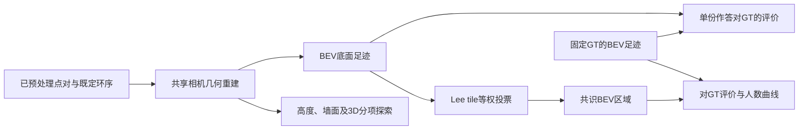

# 当前研究：BEV表示、质量评价与人员共识

更新：2026-10-03。本页统一当前算法职责与研究顺序，取代早期“先分簇／先做完整空间候选／先做交叉效应模型”的前置安排。规范真源为[当前方法合同](PAPER_A_METHOD_CONTRACT_CURRENT.json)，版本 `consensus_research_20260923_v1`；完成情况集中在[推进台账](研究推进台账_20261003.md)。本次只整理文档，不运行分析或测试。

## 1. 论文主线与当前基线

论文仍研究：**图片的困难与人员差异怎样影响标注结果，以及增加人数后得到的共识。** 先推进A线“粗难度与人数曲线”，再推进B线“人员质量画像、分类与真实组合”，之后联系两线。人员／图片效应模型按比较需要使用，不替代研究问题。

**BEV是表示，IoU与质心是评价量，Lee tile是融合方法，人数曲线是实验结果。** GT提供评价参照，不参与切tile或投票。现阶段不把所有质量维度和人员变量同时放入一个模型。

## 2. BEV具体是什么，为什么环序有作用

BEV（Bird’s Eye View）在这里指**由标注声明的地面边界形成的俯视足迹**，不是全景图上的墙带，也不是整个房间的三维体积。

已有上下点对沿用预处理坐标；下轮廓视线与假设的水平地面相交，得到共享相机坐标下的底点。按既定环序连接底点，形成二维多边形。当前共用相机高度 `h=1`，长度以h、面积以h²表达；没有真实尺度时不称米或平方米。比较时不分别平移、旋转或缩放去对齐GT，以免消除待测偏差。

- 人员与人工参考：人工确认的环序保留；其余沿用预处理后的共享x默认排序，不再重新平均或配对。
- 原始GT保留来源参考环；原始和人工修订版分别评价。
- 确认排列能改变底边邻接、凹凸结构与足迹，这是排序对BEV和后续3D重建有作用的原因。未确认的默认环不因此成为物理正确的环。
- 底部坐标和邻接决定足迹；顶部支撑高度、墙面和上轮廓研究。现有输入检查仍可能因点对状态而失败，不能理解为任意顶部错误都不会影响可计算性。
- 不可计算、自交或来源缺失保留状态与分母，不静默修复、拟合成Manhattan或当作人员错误。

| 表示 | 描述什么 | 当前用途 |
|---|---|---|
| 声明BEV足迹 | 标注在底面上表达的完整范围 | 当前IoU、Lee融合和人数曲线的统一区域 |
| ERP可见墙带 | 全景图上墙面的投影覆盖 | 投影对照；依赖连线、接缝与遮挡假设 |
| 三维墙面／空间模型 | 底面之外的高度与空间结构 | 逐项研究额外质量信息，尚无完整总分 |

非星形或存在隐藏结构，不等于BEV必然不可计算；可见墙带有另外的适用条件。旧墙带函数会按x重新排序，可能忽略人工确认邻接，不能用它证明“排序没有用”。表示核验见[地基与坐标核验](布局表示地基与坐标核验_20260930.md)。

还需区分两个“曲线”：**几何连线**是在ERP中如何画墙边；**人数曲线**是人数k变化时的评价结果。当前BEV直接算地面多边形面积，不以显示在ERP上的像素曲线填充作为面积来源。环序、坐标映射和地面假设仍会影响结果。

## 3. 质量评价：已采用、下一步与探索项

| 量 | 含义与算法 | 当前地位与限制 |
|---|---|---|
| BEV IoU | 多边形交面积／并面积 | 45图参考曲线的评价终点；衡量范围一致性，不覆盖高度或全部局部细节 |
| BEV面积质心距离 | 两个区域面积中心的欧氏距离 | 已有代码与小面板探索；下一步进入共同图片人员矩阵，保留原值h和除以参考面积平方根的无量纲值 |
| 边界、上／下轮廓差异 | 墙边移动、遗漏、细节及上下差异 | 逐项验证对应、采样与未匹配部分；不直接合分 |
| 高度、墙面与模型体积差 | 在声明高度／闭合假设下比较空间 | 保留研究价值；当前体积代理不能冒称真实房间体积 |
| 墙高起伏、方向残差 | 单份结构相对几何假设的偏离 | 解释自洽性与适用性，不单独评价与GT的差距 |

质心是区域的**面积中心**，不是图片画布中心或角点坐标均值。同一边多放几个点不应改变区域质心。对称扩张、缩小或不同形状可以同质心，因此它补充整体偏移，不能取代IoU、边界或高度。

导师的加权建议保留为候选：

`Dλ = (1 − IoU) + λ × ||cA − cGT|| / sqrt(Area(GT))`。

既有λ网格仅用于敏感性分析，不按“人员排名看起来合理”选最终权重。**指标加权**与**给人员投票加权**是两件事；当前Lee融合仍人人等权，建立人员画像也不自动改变投票权重。若质心没有提供可解释增益，保留分项即可。

三维方向没有被放弃。底面一致而高度错误，BEV可以完全相同；高度或有效体积量有机会检出这种差异。方向残差为零也可能范围错误。已有体积量涉及平顶／平均高度棱柱等模型，应逐项写明假设；由重建强制得到的水平地面或竖直墙面不能再拿其零残差自证质量。已有证据见[质量研究与独立审核材料](../../research/pro_quality_handoff_20261002/README.md)。

## 4. Lee融合与人数曲线怎样计算

采用[Lee区域聚合论文](https://ceur-ws.org/Vol-2173/paper10.pdf)的tile投票基线：叠加人员BEV边界，将并集分成不重叠小区域，每人每个tile贡献一票，按支持人数选择后取并集。当前tile是几何分区，不是固定像素格；点多不增票，不要求角点数相同，也不先做作答分簇。

- **MV50基线：** 支持率≥50%，平票区域保留。
- **严格多数对照：** 支持率>50%，检查平票影响。
- 不直接照搬只保留最大簇；合理少数范围不在当前步骤被默认删除。
- 融合输出是区域，可能断开或不满足完整layout约束；恢复合法角点环、上下配对和三维空间属于另一步。

当前45图实验在每图完整候选池中均匀抽取不同真人的k人集合，k固定1—8，不先把池截成8人。小池及容易枚举的点精算，其余使用固定16384次均匀排列，重复集合按出现频次计入。全员tile仅作为离线积分细分，子集票只来自该子集，已核对与当前成员重切tile等价；它不是让未来人员提前参与投票。

| 问题 | 观察什么 | 完成状态 |
|---|---|---|
| 是否更接近GT | 固定k的平均BEV IoU、相对单人增益 | 45图首轮已完成，MC计算误差明确 |
| 换具体成员是否改变结果 | 同人数、同构成下不同组合的融合差异 | 12图有探索；尚未完成正式稳定性精度与类型组合实验 |
| 增加一人后是否变化很小 | 相邻集合的融合变化 | 有首轮探索，尚不能判断稳定速度或足够人数 |

MV50对同一递增成员链，奇数→偶数只会扩张、偶数→奇数只会收缩；严格多数相反。这个奇偶机制不代表人员能力变化，IoU方向仍取决于增删区域。全员时组合差异为零也有机械原因。遗漏／外扩面积用于解释，期望交面积与期望并面积之比不能冒充平均IoU。

## 5. 已完成什么，论文现在可以讲什么

S1完成12图参考均值精度补强；S2完成259图、3152份记录的覆盖盘点；S3-A完成固定45张Manual图的1—8人曲线。677份独立候选参与，简单22图、中等13图、困难10图，原始GT覆盖全部45图，修订GT只在相同2图配对比较。

当前MV50结果（图片等权、原始参考）：

| 粗难度 | 单人平均IoU | 8人平均IoU | 相对单人增益 |
|---|---:|---:|---:|
| 简单 | 0.8553 | 0.8964 | +0.0411 |
| 中等 | 0.7899 | 0.8200 | +0.0301 |
| 困难 | 0.7592 | 0.8214 | +0.0622 |

**简单组的参考一致性水平较高；困难组的增益点估计较大，现有结果并不支持预先认定“困难图必然改善更慢”。** 中等与困难在8人时很接近，增益组间存在计算误差重叠，不能据此排序稳定速度。

752个参考均值含288个精确值与464个MC均值；后者95%同时计算误差界约±0.017319，属于固定池计算误差，不是人员／图片总体置信区间。13张中等图全部来自同一建筑，45图的人员池也不同，因此只讨论当前粗对应，未识别难度的独立作用。非困难35图与困难10图完整单列，同建筑三档对照、反向个例和2条数值警告均保留。完整图表与限制见[45图报告](../../analysis_results/lee_difficulty_20261003/REPORT.md)。

## 6. 后续按小步推进

| 顺序 | 工作与交付 | 不提前下的结论 |
|---|---|---|
| 下一步：B线画像 | 同样24人共同完成的10张Manual图，建立IoU与面积质心两张人员×图片矩阵；同图比较、跨图观察、逐建筑留出 | 不先定三类人，不把跨图波动全归因个人不稳定；该面板不承担三档难度比较 |
| B线分类与组合 | 画像有解释力且稳定后，再比较同人数不同类型比例、同比例不同具体成员；校准避开目标建筑 | 不复制真人，不同时改人员权重与融合算法 |
| 稳定性专题 | 为选定的成员差异、相邻融合变化补计算精度，再谈稳定速度 | 接近GT与趋于不变分开，稳定偏离GT也是结果 |
| 模型粗难度线索 | 依次看HoHoNet默认输出／点数／可核验回退、冻结d_model特征距离、BiLayout两输出差异 | 每次增加一类线索，不建立精细综合难度分数，不用待解释曲线反过来定义难度 |
| 质量增量与两线联系 | 边界、上下轮廓及3D量逐项看补充信息；再联系难度与人员构成作用 | 不以指标或变量堆得多为完成标准 |

模型点少、3D规整只能是线索。HoHoNet存在无效一般布局回退四角布局的[实现分支](../../lib/model/modality/layout.py)；复杂图也可能得到规整输出。某图实际回退需要来源证据，模型不规整也不能证明原因就是遮挡。d_model是特征距离，BiLayout两输出差异不是独立模型投票。

门洞交界可能局部无法按规则合理标注；OOS的GT未必正确或适用。保留困难场景及参考状态，沿用已有审核与资格，不以低GT-IoU直接判人员错误，不新增全量GT重审。

## 7. 辅助方向与来源边界

作答分簇用于描述同图的点位、细节、邻接或范围模式；人员分类用于描述跨图的人员表现，两者不能互相替代。几何等价与标注表达等价也应分开，匹配保留未对应部分，不能用最近点多对一吞掉结构差别。

减法／局部重组用于寻找有观测依据的几何合理空间，是独立探索。原作答筛选、最小删改与多来源重组可以后续比较；局部支持不能相加为整房支持，优化残差下降不等于视觉正确。分簇、局部路径、合理空间候选及同房预测均不阻塞当前两条主线。原提案及反例见[方法研究归档](../../research/layout_methods_review_20261001/README.md)。

统一输入经 `load_current_bundle()` 读取[合包manifest](../../analysis_results/research_input_20260929/manifest.json)。确认顺序、预处理点、原始导出、GT版本、既有资格和历史实验保持可追溯；未记录不填成否定，方法失败不悄悄移出分母。历史12图与16排列仍见[首轮融合](../../research/lee_tile_stage1_20261002/README.md)，不再称为当前全部进度。

外部Pro与dot报告是需要核对的研究意见，不自动成为方法真源。无原图的研究包不能裁定视觉合理性；GT固定参照与GT绝对正确是不同命题。
