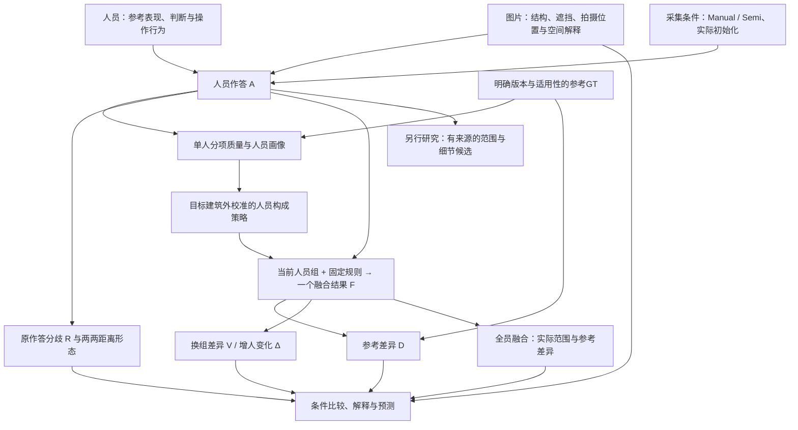

# 研究模型：人员、图片与融合不确定性

更新：2026-10-08。本页是研究问题、变量及当前计划的统一入口，不是已经拟合完成的统计模型。规范合同仍为 `consensus_research_20260923_v1`。

接手顺序：本页 → [术语](CONTEXT.md) → [数据说明](研究数据说明_来源预处理与用途_20261006.md) → 所需结果。[完整交接](线程交接_连线质量与完整共识_20261004.md)保留原意与历史证据，旧报告中的待办不自动延续。当前进度与计划见第8节，方法细节集中在[墙线融合共识方法](共识投票机制与三路线推进_20261007.md)。

**研究目标保持两条相连的线：**用原作答一致性、融合人数过程、实际全员结果与GT参考表现研究人员和图片条件；比较能表达当前人员观察的融合方法。融合不按GT选输出，GT仍为质量研究的外部参考。R、D、V是不同观察量，不直接等于已经分离的图片／人员噪声。

难度假设是“部分困难图增人后接近GT较慢或不再接近”，不是“困难必然越加人越不一致”。现有结果依赖投票规则、人数区间和参考版本，尚无普遍规律。门洞带可标性记录进入难度分析，OOS单列；非正交但清晰可标不能直接归为不可标。

**当前方法进展与缺口：**[调参与全员融合交付](../../analysis_results/consensus_delivery_20261008/REPORT.md)已接通对应、全池MV50、全来源中位数与连接，工作参数7.5。自动结果与人工辅助结果分开保存；最新计数及例外统一见交付报告。对应仍会误合／拆散，全部来源位置折中也不等于已解决端点目标选择；>90%自动正确尚未验证。人工排序被允许，不作为当前自动化重点；原环确认不传递给融合环。

## 1. 研究问题与最终产物

### 当前研究定位（2026-10-08）

- 新人补采仅为待定选项，人手未确认；不启动采集，不作为现有研究前置。
- 当前点融合已转为共同墙线身份、存在票、上下位置与连接的分阶段流程。绑定、上下独立、混合是历史设想和已有原型，可在具体问题需要时作对照，不是下一阶段必须补做的三条路线。Lee底面与精确曲线保留既有证据，不预先宣布通用赢家。
- “困难图可能有更多标法／细节选择，融合可能偏离参考”是开放假设，不以证明困难无法稳定为实验目标。可同时出现不同表达、近似同空间及稳定但偏离参考的融合。
- 恢复整份标法分簇的独立研究用途：按当前研究定义，不同点对数分不同簇，即使近共线加点对BEV范围影响很小；同点数仍需对应、位置及环结构才能判断同簇。分簇表达标注结构，不直接判断好坏，也不等同不同空间。该诊断不要求融合先选最大簇或每簇各输出。
- 九图与137图三路线扩展是历史实验；当前执行以冻结墙线版本和SOP为准。自动计算不读取GT或按GT分数选输出；部分人工身份判断曾参考GT，不能将人工辅助结果称为GT盲审。
- Pro并行质量任务材料见[最新任务](../../research/pro_quality_handoff_20261007/PRO_TASK.md)：将范围、上下定位、表达结构和真实细节判断放在同一案例上；先验证指标各自解释什么，再决定是否有依据拟合少量参数。下方历史阶段待办以本段为最新解释。

### 历史探索：局部自适应与输入对照（2026-10-07，非当前待办）

用户提出：局部一堆点集中、对应较明确时，可上下分别成组／融合，再将上下x取平均；不同位置的角点较分开时，可绑定上下点对进行对应。这是[9月27日混合路线](PANORAMA_CONSENSUS_RESEARCH_DISCUSSION_20260927.md)的具体化，新增问题是如何按观察自动选择，而不是首次提出分别估计两端。绑定法本来就分别取top_y／bottom_y中位数；若对应成员和估计器不变，单说“分别融合”不一定产生增量。

**已完成一个局部自适应原型及九图实算**，见[实验报告](../../analysis_results/adaptive_point_20261007/REPORT.md)。9图150份Manual作答、800对，固定5°／9°／12°，比较绑定、独立unique、上锚、下锚、自适应v1；加上先／晚共享x两视图共270状态。构造不使用GT，参考评价在候选保存之后进行。这不是全部混合设想已实现，更不是自动对应已解决。

自适应v1按原点对成员重合把达票绑定／上／下身份连接成局部组件：恰有一个上组、一个下组、至多一个绑定组且存在原配对关联时，用独立端点；否则保留该组件的绑定结果。改变的是局部身份、来源成员与配对选择，沿用原坐标中位数和共享x排序新环；组件中未能采用的端点继续记录。该规则没有拟合“密集／稀疏”阈值，也没有把回退绑定视为身份正确的证明。

“集中”须区分同一角点的观测集中和多个相邻角点挤在一起；“分开”须区分不同角点彼此分离和同角观察定位分散。实际分支选择宜结合原始配对关联、局部身份间隔及端点内离散，不能仅凭点密度自动合并身份。当时据此进行了固定路线与局部混合对照；当前不按目标GT为各图选择分支。

共享x的平均使用全景周期一致的平均；例如1022和2应在接缝0附近，不应得到512。在当前竖直墙角表示中它是输出协调，不证明配对正确；记录调整前端点中心、上下支持及原配对关联支持。用户认可的预处理作答仍是研究“原始／基准标注”；主视图保留每位人员已有共享x，另一个敏感性视图恢复处理前上下x，匹配、定位后再共享x。两视图不回写源数据或原环，也不撤回全部清洗。早投影后中位数与先中位数再投影不交换，输入效应不能全部归为身份改善。

主输入27个图×门限状态中，绑定／独立／下锚／上锚／自适应分别有23／11／25／24／24个几何候选；这是输出覆盖，不是正确率。2t7在9°五法相同；rPc自适应绕开整图unique拒绝，却没有在最终达票身份中保留已知同角三人；uNb下锚会混合已知不同上端目标。晚共享x也未一致改善覆盖和质量。因此本轮没有选出赢家，不能用更多点或更低面积误差认定共识正确。

### 对照最初模型的当前完成度（2026-10-07）

|原目标|已完成的证据|仍缺的连接|
|---|---|---|
|人员、图片、采集条件→观测→质量→融合→解释|五层概念模型；R、D、V及全员产物已区分|没有估计出独立的人员／图片不确定性来源，也未拟合完整生成模型|
|人数与人工难度|全259研究图入口、249图274可算池；最新标签接回固定面板，保存548份两规则全员底面|大规模证据主要是底面范围；点／曲线方法的对应人数规律尚未验证|
|人员质量及AABC构成|共同24人十图画像、39图构成；最新加人—选人连接含32张高人数普通图，OOS另列|Q目前主要为楼外IoU分层，非稳定天然类型；T/S/B有历史材料但未完整接入本轮，Semi构成／初始化作用未完成|
|可解释质量|范围、质心、上下边界、局部与条件3D有实算和已知反例|同批真实错误、合理目标和细节差异的完整评价未验收；新版Pro任务包已备妥，尚无本地记录确认其新一轮启动或返回|
|单一全员融合|Lee已有较广实算；点方法有137图基础、四图四路、九图108基线；新增九图两输入五实现270状态及137图固定9°五实现685状态，含局部自适应v1；精确上下曲线有有限完整输出|最终方法未选择；一般对应、配对、连接仍未解决；下一轮比较多数支持保留，局部自适应只有一个已实测原型。设置数不是独立样本数|
|整份标法结构分簇|历史同点数门槛、结构原型及人工案例存在；最新已明确表达差异与空间／质量不同|尚未在当前统一面板上接通标法支持、局部细节和单一融合结果；不以簇数证明难图不稳定|
|图片模型特征及Semi|d_model、预标注点数、BiLayout来源和差异等既有材料|预测人工难度未完成；初始化对最终质量／一致性的作用尚未接成当前主线|
|合理空间候选／减法|分支、删点、局部替换等原型，已有合理内／外侧等判断|缺少经过真实目标验证的通用完整候选构造；与单一融合和标法分簇分别研究|
|新人及迁移|旧人员跨建筑有开发性证据|新人补采人手待定；没有未来人员验证，不作为当前工作前置|

上述为2026-10-07阶段证据；当前墙线流程已完成全员交付，下一步按第8.4节接回人数过程，不将旧局部对照再次列为必做任务。

研究的核心问题是：**在给定图片、采集条件和人员组成下，标注为何产生差异；这些差异经过融合后还保留多少、怎样变化，以及产生的结果在什么意义上可用。**

要得到三类相互衔接的产物：

1. 可解释的质量衡量：分别说明范围、边界／细节、位置与条件三维的差异，支持人员比较，容纳参考本身与合理范围选择的问题。
2. 人员—人数—图片的实证关系：人员原作答有多大分歧、各自距参考多远；什么人员或构成在什么图片上有效；增人过程与全员融合的参考表现怎样；图片特征能否预测这些结果。
3. 可使用的共识与有来源的空间候选：主人数实验每组人只产生一个融合结果；另一路研究保留不同合理范围／细节的候选。两项不同，候选构造不作为人员研究的前置。

统一的是对象、条件、关系和可检验问题。不能把全研究缩成一个加权质量总分、一次二分人员类型，或两条人数均值线。

## 2. 五层模型

图中箭头表示生成、信息使用或比较关系，不是已识别的因果图。图片难度、人员能力与参考偏差并非当前已知且独立的参数。

| 层 | 核心对象 | 本层应回答什么 |
|---|---|---|
| 条件 | 图片i、人员j、采集条件c、实际初始化M、参考版本v | 人在什么条件下作答，哪些信息可用？ |
| 观测 | 完整作答A及已有审核、时间、修改行为 | 实际画了什么、用了什么范围、有什么已知问题？ |
| 质量测量 | 原作答间距离、相对参考的分项向量e | 人员彼此差多少、距参考多远，差异发生在哪里？ |
| 团队与融合 | 当前人员组S、人数k、构成ρ、规则m、输出F | 哪些人按何规则形成什么类型的结果？ |
| 响应与解释 | 原作答分歧R、融合D/V/Δ、实际全员结果及可计算状态 | 人数、构成、图片和算法怎样改变结果？哪些关系可预测？ |

### 2.1 作答如何进入模型

概念上，作答来自图片可见信息、人员的空间目标选择与执行表现，以及采集条件：

\[
A_{ijc}=H(X_i,\theta_j,Z_{ijc},M_{ijc},\varepsilon_{ijc}).
\]

这里X表示图片信息，θ表示人员跨任务表现，Z表示该次选择的范围／边界目标，M表示Semi实际初始化，ε包含未解释的单次变化。**这只是变量关系声明，尚未估计H或把Z、θ、ε从数据中唯一分离。** Z也不要求先把作答聚成几簇。

相同图片上出现不同作答，可能来自看不清、操作定位偏差、漏细节、合理范围选择、规则理解、共同初始化或其他交互。现有审核记录提供部分解释，不假设所有差异都合理或都错误。

GT记为G_i^v，是明确版本的参考目标，不等同于已知物理真值。原GT与修订GT分开评价；同一结果换参考后不同，不归咎于人员能力变化。

Manual与Semi分层。Semi的初始模型可能使多人趋同，也可能使共同偏差保留下来；模型来源、初始化到最终作答的改动和净改善有独立研究位置。Manual没有初始化，修改量记不适用，不能填0。

### 2.2 单人质量与人员画像

对同一参考版本，使用可计算的分项：

\[
\mathbf e_{ijc}^{,v}=\mathcal L(A_{ijc},G_i^v).
\]

当前可广泛使用范围遗漏／外扩及IoU摘要；上下边界与其他质量量按实际实现和可计算域补充。单人的参考表现是画像的一部分，不等于全部能力、规则判断或认真程度。

保留既有Q/T/S/B研究族：Q为参考质量，T为有效时间，S原义是可标／不可标任务的误拒绝与误接受，B为Semi修改量及参考净改善。**S不能偷换成选择哪一种合理空间范围；B的小改不必是漏改，大改不必是改善；T不直接表示认真程度。** 当前IoU上下半只验证Q的一条基线，不能宣布其它三块已无用或已完成验证。参见[人员原意与证据](人员粗分类原意与既有证据_20261003.md)。

在共同人员×共同图片矩阵上，对一个指定质量量可描述性地写：

\[
e_{ij}=\mu+a_j+b_i+r_{ij},\quad
a_j=\bar e_{\cdot j}-\mu,\quad b_i=\bar e_{i\cdot}-\mu.
\]

这是完整平衡面板上的行列均值分解：a描述人的平均相对表现，b描述图片对该人员池的平均参考差，r是额外的人图差异。r包含交互、一次作答变化及测量问题，b也可包含参考问题。它不是可识别的纯人员噪声／纯图片噪声分解；每人每图一次，不能直接估计同人重复标同图的随机波动。现有画像已保存同图中心化表现，先复用，不另建复杂联合模型作前置。

现已对共同24人十图的遗漏／外扩／D执行该描述分解并保存人图单元：原GT下45对图片的人员D排名相关中位数0.198，6对为负；P017十图D均排第1。仅敏感性中暂去P017后中位数降至0.088，说明稳定优秀个体不能代表其余人员都有稳定排序；主实验保留全部人员。在GT面积归一化下，遗漏的图片平均差项最大，外扩的剩余项最大；换原始h²外扩后图片项反而最大。这些是依赖尺度的矩阵描述，不是外扩天然来自人员因素，也不是独立不确定性比例。[针对性复算与取舍](../../analysis_results/consensus_response_20261006/worker_image/README.md)保留两参考政策。逐图正面积缩放不改变图内名次和同图构成优劣方向，但改变跨图汇总权重。平衡面板减去图片均值不会改变人员平均D排序，不把这种中心化包装成新的选人收益。

### 2.3 当前组产生一个融合结果

\[
S\sim\pi_i(k,\rho;\eta_{-b(i)}),\qquad
F_{i,S}^{m}=f_m(\{A_{ijc}:j\in S\}).
\]

π是从现有人员池抽取团队的规则，ρ是构成条件，m是融合规则，η是需要时从目标建筑之外校准的人员画像。当前η影响人员分组和抽组，Lee融合本身仍等权，未按画像加权；未来如研究加权融合，应另列方法条件。随机团队与按类型比例抽组是不同π，目标图GT不能用来挑当前好人、权重或输出。

**对同一图片、具体人员组和规则，只形成一个主融合结果。** 有效完整输出不可得时保留明确失败；不靠改成最大簇、删人员或补角来满足输出要求。不同输出类型分别说明：Lee提供底面区域，精确曲线提供可适配时的上下边界，点／点对方法还涉及身份、中心和环连接；能给出区域不等于已给出完整三维房间。

融合表达当前成员按声明规则形成的共识；GT比较说明它相对某个参考目标的位置，不是融合的监督目标。合理但低支持的细节可能不出现在全员结果，需解释其支持与形态，不能仅因它合理就强补入主共识。对不同合理目标的空间候选仍独立研究。

点方法中还须区分“同一实体角的表达支持”与“角点位置组的支持”。现有绑定方法通过上下位置相容性共同成组；独立方法分别通过上／下位置成组。两者均以全体N为分母，当前MV50为s≥ceil(N/2)，18人中9票是达到半数而非严格多数。组内坐标中位数是代表位置，不是GT优化或在某个精确坐标上数票。新交付已将候选身份、存在票与位置估计分开实现；尚未解决的是对应可靠性，而不是流程尚未接通。位置使用全部来源中位数，没有第二轮位置投票。

算法是条件之一。同一批作答换融合规则后D、V会变，不能省去m再把结果全部归因于人员或图片。

### 2.4 共同单元上的共识定义（点路线比较框架）

固定图片及当前团队S。先由该团队作答的点对、原环和局部结构建立候选墙角线／表达节点的对应分区Π_S；每组不是已经认证的物理实体，也不以GT或最终达票组数选择对应。现有同人不同节点不合组，是“一人对该表达单位最多一个节点”的表示假设；一人一票本身只需按人去重。

令b_jc表示人员j是否提供归入单元c的观察，存在性选择为：

\[
z_c=\mathbf1\!\left[2\sum_{j\in S}b_{jc}\ge |S|\right],\qquad
z\in\arg\min_{v\in\{0,1\}^K}\sum_c\sum_{j\in S}|v_c-b_{jc}|.
\]

这是固定Π_S之后的二元总分歧最小化；半数平票按现行MV50纳入。不依赖点位集中程度的存在票，只能在足够可靠的对应建立后获得，公式不会自动解决对应。

对保留单元，用其同角观察的条件经验分布Q_c估计θ_c=(共享x,top,bottom)，例如最小化周期／坐标L1得到代表位置；均值、位置模式选择是不同损失或决策规则。Q_c保留原配对联合分布，上下独立只使用各自边际／选定来源时，仍需另外记录联合支持。未来若比较历史变体，须明确改变对应、成员、模式、配对或约束中的哪一项；同成员同可分离估计器可以没有结果差异。

完整输出为F_S=(达票单元集合,各单元上下位置,闭合连接)。当前比较保持硬MV节点与声明的位置估计；原作答有实际改序历史、非x单调确认环或候选连接歧义时，可人工复核新候选顺序，保留自动与人工辅助结果。源环确认不传递给融合环；只改排列不等于改变存在票或位置。若需增删节点、移动中心或改对应，另列修改，不伪装成顺序复核。无适用完整环时如实报告失败，逐角多数也不意味着整环得到多数直接支持。

这一分解沿用共同坐标和当前预处理输入。研究k人时对应只能用当前k人的观察；先以全员推断身份再给k人使用，属于全员辅助对照，不能当成纯k人方法。既有R/D/V及实际全员终点继续使用，不把这些观察量改名为已识别的独立噪声。

同日[yq-25坐标与改序实例](history/三路线与墙线融合_阶段说明_20261007.md#7-yq-25x主导联合筛选与允许缺点的实际检验案例)进一步约束自动对应：该图同角候选x可跨过邻角，而不同角x可很近；y和确认环中的结构位置能补充区分。可见角也会被省略，必须允许缺点的部分对应，不能按x排序或固定节点序号匹配。高可信自动对应、未决比例与人工复核量一起评价，不把只接收简单案例的高准确率当作已解决全员对应。

## 3. 核心测量：原作答、人数过程与全员结果

一致性和参考接近度是两个评价维度，在原作答与融合结果两个层面分别使用。原作答更一致不等于更准确；融合更稳定也不等于原作答分歧变小。

| 层面 | 一致性／分歧 | 参考接近度 |
|---|---|---|
| 人员原作答 | 两两距离及其平均R，保留距离矩阵中的整体标法形态 | 每份作答的参考差异及逐人分布 |
| 固定k人融合 | 换组输出差异V；保留当前团队加人的变化Δ⁺ | k人融合的期望参考差异D(k) |
| 全员融合 | 没有其它全员组可换；仍可看原作答分歧和对最终共识的差异 | 实际全员输出、D(N)、遗漏／外扩与差异位置 |

### 3.1 人员原作答一致性是主要观察

以已实现的BEV区域为例，P_i是该图当前完整纳入人员池，N_i为人数；U_i为这个固定池全部标注区域的并集，G为所用版本参考。定义：

\[
d_i(A_a,A_b)=|A_a\triangle A_b|/|U_i|,\qquad
R_i=\frac{1}{\binom{N_i}{2}}\sum_{a<b}d_i(A_a,A_b).
\]

R越小，原作答范围越接近。保留逐人参考分项和两两距离矩阵，避免平均数掩盖两种集中标法或少量离群观察。BEV距离首先说明范围；同范围但不同上界／细节还需对应测量，不由R认证语义相同。

对同一个固定池均匀无放回抽k人，使用固定距离与分母时：

\[
\mathbb E[R_i(S_k)]=R_i\quad(k\ge2),\qquad
R_i=\frac{N_i}{N_i-1}V_i(1).
\]

第一式因为每对人员进入抽组的概率相同；第二式排除V(1)两次抽到同一人的零距离。两式适用于这里的均匀抽样和固定U，不直接推广到改变人员构成、随组改变分母或其它距离。**不要将期望恒定的组内平均两两距离画成人数“收敛证据”。** 单条逐步加人路径仍会升降，抽组间分布也会改变；构成变化则可改变平均R。

“少量集中标法／很多零散标法”保留为独立的形态问题，先用两两距离矩阵与已有原观察展示。不先强制聚类，也不将簇数随样本增多称为已证明的不收敛，更不改成每簇输出。一个标量不能决定这些形态。

### 3.2 融合人数过程：接近参考与换人稳定性

\[
O_i(k,\rho)=\mathbb E_S|G\setminus F_S|/|G|,
\quad E_i(k,\rho)=\mathbb E_S|F_S\setminus G|/|G|,
\quad D_i=O_i+E_i.
\]

D越小，范围越近；可大于1，不是1−IoU。原始h²面积也保留，h是共同相机高度单位，不是实测米。IoU可作摘要，但不把它和遗漏、外扩当三份独立证据重复计权。

\[
V_i(k,\rho)=\mathbb E_{S,T\ \mathrm{independent}}|F_S\triangle F_T|/|U_i|.
\]

两组独立抽取、允许成员重叠。V越小，融合范围越不依赖具体抽到谁；它不是原作答一致性，更不直接等于人员噪声。D(k)与V(k)是不同抽组的期望，不是按人员编号把单人IoU连线；也不是先平均IoU再把均值转换为面积误差。

\[
\Delta_i^+(k)=\mathbb E_{S,j\notin S}|F_{S\cup\{j\}}\triangle F_S|/|U_i|.
\]

Δ⁺保留当前团队后增加一人，且重新按k+1更新门槛。当前高人数结果已计算随机抽组的该量；构成实验主要保存同人数换组差异，不能笼统声称每种构成都已有增人过程。

| 解释问题 | 使用什么量 | 当前限制如何进入解释 |
|---|---|---|
| 人员原本一致吗？ | R、两两距离矩阵及逐人参考分布 | R随均匀抽组人数的期望恒定；不能由低R推断正确 |
| 接近参考了吗？ | D及遗漏／外扩，按参考版本分开 | 只说明测量对象的参考差异；不自动判定范围选择错误 |
| 换人后仍相似吗？ | V，必要时原始面积差 | 全员并集可能受外扩作答影响，跨图应保留h²原值和分母；不为此另造统一总分 |
| 继续加人还会变吗？ | Δ⁺及D的同图人数差 | 奇偶门槛、池规模和既有人员构成均会影响变化 |
| 稳定但远离参考说明什么？ | 联看D、V、原作答和已有范围／细节／GT证据 | 可能是共同偏差、目标差异、GT问题或融合压制细节；D/V本身不能归因 |

增人不保证V单调下降。四人对一个区域恰好两票赞成、两票反对时，MV50的V从k=1到4依次为1/2、5/18、1/2、0。奇偶平票政策和覆盖支持即可造成反弹，不需先归因图片变难。

全池k=N时只有一个集合，V=0是机制事实；纯子类池耗尽也如此。接近池上限时两次抽组共享成员越来越多，会影响V的解释，并非只在末点才发生，也不保证逐步单调。大k下可行构成收缩，极端构成曲线合拢不能直接证明类型无差异。当前研究估计的是既有池响应。

同k不同策略也有共享成员差：上／下各12人的共同池，纯类8人的两次抽组期望共享5.33人，4＋4混合仅2.67人。因此混合V较高可描述策略敏感性，不能直接归因“类型冲突”。只有要研究固定换人幅度的机制时才增加相应对照。

已有`next_person_loss_union`可在需要解释时补充为：

\[
H_i(k)=\mathbb E_{S,j\in P_i\setminus S}|F_S\triangle A_j|/|U_i|,\quad k<N_i.
\]

它比较留在池内、未参加当前团队的一份原作答与融合，不是加入此人后的融合变化，也不是未来新招人员风险。H接近池上限同样受留出关系影响；上述四人例的H为2/3、2/3、1，满员无定义。H只作已有诊断，不另立一条必须通过的研究关口。

### 3.3 全员融合是核心产物，不只是一条曲线的末点

\[
F_{i,\mathrm{all}}^m=f_m(\{A_{ijc}:j\in P_i\}),\qquad
D_{i,\mathrm{all}}^v=|F_{i,\mathrm{all}}^m\triangle G_i^v|/|G_i^v|=D_i(N_i).
\]

每张图交付这个实际结果的范围／布局、N、规则、参考版本和遗漏／外扩位置；与原作答参考分布及人数过程并列。全员指该图按既有规则纳入的全部独立人员，不是上半人员、最大簇或全库27人。共同十图为24人；其他图按各自完整池计算。原有明确排除与失败保留说明。

V(N)=0不增加正确性证据，**但D(N)和实际全员输出十分重要，必须保留**。例如既有Manual、MV50、原GT结果：7y-04的D(1)/D(8)/D(24)为0.060827/0.050285/0.045313；Uw-09为0.697993/0.720882/0.814380。前者范围更接近，后者全员仍有较大参考差；两图V(24)都为0，不能据此说同样可靠。数值来自已有`per_image.csv`，本次只读提取。

比较“全部人”和“部分人”时保持同图、同规则、同参考；更小团队偶然更接近不能通过目标GT反向挑选最佳团队。实际全员结果也不必最接近GT。不同图片各自D(N_i)可描述实际交付，比较人数作用仍使用固定k和固定图片面板。

**完整共识未形成也是研究结果（2026-10-08补充）。** 对期望闭合Manhattan布局的点融合，排除已知明显对应拆散后，全员仍不足4对达票节点，可记为“当前人员池与规则下未形成完整共识”，作为用户所说“未收敛”的一种可观察表现；不要求为消除这个结果而补点。这是全员终点状态，尚不证明继续增加新人也不收敛，更不能据此循环定义图片为困难。困难标签与该结果的关系需另行比较。

达到4对不是充分条件：不同抽组仍可能产生不同节点、位置或连接，必要结构也可能没有获得足够共同支持。反过来，稳定但偏离GT可以是共同偏差，不能仅凭参考误差大就称为人员意见未收敛。对应失败、当前观察分歧、完整输出不足和参考偏差分别解释；有限池全员V=0仍不代表原作答一致。当前不足4对的具体证据与未决保留在交付报告，不将该门槛变成适用于所有OOS形状的规则。

### 3.4 已有面积分解的解释边界

已有代码还保存面积偏差—方差恒等式。令q(x)为抽组融合覆盖x的概率、g(x)为参考指示，则在**相同面积分母**下：

\[
\frac{\mathbb E|F\triangle G|}{|U|}
=\underbrace{\frac{\int(q-g)^2\,dx}{|U|}}_{B_U}
+\frac{V}{2},\qquad
D=\frac{|U|}{|G|}(B_U+V/2).
\]

积分包含参考在U之外的部分。这个分解描述融合覆盖概率对参考的偏离与换组波动，**B_U不叫图片不确定性，V/2不叫人员不确定性**。当前表格D和V分母不同，不能直接相减获得其中一类来源。

## 4. 把范围质量接回完整质量

| 测量层 | 在统一模型中的用途 | 实现与选择状态 |
|---|---|---|
| BEV范围 | 现有大面板的共同参考比较，区分遗漏与外扩 | 广泛实算；已有D、V、Δ⁺人数过程 |
| 上／下边界 | 分开观察范围之外的上界目标／位置差异 | 有真实／合成实验。Pro本次e9z-16为8192经度中点采样MAE，并非连续精确积分或角点误差 |
| 位置与局部细节 | 面积质心、双向边界距离、尾部及已有细节证据辅助解释 | 已有实算；不把范围差异引起的质心位移直接当独立定位处罚 |
| 角点对应 | 已知同一结构的定位、遗漏与错配 | 真实全库正确对应未解决；真实点RMSE不能由按x匹配补造 |
| 三维自洽／条件范围 | 解释墙向、高度变化、平顶假设、条件体积 | 已有真实小面板，不因本次体积未提供额外主评分价值而取消这条研究 |

统一质量量是分项向量及可计算状态。对于单值曲线上下误差，可以设计共同有效经度域Ω与覆盖率，但**Pro当前实现是整圈适用则计算、否则整项NA，尚未实现通用部分域评价**；不能把建议写成现成功能。已有路径弧长距离与同经度纵向角差也不是同一个量。

上下误差较大可能来自目标线选择、水平错位或形状变化，不足以直接归因为人员上点错误。yq-32被用户判断易漏细节，范围误差却较低；Pro现已用原图区分“大壁炉轮廓保留”和“门前小内收被填入”，而不是笼统判断整图细节恢复或失败。

### 4.1 已连接的局部观察诊断

[两处片区实验](../../analysis_results/consensus_response_20261006/local_patches/README.md)固定Pro选定的原作答短路径／端点直连区域P，计算`E[|F∩P|]/|P|`，与同图D及实际全员F并列。rPc片区在来源作答内部，是观察凸出保留率；yq片区在来源作答外部，是观察内收填入率。来源分别R01557和R02256，均为P023的作答；片区是事后诊断，不是新GT或可直接用于人员评分的细节准确率。

原GT、MV50：rPc随机8→全员24人的D为0.4942→0.4865，观察凸出保留率54.8%→39.5%；yq的D为0.1186→0.1028，内收填入率73.1%→70.5%。因此整体变近不决定局部方向，也不能把人数增加概括为必然压制细节。

同k=8、原GT楼外校准下，Q上半相对下半在两图均有整体参考收益；rPc凸出保留更多，yq却填入更多内收。改用既有修订优先校准，两个局部方向均反转，对原GT的整体收益仍存在。**Q分组当前说明参考范围表现，尚不能作为稳定的细节能力类型。** yq两版GT自身填入该观察片区约99.1%，解释了接近参考与保留该内收可能冲突。

后续已直接对照实际融合边界，并取得页首所述人审。同一片区被覆盖不等于边界出现对应转折；新增人审只认证所列局部的目标／简化关系，没有把片区升级为GT，也没有以此改变票数。W002已绑定P002／R00020，其扩大窗口叠图支持内侧墙面选择；不由此认证整环。局部补充本轮收束，后续沿人员×图片主分析推进。

### 4.2 条件三维范围

本次条件体积采用共同地面、每份一个平均高度H：

\[
IoU_{3D}=\frac{|A\cap G|\min(H_A,H_G)}{|A|H_A+|G|H_G-|A\cap G|\min(H_A,H_G)}.
\]

等高时退化为BEV IoU，异高时确实加入平均高度信息。“由已有量可推导”本身不是拒绝指标的理由。当前暂作诊断，是因为这种模型未新增局部高低顶的观测，也未验证额外任务收益；不是宣布三维质量无用。

## 5. 人员与图片怎样比较，哪些是待检验假设

| 问题 | 最直接的对照 | 研究状态 |
|---|---|---|
| 人员原来怎样分歧？ | 同图R、两两距离形态与逐人参考分布，再跨共同图片比较 | 57池两两距离与逐人参考分项已提取；不强制聚类 |
| 人数过程与全员结果怎样？ | 固定图片、完整人员池及规则，比较D/V/Δ⁺随k变化，并展示实际全员结果和D(N) | 57池终点表及114份实际全员底面、图集已保存；共同十图另有两两距离及原作答误差图；逐图不必单调 |
| 选哪些人比增加人数更重要吗？ | 同图同k不同构成，再与更多随机人员比较 | 楼外Q画像有平均收益，非每图成立；不是通用最优团队 |
| 图片影响有多大？ | 完全相同人员池，必要时同一抽组名单，跨图看质量与人数响应 | 共同24人×10图已补齐5简单／2中等／3困难；新标签已有同池结果 |
| 人员子类能否更稳定、更有效？ | 类内人数过程与同图同人数随机对照；再看混合比例 | Q构成R/D/V已连接39图，参考收益与原作答一致性可反向；历史Q/T/S/B保留，不用一次上下半覆盖全部原意 |
| 图片特征能预测什么？ | 分别预测人工难度或指定人数下D/V/Δ⁺，按建筑／房间留出 | 特征存在，预测验证未完成；不同目标不强行合成“固有难度” |
| 合理不同范围怎样表达？ | 完整原答／单一共识／有来源候选并列，结合原图和既有裁决 | 有原型和真实例；没有通用合理候选选择算法，不阻塞上述比较 |

“少人数已较近”“继续改善”“稳定但仍偏离”“仍明显依赖选人”是响应形态假设，不预先绑定简单／中等／困难。速度必须看人数过程，不能只看终点；在没有实际用途容差前，不冻结快慢阈值或最佳人数。

人工难度是人的判断层；模型特征是候选解释／预测信息；D、V是结果。三者不得互相循环定义。预标注点数、BiLayout enclosed/extended差异、d_model特征等保留；实际给人的初始化与离线模型输出分别取源。依赖目标GT或未来作答的量可用于事后解释，不能伪装成无GT新图预测的输入。

场景条件至少保留以下区分；它们用于解释结果，不事先规定一致性高低：

| 条件 | 记录什么 | 已有证据与处理 |
|---|---|---|
| 人工标注难度 | 简单／中等／困难及原备注 | 与范围分歧、细节遗漏分别连接；缺失不猜 |
| 结构适配／OOS子类 | 是否不满足当前Manhattan等任务假设，具体是哪种限制 | 非正交但清晰可标，与多层顶／地面或其它表达困难分别解释；不将OOS自动写成不可标 |
| 门洞交界及可标性 | 拍摄是否位于交界；可标／不可标／未定，并保留既有“难标”原义 | 房间可仍是Manhattan；可标门洞也可能高度一致。“难标”不自动改为“不可标” |
| 参考适用性 | 此版GT能否用于当前比较，是否存在范围或结构问题 | 不由场景名或低IoU直接推定GT错误；已有明确GT裁决优先 |

已找回两个明确例外：x8F5xyUWy9e-01、x8F5xyUWy9e-09属于**非正交但稳定可标**，同属房间G231；x8-09原话明确称墙面不正交而标注共识好。它们是两个视角，不能当作两个独立房间证据。可标门洞已有jtcxE69GiFV-12和uNb9QFRL6hY-47；uNb-47记录“大家也全都是标完整的区域”，提供范围选择趋同线索，但不能据此宣布所有边界几何相同，也不猜它就是用户本轮回忆的那一张。

来源为统一包的[OOS图片清单](../../analysis_results/research_input_20260929/final_review/OOS_图片清单.csv)、[恢复库存](../../analysis_results/review_source_audit_20261004/corrected_inventory/images.csv)及[复核SOP第12节](两人审核归并与二次复核SOP_20260925.md)。这些区别已经存在，本次恢复到解释入口，不让简单的`scene=oos`汇总覆盖子类。

OOS与门洞可重叠；结构非正交、难度高、可标性低都不逻辑蕴含人员分歧大。“简单／中等随人数更一致、困难／特殊场景更不一致”以及“不断出现新标法”均为猜想，不能写成已观察规律。原参考存疑时仍可单列可用表示上的作答分歧与共识；人员主质量资格沿已有裁决，稳定非正交不会因一致便自动恢复。

## 6. 当前数据地图：问题、输入和结果一一对应

具体字段、改序来源、最新补标和数量口径集中在[数据说明](研究数据说明_来源预处理与用途_20261006.md)，本节只保留研究问题的入口。

| 问题 | 当前材料 |
|---|---|
| 当前作答、GT与确认环 | [统一包manifest](../../analysis_results/research_input_20260929/manifest.json)，通过`load_current_bundle()`读取，不重复预处理 |
| 人工难度与特殊场景 | [最新全量coverage](../../analysis_results/difficulty_full_20261007/updated/coverage.csv)和[补标后报告](../../analysis_results/difficulty_full_20261007/updated/REPORT.md)，连接原库存、8图及10图补充；不同人数面板不拼接 |
| 原作答、人数及全员结果 | [57池结果](../../analysis_results/consensus_response_20261006/REPORT.md)、[全量区域结果](../../analysis_results/difficulty_full_20261007/REPORT.md)；原作答分项与实际轮廓已保存 |
| 人员画像与构成 | [24人×10图画像](../../analysis_results/worker_profiles_20261003/REPORT.md)、[共同人图矩阵](../../analysis_results/consensus_response_20261006/worker_image/README.md)、[构成R/D/V](../../analysis_results/consensus_response_20261006/composition/REPORT.md)、[加人／选人](../../analysis_results/count_selection_20261007/REPORT.md) |
| 上下融合 | [九图](../../analysis_results/adaptive_point_20261007/REPORT.md)、[137图](../../analysis_results/adaptive_point_20261007/expanded/REPORT.md)、[G184局部证据](../../analysis_results/adaptive_point_20261007/expanded/g184/REPORT.md)，原作答与派生候选分开 |
| 质量分项与完整案例 | [指标实验](../../analysis_results/layout_metric_response_20261001/REPORT.md)、[三维诊断](../../analysis_results/layout_3d_quality_probe_20261002/REPORT.md)、[首轮Pro返回](../../research/fast_research_return_20261006/README.md)、[六图返回](../../research/pro_parallel_return_20261006/README.md) |
| 模型资料、Q/T/S/B与空间候选 | [数据说明](研究数据说明_来源预处理与用途_20261006.md)、[人员原意](人员粗分类原意与既有证据_20261003.md)、[方法溯源](点投票与区域投票_方法溯源_20261003.md)；已有材料不等于新预测器已训练 |

259张研究图、274个可计算条件池、57个高人数池、共同十图和137图点面板分别定义，不能互换。参数状态、重复组合和表格行数不是新增独立样本；具体名单以实验输入及字段合同为准。

## 7. 外部意见的独立取舍

| 意见 | 采用的范围 |
|---|---|
| 范围分项与上下边界有用 | 保留；单个成功案例不证明通用边界质量已解决。简化体积暂作诊断，不由“可推导”推出三维永远无用 |
| 选人可能优于继续增人 | 有限池的指定对照支持；不据此冻结人员类型或最佳人数 |
| R/D/V能分离图片与人员不确定性 | 不采纳。它们是观察维度，来源仍需同图／同人比较及语义证据 |
| 只看换组稳定性即可 | 不采纳。原作答分歧与实际全员输出同样是主要观察 |
| 对应修好便算融合成功 | 不采纳。yq-25非x单调原环说明必须检验最终连接，人工可复核新环但不替算法认领自动成功 |
| 同墙角全部上下位置都可直接平均 | 可以声明为折中基线，但不据此声称同一目标获胜；uNb已有不同上端目标的反例 |
| 当前混合规则代表自适应思路已验证 | 不采纳。它只处理达票后的组件，既不能修复所有拆组，也不能由无达票竞争证明身份明确 |
| 独立／混合现有边票代表全部参与者 | 不采纳。当前环映射只来自共同来源；需要分别记录边际与共同连接证据 |
| 需要再做一轮全面审核才能推进 | 不采纳。复用已有人审与结果，只复核会改变对应、位置或连接解释的局部 |

保留一个已验证的测量反例：四块等面积区域上，`1100,1100,0011,0011`与`1100,1010,0101,0011`有相同逐区域支持，所有k的R/V/H相同，却有不同整体标法形态。因此原观察与两两矩阵不能被一个平均数取代。外部复算和历史技能审查是证据来源，不是额外真人样本；详细过程留原报告，不作为当前待办。

## 8. 后续快速推进：先把现成结果连成完整证据

### 8.1 已完成的主线

| 工作 | 当前进展与含义 |
|---|---|
| [原作答—人数—全员](../../analysis_results/consensus_response_20261006/REPORT.md) | 57池R、逐人参考分项、114份实际全员底面和共同十图两两／人图比较已完成 |
| [构成研究](../../analysis_results/consensus_response_20261006/composition/REPORT.md)、[成员到融合连接](../../analysis_results/consensus_response_20261006/member_fusion/REPORT.md) | 39 Manual的k=4／8／12；共同十图MV50原GT下，上半组9图更近参考、7图原答更一致、5图融合更稳定，三者不同 |
| [全量与最新补标](../../analysis_results/difficulty_full_20261007/updated/REPORT.md) | 259研究图中249图／274池可算，548份全员区域；10图补标9份已填，uNb-63按OOS单列，uNb-25空白，困难门洞可标性仍有待定 |
| [难度人数过程](../../analysis_results/difficulty_consensus_20261006/trajectory/REPORT.md)、[加人／选人](../../analysis_results/count_selection_20261007/REPORT.md) | 固定面板看起点、区间变化及全员残留；32张N≥20普通图中原GT／MV50增人24图改善、既定选人27图改善，适用范围与规则须一起报告 |
| [质量与特殊场景](../../research/pro_parallel_return_20261006/README.md) | 非正交可标、可标门洞和两处细节案例已有完整结果；面积接近不证明上下边界或局部转折恢复 |
| [九图方法](../../analysis_results/adaptive_point_20261007/REPORT.md)、[137图扩展](../../analysis_results/adaptive_point_20261007/expanded/REPORT.md) | 九图150份270状态；137图1520份685状态。绑定、独立、锚定、自适应v1与共享x时机已有对照，未支持自适应普遍更好 |
| [G184来源跟进](../../analysis_results/adaptive_point_20261007/expanded/g184/REPORT.md) | 九视角167份，26／41同角与异角已有判断；定位差异不直接升级为不同语义标法 |
| [自动对应与来源环](../../analysis_results/ring_correspondence_20261007/REPORT.md) | 五图98份、35状态。yq恢复18人遮挡角候选及六对输出，新增5份和局部顺序经用户确认；保序与自由对照最终输出相同，rPc已知同角仍拆散 |

上述人数大范围结果主要是Lee底面区域投票，不能当成完整上下融合已验证。固定k面板与不同N的全员终点各有用途，不拼接不同图集的均值曲线。详细分母和源入口集中在[数据说明](研究数据说明_来源预处理与用途_20261006.md)。

### 8.2 目前已学到什么、仍缺什么

- 选人、增人、原答一致性、融合稳定性和参考接近度可以不同步。既有有限池中的选人收益成立，但尚未证明稳定人员类别或未来新人表现。
- 难图后段参考改善较小在部分MV50对照出现；严格多数及改用另一版参考会改变解释。不能规定所有困难图缓慢，也不能把全员换组差必为零解释为意见一致。
- 完整上下融合的瓶颈仍有对应、端点目标／位置选择与连接。历史自适应原型只在达票组上切换；当前墙线流程已将对应提前到投票之前，难例允许人工辅助。
- 同范围不同点数／细节仍可属于不同标法表达；这条结构分簇研究不等同于GT质量，也不是每组只输出一个共识的替代方案。
- 模型特征预测人工难度、合理空间候选、未来新人验证仍未完成；不把它们全部设为当前融合实验的前置工程。

### 8.3 已收束的案例与保留问题

rPc-06／yq-32两个局部窗口已有用户判断：合理内侧／外侧目标不强并，yq同结构的定位偏差与简化分开。无需重复同一轮审核；融合也不因没有保留某个精细个体就自动判错。记录见[原话与绑定](../../analysis_results/consensus_response_20261006/boundary_followup/user_review.json)。

uNb-47原GT已追到源TXT，本地PNG与标注JPG方位一致；更上游90°线索成因未定，保留两版参考，不再全链追查。困难门洞q9-13／uNb-21可在具体需要时查看作答，未定可标性不阻塞方法实验。新人采集人手待定，不启动补采。

### 8.4 当前紧接着做什么

**本阶段只专注融合算法：对应 → 存在票 → 同角全部观察直接融合 → 自动建议或人工确定顺序。** 人员／人数／难度研究保留既有成果，暂不安排新实验。当前定位基线优先每人等权的全来源中位数；位置分簇筛人和自适应不再作为必需环节。绑定与上下独立仅在具体问题需要时作为历史对照，不强求三套完整算法并行发展。[固定身份定位](../../analysis_results/ring_correspondence_20261007/location/REPORT.md)已有35身份×3门限×4估计共420行，是历史对照而非默认必须采用的定位政策。

**当前进度（2026-10-08）：**

- 已有178图直接融合扩展，177图可计算、rPc-22整池失败；节点与排序解耦，已支持人工拆分及人工排序。原自动／辅助输出保留，历史数量及局部证据见[直接融合与流程](../../analysis_results/direct_fusion_20261007/REPORT.md)。
- 已完成[177图13档参数扩展](../../analysis_results/direct_fusion_20261007/gap_sweep/population/REPORT.md)及[7.5—9细扫](../../analysis_results/direct_fusion_20261007/gap_sweep/population/refine_20261008/REPORT.md)：全177图四档、29图按0.1补齐，共1056状态。无需重新执行原“17图检查”待办。
- 17图初审和11图复审已收到。最新11图23条局部意见全部按实际填写纳入，用户未勾完成不作为忽略条件。人工只判断同墙线及归类可用性，参数由研究端比较；意见未自动改写算法结果。
- 新证据表明有些同角可由区间内调参修复，yq-25明确18份、jtc-28两份、zs-05第3对四份则在全区间仍被拆散。少数身份意见冲突或超出现成表示，按局部保留未决，不强迫全部认证。>90%自动归类仍是目标，不是已测准确率。

**当前融合阶段：**共同身份→全员存在票→上下位置→候选连接与人工回执已核查收尾，当前人工辅助研究版本固定gap=7.5；不等于全部实体身份已认证或通用最优。当前执行读[融合SOP](融合共识操作SOP_20261008.md)，结果、例外和最新计数统一读[交付报告](../../analysis_results/consensus_delivery_20261008/REPORT.md)。不在研究模型复制阶段统计。

当前成果服务人员／人数／图片条件研究，不将融合稳定性等同正确性；也不以GT选择共识。绑定、独立、自适应保留为历史设想和可选对照，不列为必须完成的待办；当前实现也不是已证明的通用优胜者。两人池暂缓排序、复杂图允许少量身份及顺序帮助；Uw目前未形成完整多数布局，是保留的研究结果。先说明对应与人员支持证据，不把强制形成完整布局作为收尾前提。

**下一阶段计划，尚未运行：**逐图随机重排人员，以嵌套前缀重算点融合，观察其他图片是否中途也不足4对，并连接指定GT的参考接近曲线。必须同时报告不完整／不可评价比例和有效评价分母；全员人工身份辅助与仅用当前k人重算分开。偶奇数MV50门槛变化可能使节点进出，不能直接当图片难度证据。具体接口与两人处理见SOP第9节；本轮未把旧Lee曲线改写为新点融合结果。
