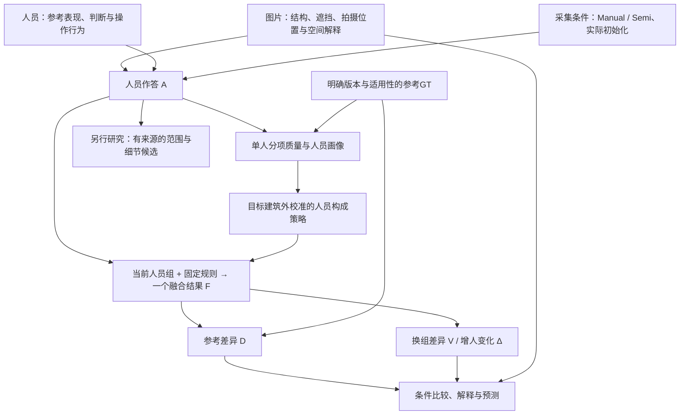

# 研究模型：人员、图片与融合不确定性

更新：2026-10-06。用户本轮明确要求把整个研究抽象成模型并落实文档。本页是当前研究的统一解释入口，取代零散聊天作为概念依据；不是已拟合完成的统计模型，也不凭此宣布最终算法或阈值。规范操作仍遵循 `consensus_research_20260923_v1`。

接手顺序：本页 → [术语](CONTEXT.md) → [数据说明](研究数据说明_来源预处理与用途_20261006.md) → 所需实验结果。[完整交接](线程交接_连线质量与完整共识_20261004.md)保留研究原意和历史证据；旧报告中的待办不自动延续。

## 1. 研究问题与最终产物

研究的核心问题是：**在给定图片、采集条件和人员组成下，标注为何产生差异；这些差异经过融合后还保留多少、怎样变化，以及产生的结果在什么意义上可用。**

要得到三类相互衔接的产物：

1. 可解释的质量衡量：分别说明范围、边界／细节、位置与条件三维的差异，支持人员比较，容纳参考本身与合理范围选择的问题。
2. 人员—人数—图片的实证关系：什么人员或构成在什么图片上有效；增加人数减少了人员选择波动，还是也改善了参考表现；图片特征能否预测这些结果。
3. 可使用的共识与有来源的空间候选：主人数实验每组人只产生一个融合结果；另一路研究保留不同合理范围／细节的候选。两项不同，候选构造不作为人员研究的前置。

统一的是对象、条件、关系和可检验问题。不能把全研究缩成一个加权质量总分、一次二分人员类型，或两条人数均值线。

## 2. 五层模型

图中箭头表示生成、信息使用或比较关系，不是已识别的因果图。图片难度、人员能力与参考偏差并非当前已知且独立的参数。

| 层 | 核心对象 | 本层应回答什么 |
|---|---|---|
| 条件 | 图片i、人员j、采集条件c、实际初始化M、参考版本v | 人在什么条件下作答，哪些信息可用？ |
| 观测 | 完整作答A及已有审核、时间、修改行为 | 实际画了什么、用了什么范围、有什么已知问题？ |
| 质量测量 | 相对参考的分项向量e，而非预设总分 | 差异发生在哪个测量层面？ |
| 团队与融合 | 当前人员组S、人数k、构成ρ、规则m、输出F | 哪些人按何规则形成什么类型的结果？ |
| 响应与解释 | 参考差异D、换组差异V、增人变化Δ及可计算状态 | 人数、构成、图片和算法怎样改变结果？哪些关系可预测？ |

### 2.1 作答如何进入模型

概念上，作答来自图片可见信息、人员的空间目标选择与执行表现，以及采集条件：

\[
A_{ijc}=H(X_i,\theta_j,Z_{ijc},M_{ijc},\varepsilon_{ijc}).
\]

这里X表示图片信息，θ表示人员跨任务表现，Z表示该次选择的范围／边界目标，M表示Semi实际初始化，ε包含未解释的单次变化。**这只是变量关系声明，尚未估计H或把Z、θ、ε从数据中唯一分离。** Z也不要求先把作答聚成几簇。

相同图片上出现不同作答，可能来自看不清、操作定位偏差、漏细节、合理范围选择、规则理解、共同初始化或其他交互。现有审核记录提供部分解释，不假设所有差异都合理或都错误。

GT记为G_i^v，是明确版本的参考目标，不等同于已知物理真值。原GT与修订GT分开评价；同一结果换参考后不同，不归咎于人员能力变化。

Manual与Semi分层。Semi的初始模型可能使多人趋同，也可能使共同偏差保留下来；模型来源、初始化到最终作答的改动和净改善有独立研究位置。Manual没有初始化，修改量记不适用，不能填0。

### 2.2 单人质量与人员画像

对同一参考版本，使用可计算的分项：

\[
\mathbf e_{ijc}^{,v}=\mathcal L(A_{ijc},G_i^v).
\]

当前可广泛使用范围遗漏／外扩及IoU摘要；上下边界与其他质量量按实际实现和可计算域补充。单人的参考表现是画像的一部分，不等于全部能力、规则判断或认真程度。

保留既有Q/T/S/B研究族：Q为参考质量，T为有效时间，S原义是可标／不可标任务的误拒绝与误接受，B为Semi修改量及参考净改善。**S不能偷换成选择哪一种合理空间范围；B的小改不必是漏改，大改不必是改善；T不直接表示认真程度。** 当前IoU上下半只验证Q的一条基线，不能宣布其它三块已无用或已完成验证。参见[人员原意与证据](人员粗分类原意与既有证据_20261003.md)。

在共同人员×共同图片矩阵上，对一个指定质量量可描述性地写：

\[
e_{ij}=\mu+a_j+b_i+r_{ij},\quad
a_j=\bar e_{\cdot j}-\mu,\quad b_i=\bar e_{i\cdot}-\mu.
\]

这是完整平衡面板上的行列均值分解：a描述人的平均相对表现，b描述图片对该人员池的平均参考差，r是额外的人图差异。r包含交互、一次作答变化及测量问题，b也可包含参考问题。它不是可识别的纯人员噪声／纯图片噪声分解；每人每图一次，不能直接估计同人重复标同图的随机波动。现有画像已保存同图中心化表现，先复用，不另建复杂联合模型作前置。

### 2.3 当前组产生一个融合结果

\[
S\sim\pi_i(k,\rho;\eta_{-b(i)}),\qquad
F_{i,S}^{m}=f_m(\{A_{ijc}:j\in S\}).
\]

π是从现有人员池抽取团队的规则，ρ是构成条件，m是融合规则，η是需要时从目标建筑之外校准的人员画像。当前η影响人员分组和抽组，Lee融合本身仍等权，未按画像加权；未来如研究加权融合，应另列方法条件。随机团队与按类型比例抽组是不同π，目标图GT不能用来挑当前好人、权重或输出。

**对同一图片、具体人员组和规则，只形成一个主融合结果。** 有效完整输出不可得时保留明确失败；不靠改成最大簇、删人员或补角来满足输出要求。不同输出类型分别说明：Lee提供底面区域，精确曲线提供可适配时的上下边界，点／点对方法还涉及身份、中心和环连接；能给出区域不等于已给出完整三维房间。

算法是条件之一。同一批作答换融合规则后D、V会变，不能省去m再把结果全部归因于人员或图片。

## 3. 核心测量：参考差异、换组差异和增人变化

以已实现的Lee底面区域为例，U_i为该图固定全员标注区域的并集，G为所用版本参考：

\[
O_i(k,\rho)=\mathbb E_S|G\setminus F_S|/|G|,
\quad E_i(k,\rho)=\mathbb E_S|F_S\setminus G|/|G|,
\quad D_i=O_i+E_i.
\]

D越小，范围越近；可大于1，不是1−IoU。原始h²面积也保留，h是共同相机高度单位，不是实测米。IoU可作摘要，但不把它和遗漏、外扩当三份独立证据重复计权。

\[
V_i(k,\rho)=\mathbb E_{S,T\ \mathrm{independent}}|F_S\triangle F_T|/|U_i|.
\]

两组独立抽取、允许成员重叠。V越小，融合范围越不依赖具体抽到谁；它不是原作答一致性，更不直接等于人员噪声。若需要解释“大家原来一致”还是“融合压下了分歧”，另看原作答两两差异；本轮不把该辅助量自动列为新必做算法。

\[
\Delta_i^+(k)=\mathbb E_{S,j\notin S}|F_{S\cup\{j\}}\triangle F_S|/|U_i|.
\]

Δ⁺保留当前团队后增加一人，且重新按k+1更新门槛。当前高人数结果已计算随机抽组的该量；构成实验主要保存同人数换组差异，不能笼统声称每种构成都已有增人过程。

| 解释问题 | 使用什么量 | 当前限制如何进入解释 |
|---|---|---|
| 接近参考了吗？ | D及遗漏／外扩，按参考版本分开 | 只说明测量对象的参考差异；不自动判定范围选择错误 |
| 换人后仍相似吗？ | V，必要时原始面积差 | 全员并集可能受外扩作答影响，跨图应保留h²原值和分母；不为此另造统一总分 |
| 继续加人还会变吗？ | Δ⁺及D的同图人数差 | 奇偶门槛、池规模和既有人员构成均会影响变化 |
| 稳定但远离参考说明什么？ | 联看D、V、原作答和已有范围／细节／GT证据 | 可能是共同偏差、目标差异、GT问题或融合压制细节；D/V本身不能归因 |

全池k=N时只有一个集合，V=0是机制事实；纯子类池耗尽也如此。接近池上限时两次抽组共享成员越来越多，换组差异下降、表观稳定性提高包含这个有限池因素，不只在末点才存在。大k下可行构成也收缩，极端构成曲线合拢不能直接证明类型无差异。当前研究估计的是既有池响应，尚不外推无限新增人员。

已有代码还保存面积偏差—方差恒等式。令q(x)为抽组融合覆盖x的概率、g(x)为参考指示，则在**相同面积分母**下：

\[
\frac{\mathbb E|F\triangle G|}{|U|}
=\underbrace{\frac{\int(q-g)^2\,dx}{|U|}}_{B_U}
+\frac{V}{2},\qquad
D=\frac{|U|}{|G|}(B_U+V/2).
\]

积分包含参考在U之外的部分。这个分解描述融合覆盖概率对参考的偏离与换组波动，**B_U不叫图片不确定性，V/2不叫人员不确定性**。当前表格D和V分母不同，不能直接相减获得其中一类来源。

## 4. 把范围质量接回完整质量

| 测量层 | 在统一模型中的用途 | 实现与选择状态 |
|---|---|---|
| BEV范围 | 现有大面板的共同参考比较，区分遗漏与外扩 | 广泛实算；已有D、V、Δ⁺人数过程 |
| 上／下边界 | 分开观察范围之外的上界目标／位置差异 | 有真实／合成实验。Pro本次e9z-16为8192经度中点采样MAE，并非连续精确积分或角点误差 |
| 位置与局部细节 | 面积质心、双向边界距离、尾部及已有细节证据辅助解释 | 已有实算；不把范围差异引起的质心位移直接当独立定位处罚 |
| 角点对应 | 已知同一结构的定位、遗漏与错配 | 真实全库正确对应未解决；真实点RMSE不能由按x匹配补造 |
| 三维自洽／条件范围 | 解释墙向、高度变化、平顶假设、条件体积 | 已有真实小面板，不因本次体积未提供额外主评分价值而取消这条研究 |

统一质量量是分项向量及可计算状态。对于单值曲线上下误差，可以设计共同有效经度域Ω与覆盖率，但**Pro当前实现是整圈适用则计算、否则整项NA，尚未实现通用部分域评价**；不能把建议写成现成功能。已有路径弧长距离与同经度纵向角差也不是同一个量。

上下误差较大可能来自目标线选择、水平错位或形状变化，不足以直接归因为人员上点错误。yq-32被用户判断易漏细节，范围误差却较低，是引入细节解释的动机，不是现已证明某个新指标有效。

本次条件体积采用共同地面、每份一个平均高度H：

\[
IoU_{3D}=\frac{|A\cap G|\min(H_A,H_G)}{|A|H_A+|G|H_G-|A\cap G|\min(H_A,H_G)}.
\]

等高时退化为BEV IoU，异高时确实加入平均高度信息。“由已有量可推导”本身不是拒绝指标的理由。当前暂作诊断，是因为这种模型未新增局部高低顶的观测，也未验证额外任务收益；不是宣布三维质量无用。

## 5. 人员与图片怎样比较，哪些是待检验假设

| 问题 | 最直接的对照 | 研究状态 |
|---|---|---|
| 人数增加主要减少什么？ | 固定图片、完整人员池及规则，比较D/V/Δ⁺随k变化 | 39 Manual、18 Semi高人数池已算；逐图不必单调 |
| 选哪些人比增加人数更重要吗？ | 同图同k不同构成，再与更多随机人员比较 | 楼外Q画像有平均收益，非每图成立；不是通用最优团队 |
| 图片影响有多大？ | 完全相同人员池，必要时同一抽组名单，跨图看质量与人数响应 | 共同24人×10图已补齐5简单／2中等／3困难；新标签已有同池结果 |
| 人员子类能否更稳定、更有效？ | 类内人数过程与同图同人数随机对照；再看混合比例 | 历史Q/T/S/B与当前Q都有实验，不能用一次上下半覆盖全部原意 |
| 图片特征能预测什么？ | 分别预测人工难度或指定人数下D/V/Δ⁺，按建筑／房间留出 | 特征存在，预测验证未完成；不同目标不强行合成“固有难度” |
| 合理不同范围怎样表达？ | 完整原答／单一共识／有来源候选并列，结合原图和既有裁决 | 有原型和真实例；没有通用合理候选选择算法，不阻塞上述比较 |

“少人数已较近”“继续改善”“稳定但仍偏离”“仍明显依赖选人”是响应形态假设，不预先绑定简单／中等／困难。速度必须看人数过程，不能只看终点；在没有实际用途容差前，不冻结快慢阈值或最佳人数。

人工难度是人的判断层；模型特征是候选解释／预测信息；D、V是结果。三者不得互相循环定义。预标注点数、BiLayout enclosed/extended差异、d_model特征等保留；实际给人的初始化与离线模型输出分别取源。依赖目标GT或未来作答的量可用于事后解释，不能伪装成无GT新图预测的输入。

OOS与门洞交界分轴保留。前者关注当前结构表达适配，后者关注拍摄位置造成的范围歧义；两者可重叠，也不等于统一“困难”。原参考存疑时可研究融合稳定性，但参考差异不能直接评价人员能力。研究资格仍沿原明确裁决，不由本文重新排除或恢复。

## 6. 当前数据地图：问题、输入和结果一一对应

| 用途 | 必须读取的材料 | 已有可复用产物 |
|---|---|---|
| 现行作答、参考、人员与环序 | [统一包manifest](../../analysis_results/research_input_20260929/manifest.json)，通过`load_current_bundle()`读data/research/comments | 预处理坐标、canonical身份、原／修GT、资格、原话来源；不重新拉齐x或改环 |
| 有效人工难度 | [恢复库存](../../analysis_results/review_source_audit_20261004/corrected_inventory/input.json) + [本次8图原始补标](../../analysis_results/difficulty_consensus_20261006/user_review.json) | 全库109图三档；[更新名单](../../analysis_results/difficulty_consensus_20261006/updated/difficulty_roster.csv)只覆盖当前67图，不能冒称259图总表 |
| 难度接入方式 | [更新脚本](../../tools/thesis_main/analysis/update_difficulty_review_20261006.py)的`apply_review`保留旧标签、原备注与身份，应用本次明确字段 | [更新结果](../../analysis_results/difficulty_consensus_20261006/updated/REPORT.md)：60图至8人、32图至16人、26图至20人，各面板内固定图片 |
| 单人质量与共同矩阵 | [共同画像](../../analysis_results/worker_profiles_20261003/REPORT.md)，同目录`matrix_original_iou.csv`、`worker_profiles.csv` | 24人×10图单人质量、同图中心化表现、楼外校准及固定4人构成；报告中的旧难度覆盖是历史状态 |
| 高人数、构成与稳定性 | [57池结论](../../analysis_results/worker_count_composition_20261006/CONCLUSIONS.md)；同目录`input.json`、`coverage.csv`、`panels.json` | `per_image.csv`逐图，`summary.csv`固定面板，`assignments.csv`具体校准分组，`field_contract.json`字段含义 |
| 最新十图同人员比较 | [逐图人数表](../../analysis_results/difficulty_consensus_20261006/updated/common10_per_image.csv) | 两规则、原GT、随机抽组；构成与双参考仍回到上一行，不误称此表全部包含 |
| 三维、上下与局部质量 | [质量实验](../../analysis_results/layout_metric_response_20261001/REPORT.md)、[三维实验](../../analysis_results/layout_3d_quality_probe_20261002/REPORT.md) | 真实／合成不同层面的量，不混算成统一验证集 |
| 新Pro质量及完整输出 | [本地接收与独立判断](../../research/fast_research_return_20261006/README.md) | 原报告、两表、五图、GeoJSON、选中点与代码完整保留；旧量复用和新增小计算区分 |
| 原图与语义 | 统一包中的图像身份／来源、[12图本地副本](../../research/fast_research_handoff_20261006/quality_images/)及既有人审 | Pro当轮没有看原图，不代表本地缺原图；已有usable＋scope裁决不被低票覆盖率推翻 |
| 模型、Q/T/S/B、空间候选历史 | [数据说明](研究数据说明_来源预处理与用途_20261006.md)、[人员原意](人员粗分类原意与既有证据_20261003.md)、[方法溯源](点投票与区域投票_方法溯源_20261003.md) | 找当前字段和真实初始化；历史OSPA／聚类不是当前BEV/Lee的同名结果 |

数字使用规则：259是研究图片总数；136是早期可计算Manual人数扩展；57是39 Manual加18 Semi人员池；共同十图、33图等是嵌套面板；109是全库已有三档难度，不是109张已跑同一实验。重复组合、概率状态、CSV行数不是独立人员或图片样本。

## 7. 对本轮外部意见的独立取舍

| 主张 | 本轮判断 |
|---|---|
| 保留范围分项和上下边界 | 采纳其测量分工。上下小样本增量有价值，但还不能从一个可计算例宣布通用边界质量已完成。 |
| 体积没有独立信息，应退出主评分 | 只接受当前简化体积暂作诊断；不接受由“可推导”直接推出无用或永久移除三维。 |
| 人员构成可能比持续增人数更重要 | 当前固定池平均对照支持研究价值。收益受图、参考及校准影响，不据此冻结上下半或最优8人。 |
| 用行列均值拆人员和图片 | 可作现有质量矩阵的描述工具，不作为整个研究的唯一模型，也不把余项叫纯个人噪声。 |
| 用一致性与GT接近度分别代表人员／数据不确定性 | 不采纳这种直接命名。它们是输出维度，来源要靠受控比较、语义证据和可用预测设计判断。 |
| 补标尚未取得、难度仍52/24/18图 | dot该段已过期；当前已收到8图，更新为60/32/26图，共同十图为5/2/3。 |
| e9z-19无稳定多人第二空间 | 只限本例与本次支持分析。R01301仍是既有usable＋scope原作答；区域支持弱既不撤销保留，也不认证所有连接合理。 |
| 原图是唯一主要缺口 | 不采用作项目状态。Pro的限制是当轮没看原图；真实对应、通用边界适用性及迁移验证也各有未完问题，不需因此重新全量审核。 |

本轮核读Pro原报告、公式与代码定义；dot复算结论按其原报告归档，不冒称本轮重做了9,762行或全部几何。两名子智能体只做框架及关键解释审查，不作为额外独立实验。文献新颖性本轮未判定，不能仅由几篇众包论文题目或外部意见确定论文创新点。

## 8. 下一步怎样在这套模型内推进

当前最短的实证连接是：复用共同十图、既定楼外画像和高人数结果，做逐图的**人数×构成×图片条件**对照，并列D、V以及已有随机增人变化。只重汇总已有量，缺的具体量再补算，不重做已通过的大量审核；两参考只在实际有两版的同图配对，构成比例按该池可行值报告。

解释图至少保留Uw-09的范围歧义、rPc-06／yq-32的细节差异，以及一张简单图；使用已有上下／局部测量看是否补上面积解释缺口，不能只靠困难组平均数。人员画像仍从同图分项出发，Q/T/S/B保持各自原义；复杂模型或新增分类只在简单对照无法回答具体问题时引入。

之后再选择一个明确预测目标和可获得特征，例如给定k的参考差异、换组变化或人工难度，使用未参与方案调整的建筑检验。现在的开发面板不包装成盲测；不为此立即追加采集或一轮全库审核。

**维护约定：**研究定义更新本页，词义更新术语表，输入／来源更新数据说明，数值与可复算材料留实验目录，原意／争议历史留交接或返回原件。每次结论带面板、条件、规则、参考和状态；不把建议写成已实施，也不让历史“下一步”覆盖新决定。本轮建立框架与资料入口，不额外启动上述尚未完成的分析。
