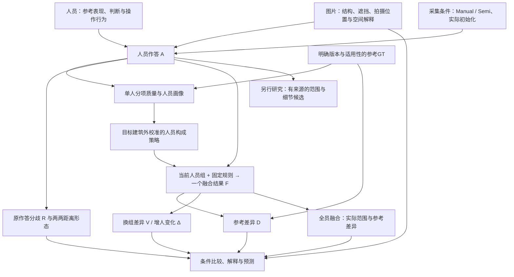

# 研究模型：人员、图片与融合不确定性

更新：2026-10-06。用户本轮明确要求把整个研究抽象成模型并落实文档。本页是当前研究的统一解释入口，取代零散聊天作为概念依据；不是已拟合完成的统计模型，也不凭此宣布最终算法或阈值。规范操作仍遵循 `consensus_research_20260923_v1`。

接手顺序：本页 → [术语](CONTEXT.md) → [数据说明](研究数据说明_来源预处理与用途_20261006.md) → 所需实验结果。[完整交接](线程交接_连线质量与完整共识_20261004.md)保留研究原意和历史证据；旧报告中的待办不自动延续。当前快速推进安排见第8节。

本日后续澄清：**原作答一致性、融合换组稳定性、全员融合的参考表现分别观察。** “增人后不断出现新标法”只是待检验猜想；困难、OOS、门洞均不预设更不一致。OOS包括非正交但清晰可标的场景，门洞另分可标／不可标；已有“难标”记录不能自动翻译为不可标。每组仍只形成一个融合共识，全员结果是核心交付。

最新用户裁决：**融合体现纳入人员的观察共识，不保证必须像GT。** rPc玻璃外侧和内侧墙面可为不同合理目标；P023是外侧较标准局部标法，P018／P003省略细节。yq的P023／P010为同一结构、细节有偏差，P002将它简化。原话与记录绑定见[局部补充](../../analysis_results/consensus_response_20261006/boundary_followup/user_review.json)，不把精细个体或GT反向设为强制融合答案。[共同24人十图分项矩阵](../../analysis_results/consensus_response_20261006/worker_image/README.md)已进一步连接同人跨图排名、遗漏／外扩和人图平均差。

本日并行实施更新：[连接结果](../../analysis_results/consensus_response_20261006/REPORT.md)已完成57池R、逐人参考分项、全员终点及114份实际全员底面；[构成研究](../../analysis_results/consensus_response_20261006/composition/REPORT.md)已完成39图Manual的k=4／8／12原作答R与融合D/V对照。共同十图k=8、MV50、原GT下，上半组相对下半组9图参考差更小，7图原作答差更小，5图换组差更小，三者不能替代。[Pro六图返回及综合分析](../../research/pro_parallel_return_20261006/README.md)现已取得；本地又把两处固定观察片区接回人数／构成，得到整体参考收益与局部保留不同步的具体证据，见第4节。先前[八图任务包](../../research/pro_parallel_handoff_20261006/README.md)保留任务快照。

## 1. 研究问题与最终产物

研究的核心问题是：**在给定图片、采集条件和人员组成下，标注为何产生差异；这些差异经过融合后还保留多少、怎样变化，以及产生的结果在什么意义上可用。**

要得到三类相互衔接的产物：

1. 可解释的质量衡量：分别说明范围、边界／细节、位置与条件三维的差异，支持人员比较，容纳参考本身与合理范围选择的问题。
2. 人员—人数—图片的实证关系：人员原作答有多大分歧、各自距参考多远；什么人员或构成在什么图片上有效；增人过程与全员融合的参考表现怎样；图片特征能否预测这些结果。
3. 可使用的共识与有来源的空间候选：主人数实验每组人只产生一个融合结果；另一路研究保留不同合理范围／细节的候选。两项不同，候选构造不作为人员研究的前置。

统一的是对象、条件、关系和可检验问题。不能把全研究缩成一个加权质量总分、一次二分人员类型，或两条人数均值线。

## 2. 五层模型

图中箭头表示生成、信息使用或比较关系，不是已识别的因果图。图片难度、人员能力与参考偏差并非当前已知且独立的参数。

| 层 | 核心对象 | 本层应回答什么 |
|---|---|---|
| 条件 | 图片i、人员j、采集条件c、实际初始化M、参考版本v | 人在什么条件下作答，哪些信息可用？ |
| 观测 | 完整作答A及已有审核、时间、修改行为 | 实际画了什么、用了什么范围、有什么已知问题？ |
| 质量测量 | 原作答间距离、相对参考的分项向量e | 人员彼此差多少、距参考多远，差异发生在哪里？ |
| 团队与融合 | 当前人员组S、人数k、构成ρ、规则m、输出F | 哪些人按何规则形成什么类型的结果？ |
| 响应与解释 | 原作答分歧R、融合D/V/Δ、实际全员结果及可计算状态 | 人数、构成、图片和算法怎样改变结果？哪些关系可预测？ |

### 2.1 作答如何进入模型

概念上，作答来自图片可见信息、人员的空间目标选择与执行表现，以及采集条件：

\[
A_{ijc}=H(X_i,\theta_j,Z_{ijc},M_{ijc},\varepsilon_{ijc}).
\]

这里X表示图片信息，θ表示人员跨任务表现，Z表示该次选择的范围／边界目标，M表示Semi实际初始化，ε包含未解释的单次变化。**这只是变量关系声明，尚未估计H或把Z、θ、ε从数据中唯一分离。** Z也不要求先把作答聚成几簇。

相同图片上出现不同作答，可能来自看不清、操作定位偏差、漏细节、合理范围选择、规则理解、共同初始化或其他交互。现有审核记录提供部分解释，不假设所有差异都合理或都错误。

GT记为G_i^v，是明确版本的参考目标，不等同于已知物理真值。原GT与修订GT分开评价；同一结果换参考后不同，不归咎于人员能力变化。

Manual与Semi分层。Semi的初始模型可能使多人趋同，也可能使共同偏差保留下来；模型来源、初始化到最终作答的改动和净改善有独立研究位置。Manual没有初始化，修改量记不适用，不能填0。

### 2.2 单人质量与人员画像

对同一参考版本，使用可计算的分项：

\[
\mathbf e_{ijc}^{,v}=\mathcal L(A_{ijc},G_i^v).
\]

当前可广泛使用范围遗漏／外扩及IoU摘要；上下边界与其他质量量按实际实现和可计算域补充。单人的参考表现是画像的一部分，不等于全部能力、规则判断或认真程度。

保留既有Q/T/S/B研究族：Q为参考质量，T为有效时间，S原义是可标／不可标任务的误拒绝与误接受，B为Semi修改量及参考净改善。**S不能偷换成选择哪一种合理空间范围；B的小改不必是漏改，大改不必是改善；T不直接表示认真程度。** 当前IoU上下半只验证Q的一条基线，不能宣布其它三块已无用或已完成验证。参见[人员原意与证据](人员粗分类原意与既有证据_20261003.md)。

在共同人员×共同图片矩阵上，对一个指定质量量可描述性地写：

\[
e_{ij}=\mu+a_j+b_i+r_{ij},\quad
a_j=\bar e_{\cdot j}-\mu,\quad b_i=\bar e_{i\cdot}-\mu.
\]

这是完整平衡面板上的行列均值分解：a描述人的平均相对表现，b描述图片对该人员池的平均参考差，r是额外的人图差异。r包含交互、一次作答变化及测量问题，b也可包含参考问题。它不是可识别的纯人员噪声／纯图片噪声分解；每人每图一次，不能直接估计同人重复标同图的随机波动。现有画像已保存同图中心化表现，先复用，不另建复杂联合模型作前置。

现已对共同24人十图的遗漏／外扩／D执行该描述分解并保存人图单元：原GT下45对图片的人员D排名相关中位数0.198，6对为负；P017十图D均排第1。仅敏感性中暂去P017后中位数降至0.088，说明稳定优秀个体不能代表其余人员都有稳定排序；主实验保留全部人员。在GT面积归一化下，遗漏的图片平均差项最大，外扩的剩余项最大；换原始h²外扩后图片项反而最大。这些是依赖尺度的矩阵描述，不是外扩天然来自人员因素，也不是独立不确定性比例。[针对性复算与取舍](../../analysis_results/consensus_response_20261006/worker_image/README.md)保留两参考政策。逐图正面积缩放不改变图内名次和同图构成优劣方向，但改变跨图汇总权重。平衡面板减去图片均值不会改变人员平均D排序，不把这种中心化包装成新的选人收益。

### 2.3 当前组产生一个融合结果

\[
S\sim\pi_i(k,\rho;\eta_{-b(i)}),\qquad
F_{i,S}^{m}=f_m(\{A_{ijc}:j\in S\}).
\]

π是从现有人员池抽取团队的规则，ρ是构成条件，m是融合规则，η是需要时从目标建筑之外校准的人员画像。当前η影响人员分组和抽组，Lee融合本身仍等权，未按画像加权；未来如研究加权融合，应另列方法条件。随机团队与按类型比例抽组是不同π，目标图GT不能用来挑当前好人、权重或输出。

**对同一图片、具体人员组和规则，只形成一个主融合结果。** 有效完整输出不可得时保留明确失败；不靠改成最大簇、删人员或补角来满足输出要求。不同输出类型分别说明：Lee提供底面区域，精确曲线提供可适配时的上下边界，点／点对方法还涉及身份、中心和环连接；能给出区域不等于已给出完整三维房间。

融合表达当前成员按声明规则形成的共识；GT比较说明它相对某个参考目标的位置，不是融合的监督目标。合理但低支持的细节可能不出现在全员结果，需解释其支持与形态，不能仅因它合理就强补入主共识。对不同合理目标的空间候选仍独立研究。

算法是条件之一。同一批作答换融合规则后D、V会变，不能省去m再把结果全部归因于人员或图片。

## 3. 核心测量：原作答、人数过程与全员结果

一致性和参考接近度是两个评价维度，在原作答与融合结果两个层面分别使用。原作答更一致不等于更准确；融合更稳定也不等于原作答分歧变小。

| 层面 | 一致性／分歧 | 参考接近度 |
|---|---|---|
| 人员原作答 | 两两距离及其平均R，保留距离矩阵中的整体标法形态 | 每份作答的参考差异及逐人分布 |
| 固定k人融合 | 换组输出差异V；保留当前团队加人的变化Δ⁺ | k人融合的期望参考差异D(k) |
| 全员融合 | 没有其它全员组可换；仍可看原作答分歧和对最终共识的差异 | 实际全员输出、D(N)、遗漏／外扩与差异位置 |

### 3.1 人员原作答一致性是主要观察

以已实现的BEV区域为例，P_i是该图当前完整纳入人员池，N_i为人数；U_i为这个固定池全部标注区域的并集，G为所用版本参考。定义：

\[
d_i(A_a,A_b)=|A_a\triangle A_b|/|U_i|,\qquad
R_i=\frac{1}{\binom{N_i}{2}}\sum_{a<b}d_i(A_a,A_b).
\]

R越小，原作答范围越接近。保留逐人参考分项和两两距离矩阵，避免平均数掩盖两种集中标法或少量离群观察。BEV距离首先说明范围；同范围但不同上界／细节还需对应测量，不由R认证语义相同。

对同一个固定池均匀无放回抽k人，使用固定距离与分母时：

\[
\mathbb E[R_i(S_k)]=R_i\quad(k\ge2),\qquad
R_i=\frac{N_i}{N_i-1}V_i(1).
\]

第一式因为每对人员进入抽组的概率相同；第二式排除V(1)两次抽到同一人的零距离。两式适用于这里的均匀抽样和固定U，不直接推广到改变人员构成、随组改变分母或其它距离。**不要将期望恒定的组内平均两两距离画成人数“收敛证据”。** 单条逐步加人路径仍会升降，抽组间分布也会改变；构成变化则可改变平均R。

“少量集中标法／很多零散标法”保留为独立的形态问题，先用两两距离矩阵与已有原观察展示。不先强制聚类，也不将簇数随样本增多称为已证明的不收敛，更不改成每簇输出。一个标量不能决定这些形态。

### 3.2 融合人数过程：接近参考与换人稳定性

\[
O_i(k,\rho)=\mathbb E_S|G\setminus F_S|/|G|,
\quad E_i(k,\rho)=\mathbb E_S|F_S\setminus G|/|G|,
\quad D_i=O_i+E_i.
\]

D越小，范围越近；可大于1，不是1−IoU。原始h²面积也保留，h是共同相机高度单位，不是实测米。IoU可作摘要，但不把它和遗漏、外扩当三份独立证据重复计权。

\[
V_i(k,\rho)=\mathbb E_{S,T\ \mathrm{independent}}|F_S\triangle F_T|/|U_i|.
\]

两组独立抽取、允许成员重叠。V越小，融合范围越不依赖具体抽到谁；它不是原作答一致性，更不直接等于人员噪声。D(k)与V(k)是不同抽组的期望，不是按人员编号把单人IoU连线；也不是先平均IoU再把均值转换为面积误差。

\[
\Delta_i^+(k)=\mathbb E_{S,j\notin S}|F_{S\cup\{j\}}\triangle F_S|/|U_i|.
\]

Δ⁺保留当前团队后增加一人，且重新按k+1更新门槛。当前高人数结果已计算随机抽组的该量；构成实验主要保存同人数换组差异，不能笼统声称每种构成都已有增人过程。

| 解释问题 | 使用什么量 | 当前限制如何进入解释 |
|---|---|---|
| 人员原本一致吗？ | R、两两距离矩阵及逐人参考分布 | R随均匀抽组人数的期望恒定；不能由低R推断正确 |
| 接近参考了吗？ | D及遗漏／外扩，按参考版本分开 | 只说明测量对象的参考差异；不自动判定范围选择错误 |
| 换人后仍相似吗？ | V，必要时原始面积差 | 全员并集可能受外扩作答影响，跨图应保留h²原值和分母；不为此另造统一总分 |
| 继续加人还会变吗？ | Δ⁺及D的同图人数差 | 奇偶门槛、池规模和既有人员构成均会影响变化 |
| 稳定但远离参考说明什么？ | 联看D、V、原作答和已有范围／细节／GT证据 | 可能是共同偏差、目标差异、GT问题或融合压制细节；D/V本身不能归因 |

增人不保证V单调下降。四人对一个区域恰好两票赞成、两票反对时，MV50的V从k=1到4依次为1/2、5/18、1/2、0。奇偶平票政策和覆盖支持即可造成反弹，不需先归因图片变难。

全池k=N时只有一个集合，V=0是机制事实；纯子类池耗尽也如此。接近池上限时两次抽组共享成员越来越多，会影响V的解释，并非只在末点才发生，也不保证逐步单调。大k下可行构成收缩，极端构成曲线合拢不能直接证明类型无差异。当前研究估计的是既有池响应。

同k不同策略也有共享成员差：上／下各12人的共同池，纯类8人的两次抽组期望共享5.33人，4＋4混合仅2.67人。因此混合V较高可描述策略敏感性，不能直接归因“类型冲突”。只有要研究固定换人幅度的机制时才增加相应对照。

已有`next_person_loss_union`可在需要解释时补充为：

\[
H_i(k)=\mathbb E_{S,j\in P_i\setminus S}|F_S\triangle A_j|/|U_i|,\quad k<N_i.
\]

它比较留在池内、未参加当前团队的一份原作答与融合，不是加入此人后的融合变化，也不是未来新招人员风险。H接近池上限同样受留出关系影响；上述四人例的H为2/3、2/3、1，满员无定义。H只作已有诊断，不另立一条必须通过的研究关口。

### 3.3 全员融合是核心产物，不只是一条曲线的末点

\[
F_{i,\mathrm{all}}^m=f_m(\{A_{ijc}:j\in P_i\}),\qquad
D_{i,\mathrm{all}}^v=|F_{i,\mathrm{all}}^m\triangle G_i^v|/|G_i^v|=D_i(N_i).
\]

每张图交付这个实际结果的范围／布局、N、规则、参考版本和遗漏／外扩位置；与原作答参考分布及人数过程并列。全员指该图按既有规则纳入的全部独立人员，不是上半人员、最大簇或全库27人。共同十图为24人；其他图按各自完整池计算。原有明确排除与失败保留说明。

V(N)=0不增加正确性证据，**但D(N)和实际全员输出十分重要，必须保留**。例如既有Manual、MV50、原GT结果：7y-04的D(1)/D(8)/D(24)为0.060827/0.050285/0.045313；Uw-09为0.697993/0.720882/0.814380。前者范围更接近，后者全员仍有较大参考差；两图V(24)都为0，不能据此说同样可靠。数值来自已有`per_image.csv`，本次只读提取。

比较“全部人”和“部分人”时保持同图、同规则、同参考；更小团队偶然更接近不能通过目标GT反向挑选最佳团队。实际全员结果也不必最接近GT。不同图片各自D(N_i)可描述实际交付，比较人数作用仍使用固定k和固定图片面板。

### 3.4 已有面积分解的解释边界

已有代码还保存面积偏差—方差恒等式。令q(x)为抽组融合覆盖x的概率、g(x)为参考指示，则在**相同面积分母**下：

\[
\frac{\mathbb E|F\triangle G|}{|U|}
=\underbrace{\frac{\int(q-g)^2\,dx}{|U|}}_{B_U}
+\frac{V}{2},\qquad
D=\frac{|U|}{|G|}(B_U+V/2).
\]

积分包含参考在U之外的部分。这个分解描述融合覆盖概率对参考的偏离与换组波动，**B_U不叫图片不确定性，V/2不叫人员不确定性**。当前表格D和V分母不同，不能直接相减获得其中一类来源。

## 4. 把范围质量接回完整质量

| 测量层 | 在统一模型中的用途 | 实现与选择状态 |
|---|---|---|
| BEV范围 | 现有大面板的共同参考比较，区分遗漏与外扩 | 广泛实算；已有D、V、Δ⁺人数过程 |
| 上／下边界 | 分开观察范围之外的上界目标／位置差异 | 有真实／合成实验。Pro本次e9z-16为8192经度中点采样MAE，并非连续精确积分或角点误差 |
| 位置与局部细节 | 面积质心、双向边界距离、尾部及已有细节证据辅助解释 | 已有实算；不把范围差异引起的质心位移直接当独立定位处罚 |
| 角点对应 | 已知同一结构的定位、遗漏与错配 | 真实全库正确对应未解决；真实点RMSE不能由按x匹配补造 |
| 三维自洽／条件范围 | 解释墙向、高度变化、平顶假设、条件体积 | 已有真实小面板，不因本次体积未提供额外主评分价值而取消这条研究 |

统一质量量是分项向量及可计算状态。对于单值曲线上下误差，可以设计共同有效经度域Ω与覆盖率，但**Pro当前实现是整圈适用则计算、否则整项NA，尚未实现通用部分域评价**；不能把建议写成现成功能。已有路径弧长距离与同经度纵向角差也不是同一个量。

上下误差较大可能来自目标线选择、水平错位或形状变化，不足以直接归因为人员上点错误。yq-32被用户判断易漏细节，范围误差却较低；Pro现已用原图区分“大壁炉轮廓保留”和“门前小内收被填入”，而不是笼统判断整图细节恢复或失败。

### 4.1 已连接的局部观察诊断

[两处片区实验](../../analysis_results/consensus_response_20261006/local_patches/README.md)固定Pro选定的原作答短路径／端点直连区域P，计算`E[|F∩P|]/|P|`，与同图D及实际全员F并列。rPc片区在来源作答内部，是观察凸出保留率；yq片区在来源作答外部，是观察内收填入率。来源分别R01557和R02256，均为P023的作答；片区是事后诊断，不是新GT或可直接用于人员评分的细节准确率。

原GT、MV50：rPc随机8→全员24人的D为0.4942→0.4865，观察凸出保留率54.8%→39.5%；yq的D为0.1186→0.1028，内收填入率73.1%→70.5%。因此整体变近不决定局部方向，也不能把人数增加概括为必然压制细节。

同k=8、原GT楼外校准下，Q上半相对下半在两图均有整体参考收益；rPc凸出保留更多，yq却填入更多内收。改用既有修订优先校准，两个局部方向均反转，对原GT的整体收益仍存在。**Q分组当前说明参考范围表现，尚不能作为稳定的细节能力类型。** yq两版GT自身填入该观察片区约99.1%，解释了接近参考与保留该内收可能冲突。

后续已直接对照实际融合边界，并取得页首所述人审。同一片区被覆盖不等于边界出现对应转折；新增人审只认证所列局部的目标／简化关系，没有把片区升级为GT，也没有以此改变票数。W002已绑定P002／R00020，其扩大窗口叠图支持内侧墙面选择；不由此认证整环。局部补充本轮收束，后续沿人员×图片主分析推进。

### 4.2 条件三维范围

本次条件体积采用共同地面、每份一个平均高度H：

\[
IoU_{3D}=\frac{|A\cap G|\min(H_A,H_G)}{|A|H_A+|G|H_G-|A\cap G|\min(H_A,H_G)}.
\]

等高时退化为BEV IoU，异高时确实加入平均高度信息。“由已有量可推导”本身不是拒绝指标的理由。当前暂作诊断，是因为这种模型未新增局部高低顶的观测，也未验证额外任务收益；不是宣布三维质量无用。

## 5. 人员与图片怎样比较，哪些是待检验假设

| 问题 | 最直接的对照 | 研究状态 |
|---|---|---|
| 人员原来怎样分歧？ | 同图R、两两距离形态与逐人参考分布，再跨共同图片比较 | 57池两两距离与逐人参考分项已提取；不强制聚类 |
| 人数过程与全员结果怎样？ | 固定图片、完整人员池及规则，比较D/V/Δ⁺随k变化，并展示实际全员结果和D(N) | 57池终点表及114份实际全员底面、图集已保存；共同十图另有两两距离及原作答误差图；逐图不必单调 |
| 选哪些人比增加人数更重要吗？ | 同图同k不同构成，再与更多随机人员比较 | 楼外Q画像有平均收益，非每图成立；不是通用最优团队 |
| 图片影响有多大？ | 完全相同人员池，必要时同一抽组名单，跨图看质量与人数响应 | 共同24人×10图已补齐5简单／2中等／3困难；新标签已有同池结果 |
| 人员子类能否更稳定、更有效？ | 类内人数过程与同图同人数随机对照；再看混合比例 | Q构成R/D/V已连接39图，参考收益与原作答一致性可反向；历史Q/T/S/B保留，不用一次上下半覆盖全部原意 |
| 图片特征能预测什么？ | 分别预测人工难度或指定人数下D/V/Δ⁺，按建筑／房间留出 | 特征存在，预测验证未完成；不同目标不强行合成“固有难度” |
| 合理不同范围怎样表达？ | 完整原答／单一共识／有来源候选并列，结合原图和既有裁决 | 有原型和真实例；没有通用合理候选选择算法，不阻塞上述比较 |

“少人数已较近”“继续改善”“稳定但仍偏离”“仍明显依赖选人”是响应形态假设，不预先绑定简单／中等／困难。速度必须看人数过程，不能只看终点；在没有实际用途容差前，不冻结快慢阈值或最佳人数。

人工难度是人的判断层；模型特征是候选解释／预测信息；D、V是结果。三者不得互相循环定义。预标注点数、BiLayout enclosed/extended差异、d_model特征等保留；实际给人的初始化与离线模型输出分别取源。依赖目标GT或未来作答的量可用于事后解释，不能伪装成无GT新图预测的输入。

场景条件至少保留以下区分；它们用于解释结果，不事先规定一致性高低：

| 条件 | 记录什么 | 已有证据与处理 |
|---|---|---|
| 人工标注难度 | 简单／中等／困难及原备注 | 与范围分歧、细节遗漏分别连接；缺失不猜 |
| 结构适配／OOS子类 | 是否不满足当前Manhattan等任务假设，具体是哪种限制 | 非正交但清晰可标，与多层顶／地面或其它表达困难分别解释；不将OOS自动写成不可标 |
| 门洞交界及可标性 | 拍摄是否位于交界；可标／不可标／未定，并保留既有“难标”原义 | 房间可仍是Manhattan；可标门洞也可能高度一致。“难标”不自动改为“不可标” |
| 参考适用性 | 此版GT能否用于当前比较，是否存在范围或结构问题 | 不由场景名或低IoU直接推定GT错误；已有明确GT裁决优先 |

已找回两个明确例外：x8F5xyUWy9e-01、x8F5xyUWy9e-09属于**非正交但稳定可标**，同属房间G231；x8-09原话明确称墙面不正交而标注共识好。它们是两个视角，不能当作两个独立房间证据。可标门洞已有jtcxE69GiFV-12和uNb9QFRL6hY-47；uNb-47记录“大家也全都是标完整的区域”，提供范围选择趋同线索，但不能据此宣布所有边界几何相同，也不猜它就是用户本轮回忆的那一张。

来源为统一包的[OOS图片清单](../../analysis_results/research_input_20260929/final_review/OOS_图片清单.csv)、[恢复库存](../../analysis_results/review_source_audit_20261004/corrected_inventory/images.csv)及[复核SOP第12节](两人审核归并与二次复核SOP_20260925.md)。这些区别已经存在，本次恢复到解释入口，不让简单的`scene=oos`汇总覆盖子类。

OOS与门洞可重叠；结构非正交、难度高、可标性低都不逻辑蕴含人员分歧大。“简单／中等随人数更一致、困难／特殊场景更不一致”以及“不断出现新标法”均为猜想，不能写成已观察规律。原参考存疑时仍可单列可用表示上的作答分歧与共识；人员主质量资格沿已有裁决，稳定非正交不会因一致便自动恢复。

## 6. 当前数据地图：问题、输入和结果一一对应

| 用途 | 必须读取的材料 | 已有可复用产物 |
|---|---|---|
| 现行作答、参考、人员与环序 | [统一包manifest](../../analysis_results/research_input_20260929/manifest.json)，通过`load_current_bundle()`读data/research/comments | 预处理坐标、canonical身份、原／修GT、资格、原话来源；不重新拉齐x或改环 |
| 有效人工难度 | [恢复库存](../../analysis_results/review_source_audit_20261004/corrected_inventory/input.json) + [本次8图原始补标](../../analysis_results/difficulty_consensus_20261006/user_review.json) | 全库109图三档；[更新名单](../../analysis_results/difficulty_consensus_20261006/updated/difficulty_roster.csv)只覆盖当前67图，不能冒称259图总表 |
| 难度接入方式 | [更新脚本](../../tools/thesis_main/analysis/update_difficulty_review_20261006.py)的`apply_review`保留旧标签、原备注与身份，应用本次明确字段 | [更新结果](../../analysis_results/difficulty_consensus_20261006/updated/REPORT.md)：60图至8人、32图至16人、26图至20人，各面板内固定图片 |
| 单人质量与共同矩阵 | [共同画像](../../analysis_results/worker_profiles_20261003/REPORT.md)，同目录`matrix_original_iou.csv`、`worker_profiles.csv` | 24人×10图单人质量、同图中心化表现、楼外校准及固定4人构成；报告中的旧难度覆盖是历史状态 |
| 高人数、构成与稳定性 | [57池结论](../../analysis_results/worker_count_composition_20261006/CONCLUSIONS.md)；同目录`input.json`、`coverage.csv`、`panels.json` | `per_image.csv`逐图，`summary.csv`固定面板，`assignments.csv`具体校准分组，`field_contract.json`字段含义 |
| 原作答分歧与全员结果 | 上行`per_image.csv`的均匀抽样k=1、k=n，以及`integration_bases.npz`和`input.json`中的人员顺序 | R由N/(N−1)×V(1)派生；全员D已有。两两距离／单人分项可复用每区域成员位图和面积；具体融合轮廓按同一输入和规则恢复，现存数值表不冒称已保存全部轮廓 |
| OOS子类与门洞可标性 | 统一包`research_tables.json`的既有category／gate、`final_review/OOS_图片清单.csv`、恢复库存`images.csv`及原备注 | x8-01／09为非正交稳定可标，jtcx-12／uNb-47为可标门洞；简化`special_scenes.csv`不足以恢复所有子类 |
| 最新十图同人员比较 | [逐图人数表](../../analysis_results/difficulty_consensus_20261006/updated/common10_per_image.csv) | 两规则、原GT、随机抽组；构成与双参考仍回到上一行，不误称此表全部包含 |
| 三维、上下与局部质量 | [质量实验](../../analysis_results/layout_metric_response_20261001/REPORT.md)、[三维实验](../../analysis_results/layout_3d_quality_probe_20261002/REPORT.md) | 真实／合成不同层面的量，不混算成统一验证集 |
| 新Pro质量及完整输出 | [本地接收与独立判断](../../research/fast_research_return_20261006/README.md) | 原报告、两表、五图、GeoJSON、选中点与代码完整保留；旧量复用和新增小计算区分 |
| 原图与语义 | 统一包中的图像身份／来源、[12图本地副本](../../research/fast_research_handoff_20261006/quality_images/)及既有人审 | Pro当轮没有看原图，不代表本地缺原图；已有usable＋scope裁决不被低票覆盖率推翻 |
| 模型、Q/T/S/B、空间候选历史 | [数据说明](研究数据说明_来源预处理与用途_20261006.md)、[人员原意](人员粗分类原意与既有证据_20261003.md)、[方法溯源](点投票与区域投票_方法溯源_20261003.md) | 找当前字段和真实初始化；历史OSPA／聚类不是当前BEV/Lee的同名结果 |

数字使用规则：259是研究图片总数；136是早期可计算Manual人数扩展；57是39 Manual加18 Semi人员池；共同十图、33图等是嵌套面板；109是全库已有三档难度，不是109张已跑同一实验。重复组合、概率状态、CSV行数不是独立人员或图片样本。

## 7. 对本轮外部意见的独立取舍

| 主张 | 本轮判断 |
|---|---|
| 保留范围分项和上下边界 | 采纳其测量分工。上下小样本增量有价值，但还不能从一个可计算例宣布通用边界质量已完成。 |
| 体积没有独立信息，应退出主评分 | 只接受当前简化体积暂作诊断；不接受由“可推导”直接推出无用或永久移除三维。 |
| 人员构成可能比持续增人数更重要 | 当前固定池平均对照支持研究价值。收益受图、参考及校准影响，不据此冻结上下半或最优8人。 |
| 用行列均值拆人员和图片 | 可作现有质量矩阵的描述工具，不作为整个研究的唯一模型，也不把余项叫纯个人噪声。 |
| 用一致性与GT接近度分别代表人员／数据不确定性 | 不采纳这种直接命名。它们是输出维度，来源要靠受控比较、语义证据和可用预测设计判断。 |
| 补标尚未取得、难度仍52/24/18图 | dot该段已过期；当前已收到8图，更新为60/32/26图，共同十图为5/2/3。 |
| e9z-19无稳定多人第二空间 | 只限本例与本次支持分析。R01301仍是既有usable＋scope原作答；区域支持弱既不撤销保留，也不认证所有连接合理。 |
| 原图是唯一主要缺口 | 不采用作项目状态。Pro的限制是当轮没看原图；真实对应、通用边界适用性及迁移验证也各有未完问题，不需因此重新全量审核。 |
| 原作答一致性应从辅助提升为主要观察 | 采纳。R及逐人参考分布与融合D/V并列，整体标法形态保留两两距离证据。 |
| 增加人数使人员更一致／更不一致 | 均不预设。随机同池的平均两两距离期望恒定，融合V也可非单调；类型名不能决定实测结果。 |
| 只比较抽组或构成就够了 | 不采纳。每图实际全员融合及其对GT的差异是核心交付，与人数过程连接。 |

本轮核读Pro原报告、公式与代码定义；dot复算结论按其原报告归档，不冒称本轮重做了9,762行或全部几何。两名子智能体只做框架及关键解释审查，不作为额外独立实验。文献新颖性本轮未判定，不能仅由几篇众包论文题目或外部意见确定论文创新点。

### 后续有界审查决策 (Decision)

**修改（Modify）**。采用are-you-sure进行了一次独立子智能体挑战；只读现有定义和代码，并穷举四人二值区域反例。

#### 挑战：有效性

原框架只重视融合V会遗漏原作答分歧；补R仍不能唯一识别整体标法形态。四块等面积区域上，`1100,1100,0011,0011`是两种重复标法，`1100,1010,0101,0011`是四种单人标法，但每处支持完全相同，所有k的R/V/H相同。因此保留两两距离及原观察，并将全员实际结果独立展示。

#### 挑战：简单性

最简单可行基线是读取已有k=1与k=N及保存积分基底。R的换算恒等式可直接使用，不必重跑57池几何、增加平均R人数曲线或开发新聚类器。H已经计算，但不必加入所有主图。

#### 挑战：后果

H也有有限池留出效应；把它替代V仍不能推断无限新人收敛。OOS／门洞的一维分组会丢掉现成的可标性差别。第3节的四人反例及x8-01／09原记录分别支持这两项修正。

#### 修订建议

按下节推进，以原作答、人数过程、实际全员输出贯通主要实证；特殊场景保持子类与既有用途。该审查不把用户猜想变成结论，也不要求新增一轮全库审核。

## 8. 后续快速推进：先把现成结果连成完整证据

**原作答—人数过程—全员结果、人员构成，以及特殊场景／局部质量小面板均已有结果。** 8.1中的57池数值、逐人／两两表及全池轮廓已齐，8.2中39图k=4／8／12的构成R/D/V已有结果；8.3的四个可标特殊场景和两个细节案例已返回，局部片区还新增人数／构成响应。下文保留具体范围与用途，紧接着的任务见8.4，不把后续模型预测或新人员验证算作完成。

### 8.1 先完成主线结果页：既有人数实验加原始分歧和全员输出

范围为现有39 Manual、18 Semi高人数池，分条件报告；其中共同24人×10图承担控制人员池的逐图解释，33张N≥20图承担同批图片8到20人的较宽比较。高人数全员终点纳入全部57池，不把研究缩成十张图。

最小交付为**一张逐图汇总表和一组对照图**：

- 每图列N、人工难度／备注、R、现有人数D/V、全员D(N)及遗漏／外扩。原／修GT在实际有两版的同图分开。全员人数不同的终点表用于展示实际产物，固定k面板用于比较人数效应。
- 共同十图补原作答两两距离矩阵与同指标逐人GT分布。复用`integration_bases.npz`的成员位图与面积，计算两人异或覆盖面积即可；不重建原始几何、不拟合新模型。
- 每图展示实际全员区域与GT的差异；解释时优先展开简单例7y-04、范围例Uw-09及细节例rPc-06／yq-32。人数图标清全员终点；对比单人分布、随机k人和全员结果，禁止按GT挑最好子组。

本轮应回答：大家本来是否一致？融合在哪些图减少或增加参考差？少人到全员的变化是改善、持平还是反向？同为“困难”是否有不同表现？不为画出预期三类而调分组或阈值。

现成`per_image.csv`给的是期望面积量，不提供所有抽组误差的分位数。第一轮先用确有的原作答分布和期望曲线；只有均值不足以回答具体选人风险时，再对共同十图作少量共享名单重放，不自动铺开全部组合。

### 8.2 接着回答人员问题：选人收益是否随图片改变

复用已有楼外Q上下半画像及构成结果，主看同图同k=8，再用已有k=4／12区分平票与人数段；仅在该池构成可行时比较，实际比例随表给出。先看共同十图，再用39 Manual和既有建筑外17图检查适用范围。Semi暂不冒称已做构成实验。

交付**同图构成对照表**：上／下／混合构成的原作答R、融合D/V，与同k随机组及全员终点并列。构成内R从同一两两距离矩阵按真实抽组权重求期望，不把全池R复制给每种构成。目标建筑外画像保持当前规则；本轮不重调切点、不增加画像加权。

问题是：质量更好的人员是否也更一致？改善来自减少外扩／遗漏，还是只让结果稳定？困难或范围歧义图是否更依赖构成？Q/T/S/B仍保留原义，当前先用已经跑通的Q对照；T/S/B是否增加解释力在此基础上选一个具体问题推进，不同时开发新分类器。

### 8.3 特殊场景与质量案例：已取得的结果及覆盖

本轮[Pro返回](../../research/pro_parallel_return_20261006/README.md)已完成下述x8-01／09、uNb-47、jtcx-12及rPc／yq案例。非正交可标两视角形成可用区域；可标门洞中uNb较统一地选择大范围、jtcx仍明显分歧。uNb对原／修GT的全员IoU为0.410／0.884，存在应核对的方位映射线索。特殊场景单列，未改主质量资格；未补造不可标案例。局部片区结果见4.1，不能称为通用细节评价已完成。以下保留案例范围说明。

实际特殊场景为已有明确记录的x8-01／09（同房两个非正交稳定可标视角）、uNb-47及jtcx-12（可标门洞）。当前没有补齐明确不可标门洞或结构表达受限OOS，是否扩展由后续具体问题决定。**明确不可标须有原裁决，只有“难标”则如实保留。** 不需要先平衡所有交叉小格或请用户重审已明确案例。未知图号的“统一门洞”回忆不当作已绑定事实。

四特殊场景不属于57主质量池，本轮沿统一包和既有可用表示补了必要几何、原作答及全员结果，尚未补齐这四图的人数过程。GT用途与场景研究资格遵循现成裁决。稳定非正交单列共识，不能只因其不正交就强制规整或排除；不能计算某种表示时保留原因，不据此判人错。

局部质量已在rPc-06、yq-32沿现有观察检查整体面积与局部结构的不同变化，并接回人数／构成。e9z-16既有上下分项仍可作补充，但它是Semi单人例，不能冒充人数或全员实验。Lee无上界；全员上下质量仅对确有上下输出且适用的方法评价。点与曲线方法的小面板继续并行，不等待通用对应完成，也不将Lee范围研究冒称完整layout研究。

当前小面板提供了选择预测目标的依据，但人工难度、指定k的参考差异、原作答／融合分歧仍是不同目标。后续利用已有模型特征作简单跨建筑预测，不立即建全潜变量模型。合理空间候选保持独立目标，不能被本轮原作答形态分析悄悄替代。

### 8.4 当前紧接着做什么

1. 人员×图片主分析已补共同24人十图O／E／D矩阵与排名。下一项有限实验尚未执行：固定共同十图、k=8、既有楼外Q分组及两投票规则，将成员期望O／E／D接回融合期望O／E／D，以“融合收益＝成员均值−融合误差”区分输入起点和聚合后的误差变化，按校准参考／评价参考分别记录，并列已有R/V与实际全员结果。这个恒等分解不证明空间互补或因果来源；保留P017、不更换主误差尺度、不增加分类切点。
2. 两个局部窗口已完成实际边界对照及用户语义判断，本轮收束；合理内侧／外侧目标不强并，局部简化不自动等于融合规则失败。无需重复请用户审核已回答问题。
3. uNb-47已确认原GT逐点沿源TXT、本地PNG与标注JPG同方位；90°线索的更上游成因尚未定，不改参考、不继续全链审计。图片模型预测仍另选一个明确响应目标，不把本轮案例视为充分训练数据。

**当前执行边界：**57池数值、114份全员底面、共同十图原作答展示及39图指定人数构成R/D/V均已交付；Pro四特殊场景／两细节图及新增两片区人数构成连接已落盘。现有数据支持参考收益与一致性、具体局部保留并非同一变化；十图困难组三图在8→16人时V均下降，D均值却上升，不能提前写成难图增人更不一致。规范合同、清洗、投票阈值、参考文件和主质量资格均保持。

**维护约定：**研究定义与当前规划更新本页，词义更新术语表，输入／来源更新数据说明，数值与可复算材料留实验目录，原意／争议历史留交接或返回原件。每次结论带面板、条件、规则、参考和状态；不把建议写成已实施，也不让历史“下一步”覆盖新决定。
