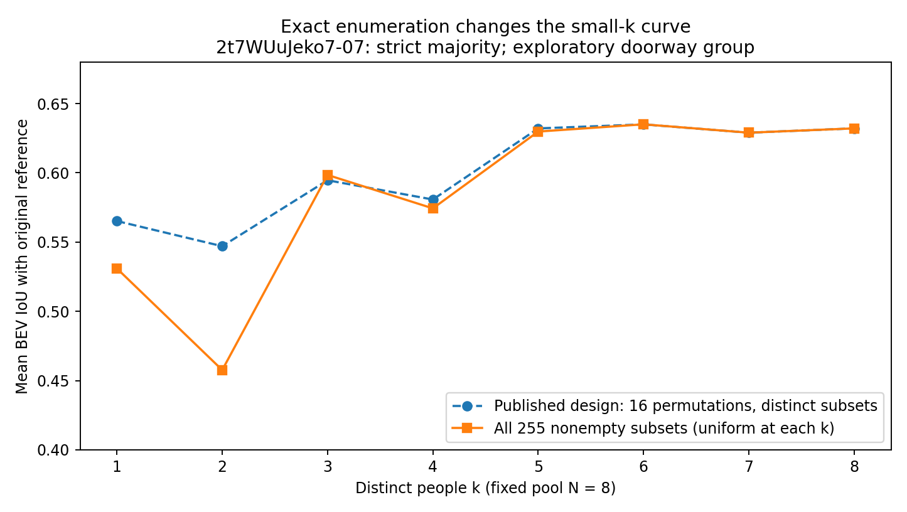
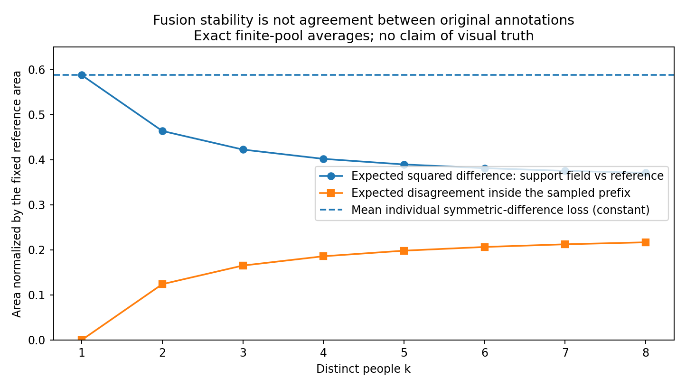

# Lee tile阶段1：独立研究与有限人员池核验

## 核心结论

当前方案可以暂定为“既定声明BEV足迹上的等权区域多数融合基线”，不宜宣布已验证了人员能力、图片难度或真实人群的收敛规律。已读源码没有显示GT参与投票、未来人员定义前缀分区或静默从k剔除失败作答；≥50%和>50%两个版本定义明确。

本轮最具体的新证据：固定16次排列不够稳定地估计某些小k均值。对2t7WUuJeko7-07全部8人的255个非空成员子集穷举，2人严格多数参考IoU的精确均值为0.457619，而源16次排列汇总为0.547016。差异约0.0894。这是抽样覆盖问题，不是投票公式错误，也不意味所有图都存在同幅度误差。

另一关键点：不同成员集的融合结果越接近，不代表原始作答越一致。全员时只有一个成员集，输出差异为0；8人组的原始支持场分歧仍为0.216666（以原始参考面积归一）。该图属难标门洞探索层，所以这不是“人员错误率”。

立即应做的是在相同BEV、相同人员和参考资格下，补足子集抽样精度，并解释融合输出的遗漏、外扩与原始投票分歧；无需先加入体积、人员类别或复杂局部路径。若只允许新增一类几何质量指标，底面边界差异应先于整体均高/体积。

## 1. 来源与实际执行边界

固定提交：b1ebab888fe8ac736548897f126a8bce7292c114。
主要来源为当前研究入口[S1]、投票和重放源码[S2]、复用的region_mesh[S3]、报告和summary.csv[S4]、验证记录[S5]与现行统计计划[S6]。

容器直连GitHub发生DNS失败，读取接口可用。未把完整输入下载到容器。本包精确摘录当前input.json中的一整组8份足迹与1份原始参考，以及对应16行摘要的共同字段。没有使用旧坐标反投影或重新预处理。

实际计算：原16个排列重放；全部255个非空子集×2方法=510个输出；2000批、每批16个排列的计算抽样波动；支持场恒等式与有限总体公式；3个简单区域融合成带孔洞区域的合成反例。9项针对性测试通过。

对应原摘要126个非缺失数值字段最大绝对差7.77e-16。Python 3.13.5、NumPy 2.3.5、Shapely 2.1.2、GEOS 3.13.1。本组没有产生原全量的97条警告，不能据此声称全部警告已解决或确定其版本原因。

未重跑12图全部177份候选、195份全记录或原仓库10项测试；未重做210份上游绑定或原图GT审核。其他11图的数字均来自源文件阅读，不是本轮独立全量复算。输入摘录亦不属于源文件逐字节认证。

## 2. 当前实现的数学对象

设人员足迹为P_j，k名当前成员S在位置x的支持率为 p_S(x)=k^{-1}Σ 1[x∈P_j]。当前两种输出分别为：

- MV50：C_S={x:p_S(x)≥1/2}；
- strict：C_S={x:p_S(x)>1/2}。

tile只是使每个小区域内部票数恒定的一种计算表达。在精确计算下，这与同一BEV域的逐位置多数投票相同。它不是角点投票，不会因为分得更细而自动获得新的独立证据。Lee等[1]定义了tile与至少50%的MV；其EM、greedy和最大簇预处理不等于当前代码都已实现，也不构成“多数必正确”的外部保证。

对任意候选区域C，平均个人对称差可写成：

J(C)=(1/k)Σ|C△P_j|=∫[p_S+(1−2p_S)1_C]dx。

逐点最小化给出1/2阈值，平票时两种选择都同样最优。因此当前方法有明确优化解释：它最小化对当前作答的平均面积对称差。它不是最大化GT-IoU，也不是最大化平均个人IoU。不能要求其人数曲线必然更接近GT。

同一成员集合的结果不依赖纳入顺序。随机排列改变的是中途出现的成员集合，不是检测先来者在心理上影响后来的标注者。

## 3. 源解释中的可靠部分与边界

源覆盖表195=177+18；所有177份当前候选足迹可计算。源码以independent、consensus_eligible及共识gate筛选，并在组内查重worker和id；同一人不会因点多或覆盖tile多成为同一tile上的多票。[S2,S4]

源验证记录报告5664条前缀、354条摘要、4354块全员tile，原运行97条RuntimeWarning；这些属于源作者的全量运行记录。本轮只独立核对其中一组。输入资格、相同成员缓存、无参考仍可融合、缺几何保持原k等逻辑是合理的。[S5]

当前报告承认原始单人均值并非全部单人的均值，p10/p90不是置信区间，全员差异为0有机械原因，也没有将OOS参考距离直接当作人员错误。这些限制应保留。

需要补强的不是“所有解释都错”，而是：16个排列是否足以支撑细小局部形状；原始作答分歧是否被最终融合掩盖；警告相关几何是否在跨环境/独立叠加复算下仍一致；参考适用性如何与共识资格分开。

## 4. 精确组合核验

| 方法/k | 实际可取子集 | 原抽到不同子集 | 原参考均值 | 穷举参考均值 |
|---|---:|---:|---:|---:|
| 任一方法/1 | 8 | 7 | 0.565178 | 0.530930 |
| MV50/2 | 28 | 14 | 0.610672 | 0.600128 |
| strict/2 | 28 | 14 | 0.547016 | 0.457619 |
| MV50/4 | 70 | 11 | 0.623555 | 0.622157 |
| MV50/8 | 1 | 1 | 0.625896 | 0.625896 |
| strict/8 | 1 | 1 | 0.632079 | 0.632079 |

原设计的不同子集等权均值并非天然有偏；在当前无失败的均匀抽样情形下，它具有对称的抽样解释。问题是有限16次造成的随机误差。2000批独立计算抽样中，strict/k=2均值的标准差约0.0420，MV50/k=2约0.0110。此为同一固定8人资料的计算波动，不是工人总体置信区间。

两人时MV50为并集，strict为交集。这是两个明确的平票损失选择，不能把一条偶数人数曲线更高解释成“这时多来的人更可靠”。奇数k两规则相同；保留奇偶完整曲线，不通过平滑或只选奇数掩盖差异。

建议k=1、N−1、N先全部枚举；N≤24时k=2、N−2最多各276个组合，亦适合直接精算。其余k按保存的均匀抽样规则加大独立批次，报告蒙特卡洛波动，而不固定16次后把很小起伏讲成规律。增加计算抽样不增加真实人数。

## 5. 三种变动必须分开

当前change_mean为同一排列相邻人数的融合区域差异；member_distance_mean为同人数、不同成员集合的融合区域差异。它们都不是原始个人作答之间的差异。

对固定N人，p_N是所有人的区域支持率。均匀无放回抽k人，在每个位置：

Var[p_k(x)] = (N−k)/(k(N−1)) × p_N(x)(1−p_N(x))。

这说明接近全员时，抽样输出必然受有限人员池压缩。不能把本式直接套到硬阈值IoU上，但它解释了为何高k的变小不能全算为发现了自然收敛。

可以保留原始票率，作一个无需新匹配的诊断。固定参考G、正归一化常数s（本轮s=|G|）：

B_N = ∫(p_N−1_G)^2 dx / s；
D_N = ∫p_N(1−p_N) dx / s。

严格恒等式：

(1/N)Σ |P_j△G|/s = B_N+D_N。

本组：0.587396902 = 0.370730719 + 0.216666183，误差2.22e-16。

B表示支持场对该参考的偏差，D表示原始作答的分歧；不是新真值后验，不是人员/图片方差分量，也不是都位于[0,1]的概率。

此外 E[B_k]=B_N+(N−k)/(k(N−1))D_N。本包对所有k实算验证。D_k在k=1必为0，存在小样本偏差，不能把随k增加的D_k直接当“越来越不确定”；平均原始两人对称差=2k/(k−1)D_k，对k≥2可作为有限池分歧的无偏比较量。此恒等式也与仓库旧region_mesh配套error_components的思想一致，不宣称新发明。

本轮全员MV50相对原始参考的遗漏面积/GT面积=0.148142、外扩面积/GT面积=0.361021。它们满足IoU=(1−遗漏)/(1+外扩)。两个方向帮助解释差在哪，但不是额外独立信息；不能把它们与IoU全部叠加重罚。

## 6. 两个源面板现象可以怎样说

源summary.csv显示7y3sRwLe3Va-12的MV50到24人时原始参考IoU=0.388328；源采样单人均值为0.494059。支持“本次抽样轨迹的参考一致性下降”，不支持“人数增加导致人变差”或“未来人群必下降”。它属于OOS探索层。

e9zR4mvMWw7-19的同一个24人MV50区域，原始参考IoU=0.469380，修订参考IoU=0.810395。同一输出被不同参考评价，不是融合算法在两条曲线上分别学习，也不能从较高分反推某一参考视觉正确。沿用已有审核结论，不增加max-over-reference。

## 7. 三个层面可以暂定到什么程度

连线/表示：暂定当前预处理坐标、既定上下配对、保存/默认环序所定义的BEV声明足迹。人工未审不自动无效；默认x不自动等同真实物理邻接。没有新原图证据时不换顺序追求更高GT-IoU。

融合：暂定等权≥50%和>50%的可复算区域基线。输出允许一般有效区域。3个包含相机且没有孔洞的简单合成多边形，其多数结果仍可出现孔洞；所以有效Shapely区域不保证能序列化为单一无孔的房间角点环。保留原始融合，不buffer修复或补墙。合理空间候选/三维恢复不是本阶段前置。

质量：暂定有效参考下BEV-IoU衡量范围交叠；特殊场景仅报告参考一致性。main_candidate是共识资格，不能直接代替人员主质量资格。原始和修订参考按既有政策独立保存；局部无法合理标注不能被机械解释成能力差。

## 8. 信息的用途与优先级

| 信息 | 主要问题 | 盲点或条件 |
|---|---|---|
| BEV IoU、遗漏/外扩 | 完整声明范围怎样交叠 | 小细节被面积稀释、没有高度 |
| 面积质心 | 整体位置分布怎样移动 | 对称改变可零移动；不是角点均值 |
| BEV边界距离/容差覆盖 | 墙线哪里偏、哪里缺 | 最近边不保证语义对应；需弧长权重 |
| 上/下轮廓分项 | 底面和墙顶投影分别怎样偏 | 遮挡/范围选择与点击误差仍混合 |
| 墙面/法向 | 局部三维方向与位置关系 | 真正跨墙比较需对应或明确无对应定义 |
| 局部墙高 | 墙顶在何处高低不同 | 由top、bottom与共同地面推导，误差相关 |
| 模型体积 | 底面和给定高度模型联合交叠 | 不能代表未知屋顶；同高时退化为BEV |
| 几何残差 | 对某个结构模型是否自洽 | 不是GT误差；被强制满足的约束不能算证据 |

下一项新增几何质量分项优先BEV边界：能直接评单人和当前tile输出，不需补高度/屋顶；可检验面积是否漏掉重要局部差异。选择双向弧长距离均值及覆盖曲线，最大值给数值采样误差界，不把有限采样max命名成精确Hausdorff。Boundary IoU[2]支持关注边界的价值，但其带宽不是本任务现成标准。

上/下轮廓在以后研究单人定位时有价值，不能立刻用于纯BEV融合输出，因为该输出没有被定义的天花高度。强行加3D会同时引入顶面重建、局部匹配和正则化变量。

## 9. 三个连续目标

目标一：可信地描述固定BEV的质量与分歧。对当前12图补足子集抽样覆盖，保留两种平票；同一输出增加遗漏/外扩、原始支持场和必要的底面边界诊断。参考资格和已有特殊场景分层不改变。完成后选择一个新增质量分项，不学习总分权重。

目标二：在参考适用、人员交叉充分的更多图片上估计人员与图片平均影响。用共同图片或交叉模型，不用每人任意图片均值直接分级。Manual/Semi不混成一种人员类型；输入经人工解释后的质量也不自动等于完全未经帮助的原始能力。先连续画像、外建筑复测稳定性，再考虑类别。不要直接跳到很多worker×risk随机斜率。

目标三：固定画像定义后做真实成员组合。固定k研究类型比例，固定比例改变成员，随后再改变k；不用目标图得分反向选人，不复制真人凑配比。简单/困难采用事先已有人工粗分先作对照，d_model_feat和BiLayout差异分别检查增量；不一次放入复杂联合模型。按共同图片面板和可用k比较，不能把高k只剩高人数图的均值变化当人数效果。n=1图没有增长曲线。

已有图片分组若基于同一批作答的分歧，则与曲线的对应只能是描述，不是独立预测成功。d_model_feat是相对参考库距离，BiLayout双头是同一模型的两种政策输出，不是难度真值和两名独立投票者。

## 10. 最值得立即推进的一小步

将目标一落实为一次固定BEV、固定人员、固定参考政策的重放补强：全单人/小组合精算、其余k量化抽样误差，同时把每个既有融合区域的遗漏/外扩与原始投票分歧画出来。重点查已出现的下降曲线、参考版本反转及偶数起伏。可以在没有原图时完成数值部分；只有解释某条边为何应标、某个局部是否能合理标时，才调用原图和现有审核，不重建整套GT裁决。

这个小步完成后，新增质量维度优先底面边界，而不是模型体积。它延续当前固定表示，最少引入新假设，同时直接服务人员与图片的测量。

## 文献及材料

[S1] https://github.com/Sparkling-Flames/3D_Manhattan_label/blob/b1ebab888fe8ac736548897f126a8bce7292c114/research/lee_tile_stage1_20261002/README.md
[S2] https://github.com/Sparkling-Flames/3D_Manhattan_label/blob/b1ebab888fe8ac736548897f126a8bce7292c114/tools/thesis_main/analysis/lee_tile_stage1_20261002.py
[S3] https://github.com/Sparkling-Flames/3D_Manhattan_label/blob/b1ebab888fe8ac736548897f126a8bce7292c114/tools/thesis_main/analysis/audit_supervisor_gt_sensitivity_20260922.py
[S4] https://github.com/Sparkling-Flames/3D_Manhattan_label/tree/b1ebab888fe8ac736548897f126a8bce7292c114/analysis_results/lee_tile_stage1_20261002
[S5] https://github.com/Sparkling-Flames/3D_Manhattan_label/blob/b1ebab888fe8ac736548897f126a8bce7292c114/research/lee_tile_stage1_20261002/VALIDATION.md
[S6] https://github.com/Sparkling-Flames/3D_Manhattan_label/blob/b1ebab888fe8ac736548897f126a8bce7292c114/docs/thesis_main/STATISTICAL_ANALYSIS_PLAN_v1.md

[1] Doris Jung-Lin Lee, Akash Das Sarma, Aditya Parameswaran. 2018. Aggregating Crowdsourced Image Segmentations. HCOMP Works-in-Progress and Demonstration Papers, CEUR Workshop Proceedings 2173. https://ceur-ws.org/Vol-2173/paper10.pdf

[2] Bowen Cheng, Ross Girshick, Piotr Dollár, Alexander C. Berg, Alexander Kirillov. 2021. Boundary IoU: Improving Object-Centric Image Segmentation Evaluation. CVPR. https://arxiv.org/pdf/2103.16562

[3] Lena Maier-Hein, Annika Reinke, Patrick Godau, et al. 2024. Metrics reloaded: recommendations for image analysis validation. Nature Methods 21:195–212. DOI 10.1038/s41592-023-02151-z. https://www.nature.com/articles/s41592-023-02151-z.pdf

[4] Yu-Ju Tsai, Jin-Cheng Jhang, Jingjing Zheng, Wei Wang, Albert Y. C. Chen, Min Sun, Cheng-Hao Kuo, Ming-Hsuan Yang. 2024. No More Ambiguity in 360° Room Layout via Bi-Layout Estimation. CVPR 28056–28065. https://arxiv.org/pdf/2404.09993

[5] Peter Welinder et al. 2010. The Multidimensional Wisdom of Crowds. Advances in Neural Information Processing Systems 23. https://papers.nips.cc/paper_files/paper/2010/file/0f9cafd014db7a619ddb4276af0d692c-Paper.pdf

文献读取：本轮读取Lee PDF解析正文及其他作者/出版方页面；Lee截图服务失败，未根据无法呈现的图表判断视觉内容。后四篇用于方法背景和公开摘要所支持的说明，不宣称在本轮运行其原算法。
