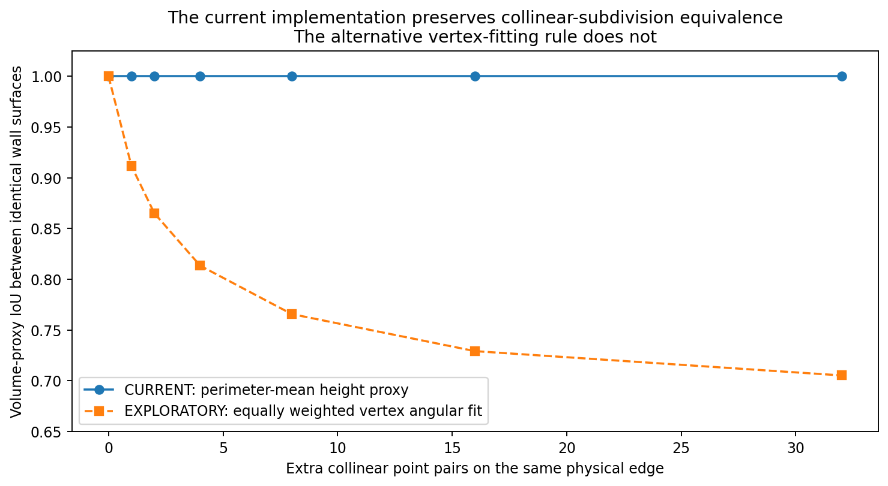
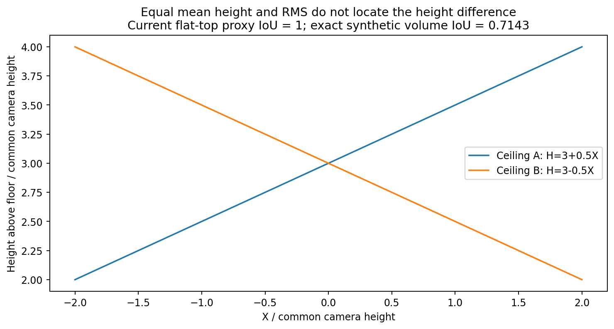
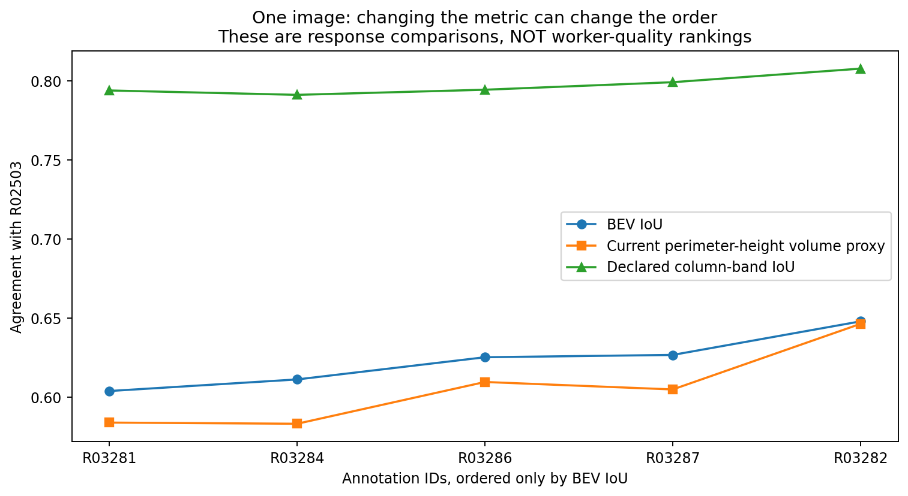

# 全景 layout 标注质量衡量：独立研究

## 结论

建议以“固定参考下的BEV范围一致性”为主终点，配合不依赖角点身份的边界差异与分开的上/下投影轮廓差异；墙高偏差、墙高起伏及方向残差作为解释和模型适用性诊断。当前水平顶面模型体积可以保留为条件性辅助终点，但尚不适合作为人员质量的唯一标尺。不把这些高度相关的量未经校准地相加为通用总分。

三维有价值，但价值在于改变测量对象、恢复物理环序和表达空间后果，不在于从同一组二维坐标凭空获得额外独立观测。局部匹配不是开展当前范围质量研究的前置门槛。

## 1. 实际执行与来源

固定提交为 `bba3dc7c9a79b8342ecb4ce2487affe41886eb56`。读取了当前交接说明、3D源码和报告以及dot对前一轮Pro的独立审核。容器下载遇到DNS失败，完整目录未落地，未执行原仓库全量验证器；没有原图、没有GT重裁、没有重新配对/预处理或回退原坐标。

本包在一张图 `2t7WUuJeko7-07` 的数值摘录上使用6份当前摘要可核对的作答及1份原始GT，执行6个BEV比较、5个列式墙带比较。35个共同数值字段与另读当前CSV在相对1e-9、绝对1e-10容差内一致；最大数值差约8.9e-15。这里只证明共同定义与选中字段相符，不是完整输入和身份绑定验证。

另外执行7个共线细分参数对照、相反斜顶与上下误差耦合2个结构模型反例、2个半像素深度敏感性对照，以及6个真实几何衍生细分对照，共17组。它们不等于17个独立真实样本，也不是仓库17组改序实验。8项本地针对性计算检查通过。所有结果都在results目录，复算入口为reproduce.py。

当前源报告的195份作答、390个参考版本行、117个缺参考行、182个原始GT可比作答及17个改序对照，是本次读取的已有结果，不冒充重新运行。该报告区分134份人工确认、48份默认共享x排序、13份不可用。默认未审不自动变成质量失败。

输入摘录中的人员身份与当前CSV在R03288处有别名差异，完整源绑定未核清。因此本包不按人员别名合并、不估计人员效应、不发布人员排名。选样是传输可得性选样，不具有代表性。

## 2. 对已有材料的独立判断

当前实现已经改用周长积分墙高，不再采用顶点中位数；也没有进行本报告另试的顶点等权角度拟合。它保留默认环的计算资格，单独记录投影失败，把模型体积与真实实体体积分开。这些改变合理，不能把历史缺陷重新归给当前实现。

dot审核支持前一轮数值的可重复性，同时指出局部路径方向、均值/覆盖的节点密度和并列映射计数问题。它没有证明局部路径B优于简单基线。本轮不直接接入那一套有已知缺口的局部实现，也不把质量主线移成交点配准或空间候选搜索。

当前195作答报告中，人工确认层自身轴RMS中位数约7.017°，默认环层约1.967°；但默认环层BEV与模型体积的一致性中位数更低。两层不是随机分组，不能据此判谁更好，但它提醒：低正交残差不是参考一致性的替代物。

17个改序例在固定最终坐标下均提高GT-BEV，是已有定向样本的结果；不证明所有改序必改善，更不证明人工确认标签可作为人员能力分组。既定配对和人工环序处理后的质量，衡量的是“按当前解释流程得到的提交”，不能追溯为未经人工处理的原始作答能力。

## 3. 三维到底增加了什么

使用当前连续坐标、共同相机高度h=1，底点俯角α、顶点仰角β、方位u对应：

`r=cot(α)`

`F=(r sin u, -r cos u)`

`H=1+r tan(β)`

保存环序决定足迹边以及墙顶线性插值。三维由相同坐标和假设决定：它允许衡量完整足迹、墙的方向和高度，同时会放大近地平线的角误差。它不是新的深度测量，也不能从单圈墙顶唯一确定内部屋顶。

水平地面、竖直墙面和共享x在流程中已被施加或预处理保证，所以它们的零残差不能作为人员高质量证据。真实调平、地面层级和中心投影的适用性仍未被本包照片验证。

### 上下误差不能当独立质量通道累加

`∂r/∂α=-csc²(α)`；`∂H/∂α=-csc²(α) tan(β)`；`∂H/∂β=r sec²(β)`。

只改变bottom，也会改变底面范围与推导墙高。把BEV差、墙高差、top三维误差各罚一次，并不代表找到了三类独立错误。需要分别报告图像/角度差异与空间后果，或在有独立定位误差估计后通过共同Jacobian传播协方差；不能从本图全部分歧反推“纯点击噪声”。

受控例中保持所有top像素不变，把水平距离乘1.25，基准高度2.7变为3.125：BEV IoU=0.64，当前模型体积IoU=0.55296。更低的体积数值是同一变化的三维后果，不是额外一次top点击错误。

同一底点向地平线移动0.5原域像素，半宽2h房间的单点位移约0.027853h，半宽32h房间约7.299778h。两者是不同尺度合成房间，不能当作两位真实人员的能力比较。

## 4. 当前体积模型：合理代理，但不是充分质量指标

当前墙高均值为：

`Hbar = sum_i length_i*(H_i+H_(i+1))/2 / sum_i length_i`。

它对同一三维直线边的共线细分不变。本轮0、1、2、4、8、16、32个插点的全部对照，以及两份真实几何各3种插点对照，BEV、列式墙带和当前模型体积均保持等价，数值误差在浮点范围。

图中下降曲线是本报告探索性“顶点等权角度拟合”，不是当前算法。其均高从约2.364升至3.352，导致相同几何的体积代理IoU降到0.705；不建议用它替换当前周长定义。过程中曾误把它归给当前源码，最终已纠正。

对两棱柱足迹面积A、B、交集I和高度Ha、Hb：

`IoU_volume = I*min(Ha,Hb) / (A*Ha+B*Hb-I*min(Ha,Hb))`。

设Ha≤Hb，分母除以Ha即可得到该值不高于 `I/(A+B-I)`。因此当前模型体积不高于BEV是数学结构，不是指标有效性的实验证明。高度相同则退化为BEV。

### 均高和起伏丢掉高度发生的位置

同一4×4底面，两顶面 `HA(X)=3+0.5X` 与 `HB(X)=3-0.5X` 的周长均高都为3，起伏RMS相同，底面/方向相同。因此当前模型体积IoU=1。但明确给定这两张合成平面后，真实体积各48，交集40、并集56，真实体积IoU=5/7≈0.714286。

新增的固定坐标最近边界墙高差在该例中约1.633h，列式墙带IoU约0.721。它们发现了高度的空间排列差异。这是模型能力边界反例，不说明真实参考属于斜顶，也不授权为真实数据任意封顶。

当前周长均高不是任意屋顶的面积平均高度。即便屋顶已知为一个斜平面，周长均值乘足迹面积也不总等于真实体积；两者分别取决于边界质心与面积质心。当前数据通常并未定义内部屋顶，因此不宜升级为精确3D IoU。

## 5. 同图实际比较

本表是独立计算的响应—原始参考一致性，不是人员排序。原始参考环状态仍保留未确认。该图属于已有doorway difficult层，quality_candidate为false，本轮没有恢复主分析资格。

|记录|BEV IoU|列式墙带 IoU|当前模型体积 IoU|新增配准墙高差/h|
|---|---:|---:|---:|---:|
|R03286|0.625075|0.794373|0.609418|0.064746|
|R03281|0.603697|0.793911|0.583718|0.090686|
|R03287|0.626540|0.799140|0.604696|0.095910|
|R03284|0.611031|0.791133|0.582986|0.133720|
|R03282|0.647781|0.807727|0.646215|0.023994|
|R03288|0.291193|不可用：相机在足迹外|0.261036|0.398190|

R03286与R03287在BEV和体积中次序相反；R03281与R03284也是如此。5份可列式比较作答产生10个人员作答对，当前体积相对BEV有2个次序反转，列式相对BEV有1个。它们不是独立样本或显著性证据。没有原图独立判断，不能宣布哪次反转更正确；它们是下一步效度核查的候选。

R03288的BEV可定义，但整圈内部墙带不适用。不能将该表示失败直接赋质量0；也不能将其静默删除后只展示成功者。其现有场景和资格状态继续保留。

## 6. 建议的质量测量方案

### 主终点：固定GT的声明范围一致性

`Q_range(A,G)=IoU_BEV(P_A,P_G)`。

它与用户关心的整体范围、隐藏声明空间及后续Lee式区域融合有直接关系。采用原保存环、共同朝向和高度尺度，不单独对齐每份标注以提高分数。默认未审环是当前声明对象，额外携带来源不确定性，但不是自动无效。

补充方向性范围量：`I/|A|`和`I/|G|`，以及新增/缺失面积。前者偏低说明相对该参考包含更多额外范围，后者偏低说明参考覆盖不足；这是集合关系，不直接命名为有意扩展或错误遗漏。IoU与覆盖有代数依赖，不重复加权。

### 关键副终点：边界和上/下轮廓差异

对边界按物理弧长求均值，并保留双向距离和尾部。可报告超过容差δ的弧长比例曲线：

`C_delta(A→G)= integral_boundaryA 1[dist(x,boundaryG)<=delta] ds / length(boundaryA)`。

不能把保留原点的密集采样直接平均成几何比例；原点保存身份，积分权重保存测度。δ可先比较0.01、0.02、0.05、0.1h作为敏感性，不称其为经验证的可接受误差。Boundary IoU是可比较替代思路，但其带宽同样要按任务标定，不直接移植自然图像中的百分比。

对当前可定义的列式上/下轮廓分别报告角度或原域像素差，不把角点数量相同当成对应关系。轮廓误差可能包含范围、邻接、遮挡选择变化，不自动称为纯定位噪声。列式方法不包括未知家具/屋顶遮挡，也不能描述隐藏墙的全部几何。

### 三维辅助诊断：高度偏差、空间高度差和自洽性

保留当前周长均高差、墙高RMS与最大偏差。新增的配准墙高差：在固定世界坐标中把源边界位置投影到目标最近边界，然后比较线性插值高度，双向弧长平均。本包用于证明均高盲点和小例诊断，不视为已建立真实墙对应；近邻多墙可匹错，需返回距离和局部适用标记。不能单独使用该量，因为等高但位置错误的墙也会得到零高度差。

自身最佳轴残差与相对固定参考轴残差均保留，但它们分别测自洽和方向差。共同轴、短边误差传播和几何模型的适用性都应说明。不拟合后再用零残差为原作答评分，不把底面水平和墙面竖直的强制满足计为成功。

当前模型体积保留为条件性辅助结果，始终同时显示高度模型适合程度，不负责将所有维度重新合成一个分数。判断模型适用性所需阈值尚未校准，不能以一个随意5px/5°门槛筛出有利样本。

## 7. 从单份比较到人员和图片效应

先固定每一种终点的含义，再各自建立人员/图片交叉模型。例如对某个质量损失：

`loss_wi = mu + worker_w + image_i + condition_wi + error_wi`。

完整数据提供重叠任务时可以估计条件平均差异；本包小摘录不能估计。只有连通还不足以保证复杂人员×难度随机斜率精确；没有同人同图重复，交互与瞬时随机误差不能无假设拆开。图像效应首先是在指定人员池、条件和参考政策下的效应，不等于图片永恒难度。

不能用每人所标不同图片的平均IoU直接分级。应按共同图片分布标准化或在交叉模型中调整，并报告不确定性。人员类型应来自训练建筑的连续特征及其可重复性，不用目标图的最终融合是否接近GT反向定义高质量人员。图像难度分类也不能用待检验的同一条人数曲线定义后，再宣称两类曲线显著不同。

范围/细节审核信息用于解释和分层，不自动抹去差异，也不将未记录当阴性。所有可测记录保留，正式、OOS/doorway探索及其他受限层沿用既有资格分开，失败及分母明确。

现有人工GT审核继续沿用；原始和修订版本不按分数择优。不把多个参考择最大作为本轮新的质量定义。GT距离叫参考一致性；是否能解释为人员错误，仍依赖任务要求和允许信息。Bi-Layout支持政策歧义存在，但不证明每份偏离GT的作答均合理。

## 8. 与Lee融合路线衔接

Lee的tile是在多人区域叠加后形成的最小不重叠单元，MV是对tile的选择规则。相同投票域与阈值下，tile MV与逐像素MV等价。借鉴该路线不要求先生成合法空间候选，也不必把最大簇之外的人一律删除。

建议明确选择融合域。BEV区域融合可以直接用同一BEV-GT指标评价单人和融合结果；ERP墙带融合只能直接评价投影结果，不能在没有合法恢复步骤时为其强算BEV或3D体积。融合区域即使有多个分量，也可以作为区域测交并比，但不冒称已形成一个可交付房间；原融合与几何恢复结果分开。

后续每个k使用同一批图片、同一参考政策、同一可计算性规则，分别展示准确性、成员变化造成的不确定性、少数表达覆盖。不是保证人数增加后单调改善，也不是仅靠更平滑的曲线宣布收敛。

## 9. 下一步只做一项小实验

在当前12图全部作答内，开展“固定GT下的指标冲突盲评”：每图抽2个作答对，约24对，一部分是BEV/高度/边界指标排序相反的冲突对，一部分是排序一致对照。抽样规则、随机种子、现有GT版本和场景分层先保存。

两位审核者只看原照片、当前保存环和既定参考，隐藏人员身份、指标值、排序层；分别判断整体范围、必要局部墙体及上下定位哪个更偏离既定任务目标，允许难以判断。没有重新建立全部GT，发现现有参考状态冲突则标不可判断，不为算法修参考。

比较主BEV终点、BEV加边界/上下分项、体积代理是否分别遗漏重要偏差。多指标方案的目标是识别单指标盲点，不要求产生一个强制总体排序。定向抽取的冲突对不能估计总体准确率；这是测量效度试验，不是人员显著性研究。该试验通过前不冻结总权重或正式人员分类。

## 参考文献

1. Lena Maier-Hein, Annika Reinke, Patrick Godau, et al. (2024). Metrics reloaded: recommendations for image analysis validation. Nature Methods, 21:195–212. DOI:10.1038/s41592-023-02151-z. 官方页面：https://www.nature.com/articles/s41592-023-02151-z （含PDF入口）。借鉴任务相关、互补指标，不声称是layout行业标准。
2. Cheng Sun, Chi-Wei Hsiao, Min Sun, Hwann-Tzong Chen (2019). HorizonNet: Learning Room Layout With 1D Representation and Pano Stretch Data Augmentation. CVPR, 1047–1056. 作者PDF：https://arxiv.org/pdf/1901.03861 。借鉴逐列上/下边界表示，不把完整可见性假设自动移植到本包。
3. Bowen Cheng, Ross Girshick, Piotr Dollár, Alexander C. Berg, Alexander Kirillov (2021). Boundary IoU: Improving Object-Centric Image Segmentation Evaluation. CVPR, 15334–15342. 作者PDF：https://arxiv.org/pdf/2103.16562 。它是待比较的边界评价思路，本包未运行原Boundary IoU实现。
4. Yu-Ju Tsai, Jin-Cheng Jhang, Jingjing Zheng, Wei Wang, Albert Y. C. Chen, Min Sun, Cheng-Hao Kuo, Ming-Hsuan Yang (2024). No More Ambiguity in 360° Room Layout via Bi-Layout Estimation. CVPR, 28056–28065. 作者PDF：https://arxiv.org/pdf/2404.09993 。借鉴政策歧义与参考一致性的区别，不采纳事后挑高分参考。
5. Doris Jung-Lin Lee, Akash Das Sarma, Aditya Parameswaran (2018). Aggregating Crowdsourced Image Segmentations. HCOMP Works-in-Progress and Demonstrations, CEUR Workshop Proceedings 2173. 官方PDF：https://ceur-ws.org/Vol-2173/paper10.pdf 。本次读取了正文；PDF截图服务报错，未声称核验其图表。
6. Peter Welinder, Steve Branson, Pietro Perona, Serge J. Belongie (2010). The Multidimensional Wisdom of Crowds. Advances in Neural Information Processing Systems 23. 会议官方作者顺序据官方元数据；PDF：https://papers.nips.cc/paper_files/paper/2010/file/0f9cafd014db7a619ddb4276af0d692c-Paper.pdf 。支持人员与图像属性分开建模的方向，不证明当前小面板足以识别全部效应。
