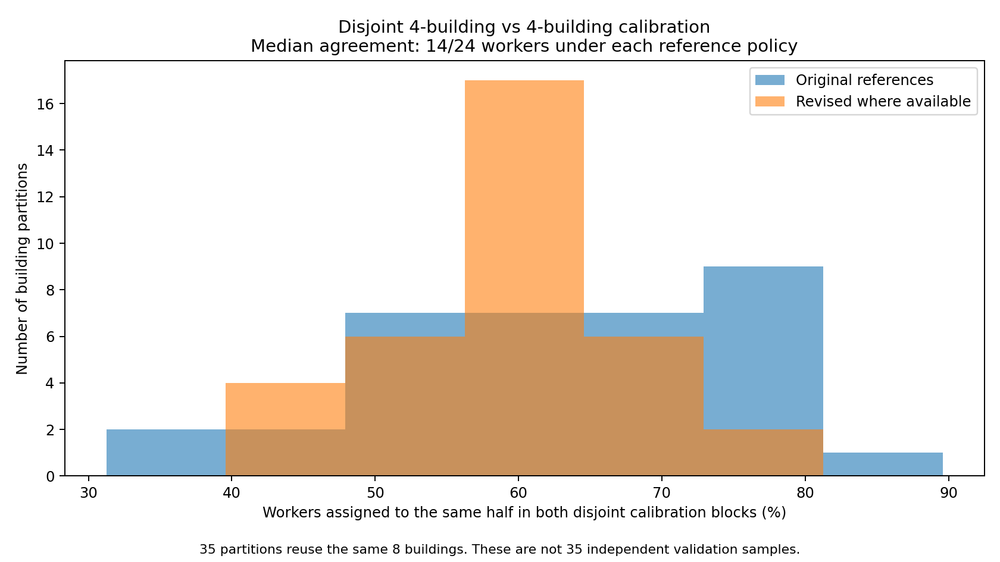
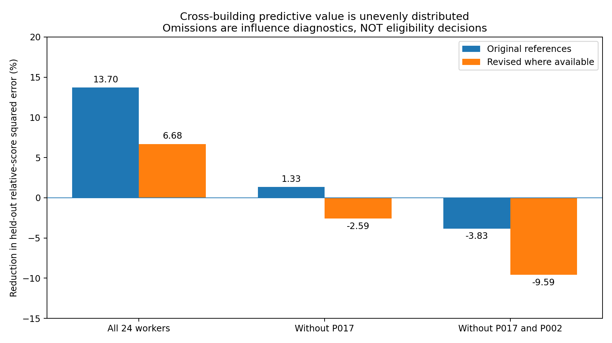
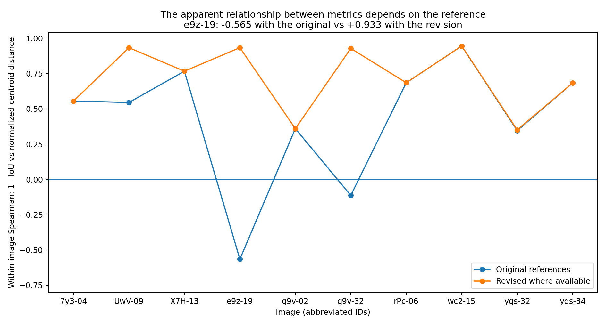
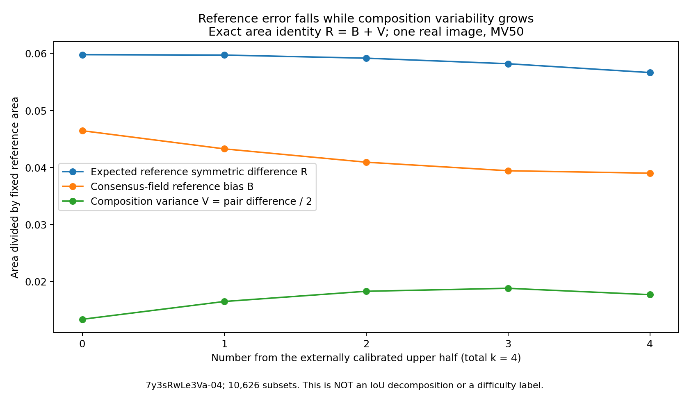

# 图片、人员与共识：独立研究结果

研究日期：2026-10-03。固定仓库：`Sparkling-Flames/3D_Manhattan_label`，提交`405f3041fdd76977f625d50c558c63dbf342699d`。

## 核心判断

当前证据支持“部分人员有可重复的跨图参考一致性差异”，但不支持把当前上/下半直接固定为两种自然、可推广的人员类型。人员分组的可重复性、均值质量增益、具体成员的几何波动是三个不同目标。

固定BEV、既有顺序和等权tile投票可以继续作为基线。真正需要优先补强的不是另一个复杂分类器或3D总分，而是校准信息的可重复性、少数人员的影响以及同一背景下替换成员的作用。质心保留诊断价值，但本轮没有证据支持给它固定正权重。

“更接近GT但组合波动更大”并不矛盾。本轮推导并实算了面积损失的精确分解，还提供了适用于任意可行人数配比的有限池超几何计算核。它可以低成本推进人数×构成研究；它不生成新真人，不等于未来人群预测，也不把面积期望比冒充平均IoU。

## 1. 来源、输入与执行边界

当前README、A线136图报告、B线24人×10图报告、推进台账、人员校准和组合源码已阅读。来源完整链接见`SOURCE_MAP.json`。当前记录、确认环与共享x默认环都作为输入，不回退原始坐标或再次预处理。

执行容器不能解析GitHub下载域名，完整目录没有传入；GitHub阅读接口可用。四个完整数值矩阵被恢复为原字节，包含UTF-8 BOM，与GitHub返回的Git blob SHA1一致。因此，以下10图人员分析确实使用全部240格，而不是几份代表作答。数值输入分别是原参考和“4图有修订则使用修订、其余6图原参考”下的IoU和标准化面积质心距离。

另外，从当前`input.json`摘录了`7y3sRwLe3Va-04`完整24人候选足迹和原始参考。该图源记录还包括2份历史未纳入对象，本数值摘录没有恢复它们。所有用于计算的足迹保持保存值与环序；没有重新投影、配对、拟合、修复或删除点。它是一个当前声明几何的核验例，难度标签是“未记录”，不因得分高而称为简单。

实际完成：

| 项目 | 本轮范围 |
|---|---|
| 人员数据 | 两种参考政策×完整10图×24人，另有对应质心矩阵 |
| 校准与稳健性 | LOBO；全部35种无序4+4建筑划分；全部留一人员影响；校准建筑bootstrap；身份置换诊断 |
| 几何与组合 | 一图24人，10,626个四人集合×两种规则，共21,252个输出分数 |
| 源摘要核对 | 30个组合字段最大差5.55×10⁻¹⁶；6个当前子集重新切tile与共同细分对照 |
| 新人数/构成计算 | 一图全部336个可行人数配比×规则状态的解析面积量 |
| 配对替换示范 | 一图两规则各276对人员，每对保持其余3人相同的1540个背景 |
| 本轮测试 | 12项针对性测试通过 |

未完成：A线136图全部重放、B线其余9图重新生成融合几何、完整源包逐记录重新绑定、原仓库23项测试全重跑、原图视觉检查及独立外部样本验证。源报告中全量结果以下均明确归于仓库已有结果。

## 2. 当前实现与报告哪些可保留

### 2.1 计算定义基本清楚

当前校准函数先隔离整个目标建筑，再用其他建筑图片的平均IoU分上/下半；目标GT只进入评价。切点并列时拒绝任意按人员ID切开。当前B线从共同24人×10图出发，避免了每人领取不同图片组合的明显混杂。

全员tile只作为离线积分的共同细分基底。当前子集的投票只读取子集成员；GT只决定参考交集。对纯等权区域阈值和面积积分，这种细分不是使用未来票数修改当前输出，不宜重新判为泄漏。

四人组合数495、2640、4356、2640、495以及SD、两次独立抽组的期望区域对称差定义均合理。同构成集合等权、构成间分开报告，避免组合数量较多的2+2自动主导总结。12+12硬分组是研究设定，不是自然类别数的发现。

Lee等人的原论文支持tile和至少50%多数基线，但其物体分割结果不能证明多数全景范围更正确。本轮也不声称复现了Lee全文的EM、greedy或最大簇方案。[1]

### 2.2 A线已经修复旧16排列精度问题

仓库当前A线不是上一轮16排列：小组与两端人数精算，其余使用16384个排列，并对1978个MC均值给出95%同时计算界约±0.018553。不能继续沿用“只有16次，所以全部曲线不可靠”的旧批评。

源报告中136图全员与单人均值均为精算：MV50的113图上升、22图下降、1图不变，是当前固定池的可靠描述。它不是错误人员比例，也不是保证增加人数必改善。

固定33图8到20人增益点估计约0.00372，源报告保守差值计算界约±0.03148，确实不足以宣称平台或8人足够。但是，这个界很保守；它没有证明真实计算方差一定很大。后续应直接利用同一排列下的配对差估算计算不确定性，而不是仅把两个单点最坏界相加后停止研究。

A线中等难度在较长人数窗集中于同一建筑，B线9/10图缺明确难度，图片池和人员池也不同。现阶段可以描述粗对应，不能宣布“困难图更依赖上半人员”已经验证。

## 3. 人员区分：存在信号，不等于稳定二分类

### 3.1 先核对原报告

本轮复现原参考下8人始终上半、7人始终下半、9人换组；两种参考校准政策导致192个人员×留出折中22次组别变化；λ网格0、0.25、0.5、1、2对应最大名次变化0、5、6、10、14。

这支持原报告的敏感性描述，但LOBO的八个训练集共享绝大多数图片。“八折始终上半”主要说明删除一栋建筑时较稳，不等价于在相互独立材料上重测稳定。交叉验证折间相关不能按独立实验处理；Bengio与Grandvalet讨论了这种相关造成的方差估计问题。[2]

在本完全矩形块中，每个人减去相同的同图全员均值，再跨图平均，只是对所有人的均值减去同一个常数。因此，图内中心化不会改变这个块的人员平均排名；它有助于描述相对误差，却不是新增一种排名去混杂证据。

### 3.2 新检验：互不重叠的4栋建筑对4栋建筑

穷尽8栋建筑的35种无序平分。在每边独立用该边4栋的全部图片计算人员均值，再各自分12人上/下半。训练材料互不重叠，但每边只有4—6图，比原LOBO校准量少，因此这是小校准量下的可重复性压力试验，不是原LOBO预测误差的替代估计。

| 政策 | 两半人员排名相关中位数 | 同一人员落在相同半组的比例中位数 |
|---|---:|---:|
| 原参考 | 0.4817 | 14/24＝58.3% |
| 有修订时使用修订 | 0.3342 | 14/24＝58.3% |

原参考35种划分的相关范围−0.0244至0.6513。跨全部70种四建筑校准集，原参考下只有P017一直上半、P005和P027一直下半。修订政策下P017一直上半，P005/P024/P027一直下半。

每种政策有一组划分遇到半组切点并列。本轮不按人员ID切分，而保留所有允许半组，并输出一致比例的上下界和等权均值。35种划分共享同一小面板，不是35个独立验证实验。结果说明明确的相对等级信号与脆弱的中间分界可以共存。

### 3.3 新检验：跨建筑预测信号是否集中在少数人员

令Y_iw为固定参考IoU，r_iw=Y_iw−同图人员均值。目标建筑b的预测是其他建筑上的平均r。定义：

S = 1 − Σ(r_iw−预测r_iw)² / Σr_iw²。

S>0表示比“所有人员在目标图没有相对差别”的零预测更好；不是IoU提高的百分点，也不直接预测未知图片的绝对均值。目标图均值用于定义评价对象，不进入训练画像。

| 参与比较的人员 | 原参考S | 有修订时使用修订S |
|---|---:|---:|
| 全24人 | 13.70% | 6.68% |
| 暂不计P017的影响分析 | 1.33% | −2.59% |
| 暂不计P017与P002 | −3.83% | −9.59% |

报告附有全部24种留一人员结果，不只挑这两人。P017与P002是观察后识别的高影响对象，双人排除是探索性压力试验，不能作为预注册假设检验。不同排除情形重新定义了剩余人员的同图基线；数值不能解读为P017“贡献了12.37%因果解释力”。

该结果支持更谨慎的结论：当前跨图可预测差异明显受少数高参考一致性人员支撑；剩余人群的平均相对预测收益较弱，尚不足以稳定分档。它不支持删除强人员，也不证明所有其他人能力相同。

另外，按建筑一致置换人员身份的20000次诊断显示，实际跨建筑人员信号比随机对应强。置换只是在选定八建筑及标签可交换假设下的检查；身份和误差依赖问题未解决前，不能用极小置换尾部比例替代真实独立验证。

### 3.4 一个需要优先回查来源的证据

本轮单图原样24份候选仅有19种不同保存足迹。相同组为：

- P002/P012；
- P003/P008/P009；
- P006/P014；
- P010/P011。

当前JSON中若干组的上下坐标也逐值相同。它们仍都被标为manual、independent=true，borrowed_points=false。source_binding记录的是与S2和当前bundle逐值对应，不能额外证明这些来源在生成过程上相互独立。

在完整矩阵中，P002/P012有7/10图同时IoU和质心指标相同；这些多图指标相等仅是进一步查核线索，不能未经坐标核对就说7/10图几何完全一样。

可能原因包括共享初始化、引用/版本绑定、复制数据路径或真实相同提交。当前证据不能裁定是哪一种，更不能判抄袭或自动合并票数。本包仍按当前资格保留24票。固定记录池的穷举结果依然成立；向“独立新人员”推广时，则需要额外的来源与依赖说明。建议先核对原始提交ID、人员键、版本、预填几何和实际提交差异，不需要改原数据。

## 4. 质量分项：低相关并不证明质心有必要增量

### 4.1 数值公式没有发现根本错误

当前质心为BEV区域面积质心，距离除以√参考面积；它不是角点均值。没有在本轮融合中使用Dλ，也没有按目标GT选择λ。可继续保留原值、标准化值和dx/dz作诊断。

### 4.2 新结果：指标关系强烈依赖参考版本

| 量 | 原参考 | 有修订时使用修订 |
|---|---:|---:|
| 24人人均(1−IoU)与人均标准化质心差的Spearman | 0.3226 | 0.8026 |
| e9z…-19图内24人的相同相关 | −0.5650 | +0.9330 |

因此，原先不一致的人员排序，有一部分与参考位置/范围有关，并不能直接解释为两个有效且独立的能力轴。修订参考也不是由本轮数值证明更真实；两种政策继续按原审核状态分开。

原参考下UwV…-09、e9z…-19、rPc…-06三图贡献了全部标准化质心距离总量的74.8%。等权图片平均并不意味着每张图对人员排名的数值拉动相等。一两种范围冲突可能主导这个均值。

例：UwV…-09中P001的IoU为0.5244、质心差0.00294，而P017的IoU为0.8057、质心差0.15560。小质心差不能自动成为更好布局证据，它可能来自相互抵消。这里需要对照既有参考看图说明误差结构，不重新以某个分数裁决GT。

### 4.3 建议的测量职责

IoU作为固定参考的范围一致性主轴保留，遗漏/外扩面积分开解释其来源。质心作为一阶位置分布诊断，不加入缺乏效度依据的默认总分。质量总分的选择不能由低相关、排名变化或显著性决定。Metrics Reloaded强调根据任务目的、目标结构和输出形式选择指标，其建议不能被当成现成layout权重。[3]

若增加一个分项，底面边界更容易接入当前单人和tile输出：按弧长统计双向距离和尾部，检查面积IoU是否漏掉重要局部结构。不要求先完成复杂点匹配；但最近边也不能冒称已建立语义墙面对应。

上/下轮廓适合随后分开研究角度偏移及几何后果。3D墙面、高度、模型体积有价值，但它们由同一坐标及地面/竖直墙假设派生，误差相关，不能当作独立新证据重复加分/扣分。纯BEV融合没有唯一恢复的天花板，不应为了比较体积任意封顶。当前目标应先明确评价什么，再验证分项是否识别了额外重要误差，而非一次引入全部指标。

## 5. 共识接近GT与组合波动：不是矛盾，也不是完全无关

### 5.1 原报告的有限结论成立

源B线全10图、原参考校准和评价，四人全下半到全上半的MV50均值0.7435→0.7848，图内IoU SD均值0.0286→0.0464；GT无关区域对称差/并集0.0593→0.0674。原报告已经承认不是逐图都改善，严格多数的方向也有差异。

这支持“当前外建筑相对分组与有限池组合质量存在对应”，不证明存在两种稳定人员类型，也不证明每名上半人员对任意组合都有正作用。10626个组合共享24份作答；精算消除的是MC误差，不增加独立人员或建筑证据。

### 5.2 新的精确分解

固定一个图片、固定人数配比与抽组选取规则。令C_S为成员集S融合后的区域，q(x)=Pr(x属于C_S)，g(x)=1[x属于固定参考G]。定义：

R=E|C_S△G|，B=∫(q−g)²dx，V=∫q(1−q)dx。

则严格有：

**R=B+V；两次独立抽组的E|C_S△C_S'|=2V。**

推导只用二值输出的平方误差等于不一致指示，以及E[c²]=E[c]=q。不同位置之间不需要独立，个人作答也不需要满足同分布错误假设。两次抽组允许恰好抽到同一个集合，与源报告定义相同。

B是整个随机融合输出场对固定参考的偏差，不是“图片固有偏差”；V是该抽组机制引起的区域波动，不是人员能力方差。q也不是原始人员支持率或真值后验。该恒等式使用面积对称差，不是平均Jaccard/IoU，也不是增人速度。

B可以下降得比V增加得多，使R下降、2V上升。因此“平均更准而成员波动更大”完全可能。二者又并非毫无关系：B≥0保证2V≤2R（在同一面积单位/固定归一化下）。这些关系不能直接照搬到平均IoU。

### 5.3 真实单图复算

在`7y3sRwLe3Va-04`完整24人池，使用外建筑校准半组、四人MV50，得到：

| 上半人数 | 平均IoU | E对称差/GT面积 R | B/GT面积 | V/GT面积 |
|---:|---:|---:|---:|---:|
| 0 | 0.943515 | 0.059776 | 0.046438 | 0.013338 |
| 1 | 0.943627 | 0.059711 | 0.043251 | 0.016460 |
| 2 | 0.944147 | 0.059166 | 0.040912 | 0.018254 |
| 3 | 0.945027 | 0.058189 | 0.039410 | 0.018779 |
| 4 | 0.946395 | 0.056641 | 0.038981 | 0.017660 |

全下半→全上半：平均IoU提高，面积风险下降，但区域波动增加；精确分解显示偏差减少足以抵消波动增加。这是一图的机制示范，不是全10图分解已完成。

另外，合成例中两个不同方向的外扩区域对GT都有IoU=0.90909，IoU SD=0，但两次抽取的期望区域对称差为0.4h²；完全固定的错误半房可以波动=0而IoU=0.5。不能让标量IoU离散度替代形状波动，也不能让稳定性替代准确性。

## 6. 本轮新增的可实施方法：任意人数配比的解析区域统计

对于每个tile t，已知上半12人中m_H人覆盖、下半12人中m_L人覆盖。随机抽h名上半、l名下半时，覆盖票数分别服从有限池超几何分布：

A~Hypergeom(12,m_H,h)，B~Hypergeom(12,m_L,l)。

抽取来自不相交的两组，在给定配比下相互独立。因此：

q_t = Σ_{a+b≥T(h+l)} Pr(A=a)Pr(B=b)，

其中MV50阈值T(k)=ceil(k/2)，严格多数阈值T(k)=floor(k/2)+1。

利用q_t、tile面积a_t和与GT的交集I_t，可直接计算：

E遗漏=|G|−ΣI_tq_t；E外扩=Σ(a_t−I_t)q_t；

E两组区域对称差=2Σa_tq_t(1−q_t)。

本轮实现对全部可行h,l从0到12（排除0+0），两规则合计336状态，得到精确面积结果。四人情况下q_t与10626集合的直接枚举相等，组合均值/SD/区域差异30源字段最大差5.55×10⁻¹⁶。六个代表子集重新切tile也与共同细分结果一致。

该核可推广到多个人员类别的超几何卷积，但本轮仅实现/实测两组。它不需要枚举C(24,12)个集合即可计算上述可加面积量。然而仅有各tile边际q_t，不足以求非线性的E[IoU]和完整几何分布。代码输出`ratio_of_expected_intersection_union`时明确不把它标为平均IoU。

全24人标注在这里是离线固定池研究输入，不是只有前k人的在线预测信息。即使所有组合都能精算，也不能把结果推广为新增真人的分布已经学会。

## 7. 最值得继续的实验：共同三人，替换第四人

不要马上把人数、类型数、比例和质量权重同时扩展。当前最关键的问题是：半组优势到底由一批人共同提供，还是主要来自少数成员和少数图片？

建议保持k=4、参考政策和原投票规则不变。对每对候选a,b，令共同背景T为不含a,b的三人集合，计算：

Δ_i(a,b)=E_T[Q(C(T∪{a}),G_i)−Q(C(T∪{b}),G_i)]。

每次比较只替换一人，另外三人完全相同。各对可有1540种背景；不把1540解释为独立样本。继续使用整栋留出校准，目标GT只评价。对所有人员都做影响分析，再对P017/P002等高影响对象解释，不为某个期待结果删人。

本包`paired_replacement.py`已在单图完整k=4结果上执行，并提供读取本地完整B线`subsets.npz`和`rosters.json`的模式。后一个模式本轮未执行。它无需新几何算法即可核查全10图的组成作用；区域波动还应与本轮解析核并列，不能由IoU差推断。

先汇总图级/建筑级的替换结果及符号变化，再判断是否值得提出稳定人员类型。若优势集中在少数人，就研究这些连续高一致性个体，而不是硬分12/12。若同一人依赖组合背景，就研究协同/互补，不能只按单人均分重建类型。如果校准排名在互不重叠建筑上不稳定，保留未定而不强分类。

## 8. 少量逐步目标与本地需要确认的事项

第一目标是可靠测量人员区分：先做已有材料中的来源重复检查、互不重叠校准及固定背景替换。它直接服务当前论文，不要求新混合模型或复杂聚类成为前置条件。

第二目标是解释组合的“偏离参考/波动”关系：将R、B、V分解推广到当前10图，仍固定k=4与双参考政策。只有需要比较人数时，再用解析核扩展配比，同时为平均IoU保留独立正确的精算或MC误差说明。

第三目标是冻结少数得到支持的人员特征后，在未用于本轮方法开发的更多建筑/图片上检验。困难粗类与已有模型线索分开检查；B线九图未知不能自动补成简单/困难，也不从待检验的同一人数曲线反推标签再声称预测成功。人员与图片效应的复杂模型不是当前必要前置。[4]

必须回本地看图确认的不是数学恒等式，而是：保存的环是否表达预期物理邻接；门洞局部是否欠定；某处是范围政策不同、必要细节遗漏还是定位误差；GT版本是否适合该图的允许信息；近地平线/调平/拼接是否造成异常几何后果。沿用已有审核，不在无原图环境下扩大GT裁决。

另有一类不必依赖看图、但必须回本地查源记录的问题：相同坐标是否来自独立提交、共享初始化或版本/身份映射；高参考一致性人员是否具有不同信息条件。图像本身不能证明人员提交独立。

## 9. 修正后的论文叙述

可以写：在固定声明BEV和已有参考政策下，当前数据出现可重复但不均匀的人员差异。外建筑校准的相对分组与部分固定人数融合收益对应，但硬分界不够稳定，少数人员和参考定义对结果有较大影响。更高参考一致性与更大组合形状波动可以并存，其面积损失可分为平均输出偏差和组合方差。图片粗难度与质量起点存在开发样本上的对应，但尚未与建筑、参考、人员池等因素充分分离。

不应写：已得到稳定高低两类工人；某个质心权重更科学；增加上半人数必然改善；困难图必然收敛更慢；组合枚举数量代表独立统计样本量；稳定表示GT正确；图像不可计算表示人员低质量。

## 参考文献与来源状态

[1] Doris Jung-Lin Lee, Akash Das Sarma, Aditya Parameswaran. 2018. *Aggregating Crowdsourced Image Segmentations*. HCOMP Works-in-Progress and Demonstrations, CEUR Workshop Proceedings, Vol.2173. 官方PDF：https://ceur-ws.org/Vol-2173/paper10.pdf 。本轮核查文字；PDF首页截图可用，第二页截图服务失败，不据失败截图新增图表断言。

[2] Yoshua Bengio, Yves Grandvalet. 2004. *No Unbiased Estimator of the Variance of K-Fold Cross-Validation*. Journal of Machine Learning Research, 5:1089–1105. 官方PDF：https://www.jmlr.org/papers/volume5/grandvalet04a/grandvalet04a.pdf 。本轮核查摘要和首页；仅引用折间依赖及方差解释，不将其定理冒用为本研究的具体置信界。

[3] Lena Maier-Hein, Annika Reinke, Patrick Godau, et al. 2024. *Metrics reloaded: recommendations for image analysis validation*. Nature Methods, 21:195–212. DOI:10.1038/s41592-023-02151-z。官方页面：https://www.nature.com/articles/s41592-023-02151-z 。本轮核查官方摘要与元数据，全文有访问限制；不声称提供了现成全景质量权重。

[4] Peter Welinder, Steve Branson, Serge Belongie, Pietro Perona. 2010. *The Multidimensional Wisdom of Crowds*. Advances in Neural Information Processing Systems 23. 官方PDF：https://papers.nips.cc/paper_files/paper/2010/file/0f9cafd014db7a619ddb4276af0d692c-Paper.pdf 。本轮官方摘要与PDF解析可读，截图失败；借鉴人员能力/专长/偏差与图片属性应分开，不声称已在本项目拟合或验证该模型。出版社HTML作者显示顺序与PDF排版存在不同，引用依论文PDF作者顺序。

仓库出处与完整固定提交链接见`SOURCE_MAP.json`。本报告中“源报告”与“本轮实算”有意区分；任何未实际传入/复算的全量工件都不作为本輪完成项。

## 附图（均为本轮计算）

