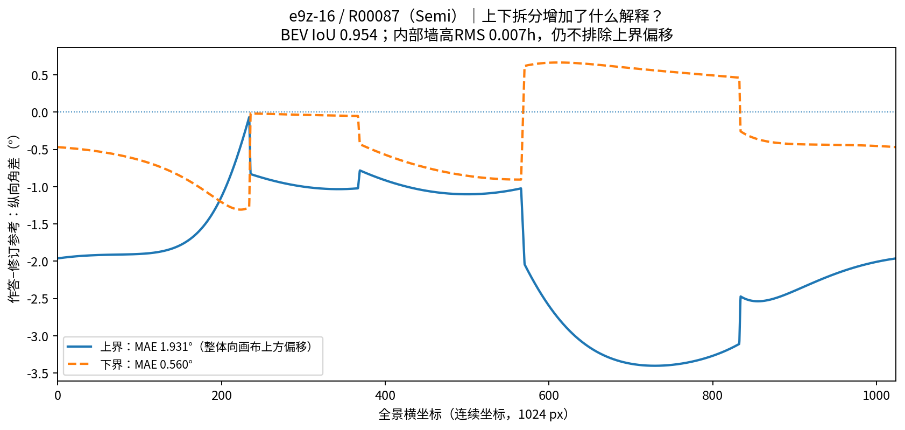
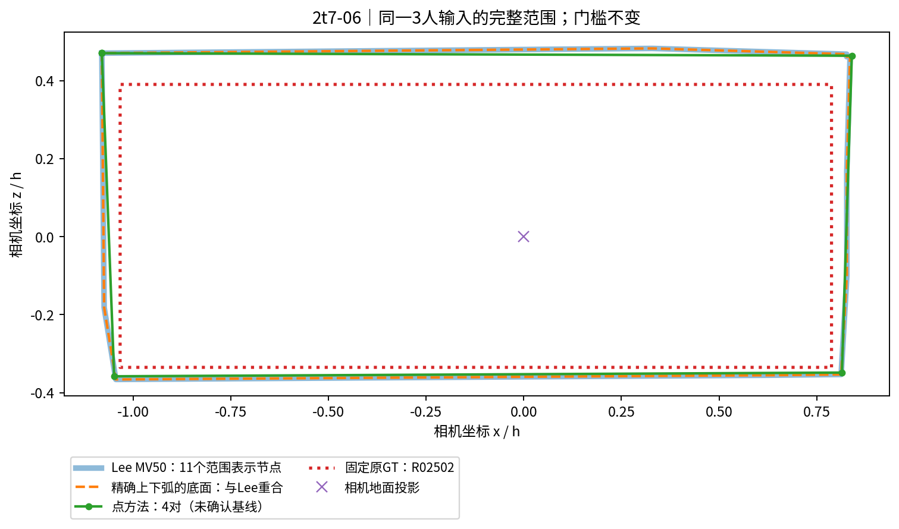
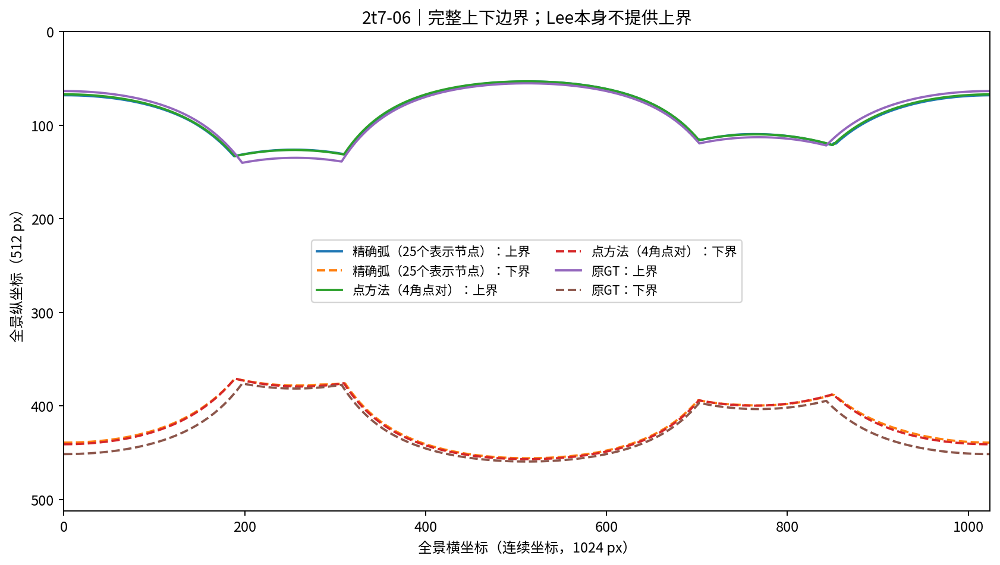
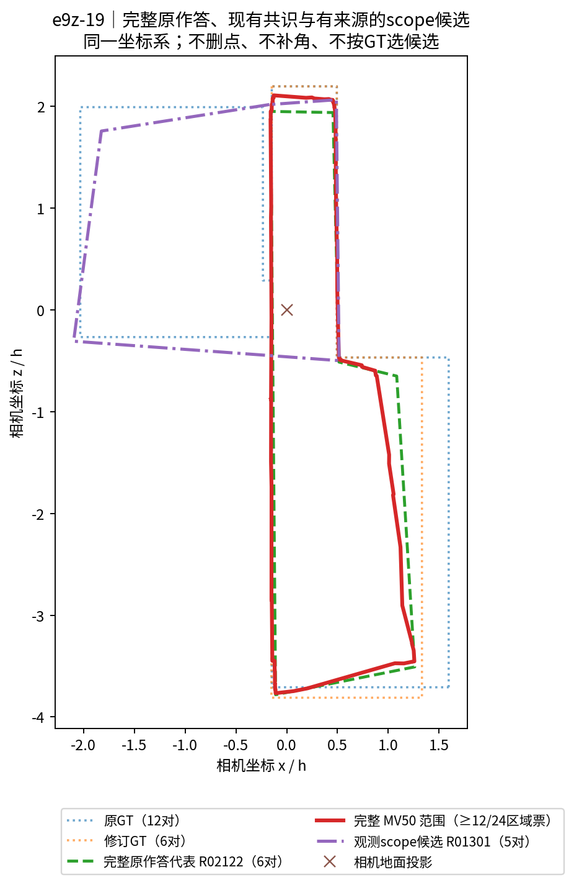
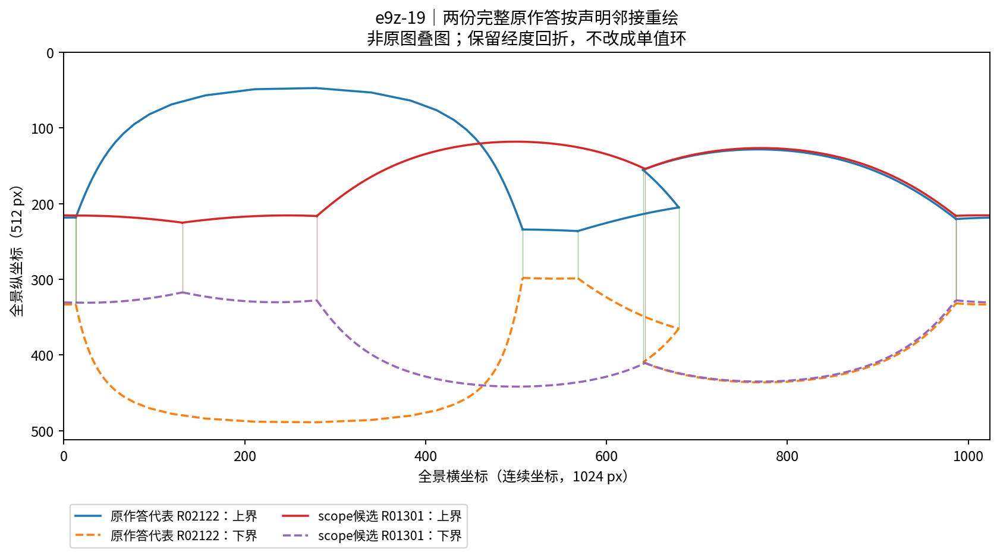

# 真实质量解释与完整结果：小范围独立结论

2026-10-06｜仓库 `Sparkling-Flames/3D_Manhattan_label`

## 结论

**当前最值得保留的是“范围遗漏／外扩＋上下边界分开比较”，不是新增一个总质量分数。** 条件三维可以说明推导高度与假设是否相容，但本轮没有证据把平均墙高体积升格为独立主质量量。实际完整输出也没有显示精确弧或区域 MV 必然更准确：2t7-06 的点基线更接近当前参考；e9z-19 的 MV 对两版参考都未超过不看 GT 选出的完整原作答代表。

**多空间的正面结论没有成立。** e9z-19 确有来源明确、范围不同的完整作答，但所保留候选在共识外的新增范围绝大部分仅有一名人员覆盖。这支持保留可追溯备选，不支持称为稳定的多空间共识；也不能据此断定该人标错。

入口优先采用 `research/fast_research_handoff_20261006/{README.md,LATEST_FINDINGS.md,REVIEW.md}`。既有作者、Codex、dot 的解释只作待判断主张，不作为结论依据。下面明确区分已有结果与本轮小计算；来源路径见 [SOURCES.md](SOURCES.md)。

## 一、四个真实例子：哪些解释增加了，哪些没有

表中 BEV 是在共同相机高度单位 **h** 下的声明足迹；“体积”是条件平均墙高代理，不是实测房屋体积。“原／修”是既有两版参考，未择优使用。除注明的上下拆分外，本表数值复用十二图已发布结果；没有重跑该面板。

| 真实作答与审核类型 | 已有结果及一项新增结果 | 增加的解释 | 不能据此推出什么／分项取舍 |
|---|---|---|---|
| **jtc-12 / R03398，Manual**；细节标记与执行问题标记并存，门洞类主质量暂缓 | BEV **0.828**，墙带 **0.958**；边界均值／P95 **0.123／0.589 h**；体积 **0.793** | 大范围覆盖接近，仍不能消除已有细节／执行问题。边界尾部提示全局均值会掩盖的局部差异。 | 不是“纯细节”正例，不能靠高墙带 IoU 宣布细节正确；真实点对应未建立，边界距离不叫角点定位误差。 |
| **e9z-19 / R01301，Manual**；明确 scope 标记 | 原／修 BEV **0.450／0.150**；对原参考，作答→参考／参考→作答边界均距 **0.080／0.928 h**；内部墙高 RMS **0.012 h** | 作答有 **92.9%** 面积落在原参考内，却只覆盖原参考 **46.6%**；差异主要涉及所选范围，而非所有共有边界都定位很差。换参考会改变解释。 | 近乎恒高不等于范围正确；质心距离 **1.489 h** 不能再当独立“点位错误”处罚。scope 标记证明存在范围差异，不认证其合理性。 |
| **B6-42 / R03325，Manual**；近地平线、难标门洞 | 面积 **200.342 vs 17.504 h²**，作答完整包含参考；BEV／体积 **0.087／0.086**；外扩／参考面积 **1044.5%** | 方向性面积说明这是当前反投影下的强外扩，不是同等程度的遗漏。近地平线的地面反投影对位置变化敏感。 | 数值放大不能自动解释为真实世界中同等尺度的标错。体积在此未提供新增的局部错误解释；保留适用性警示，不升级人员质量结论。 |
| **e9z-16 / R00087，Semi**；参考变化与上边界偏移 | 原→修 BEV **0.864→0.954**；推导平均墙高偏差 **+0.045→+0.066 h**。**新增**：对修订参考，上／下边界 MAE **1.931°／0.560°**；内部墙高 RMS **0.007 h** | 范围更接近参考，不意味着每个分项都更接近。上下拆分指出相对修订参考的主要残差在上界，而非下界。 | 低内部高度波动仍容许系统性上界偏移；Semi 单例不证明个人能力或模型纠正效果。上下分项值得保留。 |

### 可以实际使用的少量分项

**范围作为主分项：**保存遗漏 `|G\A|/|G|` 和外扩 `|A\G|/|G|`，需要一个摘要时附 BEV IoU。三者由同一面积关系得到，不能当三份独立证据重复计权。参考版本和适用性必须随行保存。

**上／下边界作为第二组分项：**在同一有效经度域分别保存纵向角误差及有效域覆盖率。此次 e9z-16 对修订参考覆盖完整一周；上界平均有符号差为 **−1.931°**，即相对参考整体向全景画布上方偏移。它不是世界坐标中已确认的天花高度误差。原参考存在经度回折，新增单值上下比较为 **NA**，没有通过排序把它变成可算。

**位置、细节保留为诊断与审核证据：**面积质心和双向边界距离帮助区分整体偏移、范围缺失与局部残差，但不能单独隔离定位误差。真实同一角点／同一局部结构对应未建立时，点位 RMSE 留 NA；已有细节、scope、执行问题标记及完整观测候选单独展示，不硬压成第三个数值总分。

**条件三维不作额外主评分：**保留推导平均墙高差、内部墙高波动和几何适用性作为按需诊断。它们依赖上下边界、相机高度及地面假设；内部自洽不是对外准确。

### 为什么当前体积量不应重复加权

共同地面、每份布局各取一个平均墙高时，令 `I=|A∩G|`：

\[
J_{3D}=\frac{I\min(H_A,H_G)}{|A|H_A+|G|H_G-I\min(H_A,H_G)}.
\]

相同高度时严格退化为 BEV IoU；不同高度时增加的是**平均高度与面积的耦合**，不是新获得的局部结构事实，也没有恢复局部高低顶。

本轮只做一个小对照：同一对连通正交底面，以单位立方体直接计数。等高 2／2 时 BEV 与实体 IoU 均为 **0.600**；高度 2／3 时体积 IoU 为 **0.428571**，与公式一致。这是合成公式核查，**不是第五个真实案例**。完整数值在 `results/formula_control.json`。

## 二、完整输出对照，而非局部对应清单

2t7-06 直接复用同一三名人员的既有 Lee、精确上下弧、点基线最终几何。三者都能给出完整范围；上／下边界只在确实有输出的路线中比较。e9z-15／wc2-53 的最新局部问题尚不足以建立合理多空间，因此转到十二图里有明确 scope 标记的 e9z-19。

| 案例与输出 | 完整产物／人员支持口径 | 对原 GT 的 BEV IoU | 对修订 GT 的 BEV IoU | 上／下 MAE，° |
|---|---|---:|---:|---:|
| **2t7-06：Lee MV50** | 完整范围，11 个表示节点；区域票 ≥2／3 | **0.831589** | — | —，范围路线不提供上界 |
| **2t7-06：精确上下弧** | 完整上下边界，25 个表示节点；原门槛不变 | **0.831589** | — | **1.413／2.634** |
| **2t7-06：点方法** | 完整 4 对；每个点簇 3 人，但全对应仍未确认 | **0.851251** | — | **1.320／2.255** |
| **e9z-19：完整原作答代表 R02122** | 原 6 对不改；按与其余 23 人平均 BEV IoU 最大选取，不看 GT | **0.482548** | **0.832680** | —，未强制单值化 |
| **e9z-19：Lee MV50** | 完整范围，122 个表示节点；区域票 ≥12／24 | **0.469380** | **0.810395** | —，不补上界／高度 |
| **e9z-19：scope 候选 R01301** | 原 5 对不改；有明确 scope 审核标记的完整观测 | **0.449596** | **0.149518** | —，本轮未作此项评价 |

**2t7-06 的结论是阴性的。** 精确弧的底面与 Lee 相同，没有范围收益；点方法对当前 GT 的 BEV 与上下误差均略好。三者都覆盖整个参考，外扩／参考面积分别为 **20.25%、20.25%、17.47%**，因此本例的改善主要是外扩减少。精确弧的价值是完整边界和来源表达，不是本例准确率领先。点基线也仍有未确认对应的限制，不能据这一个三人案例推广赢家。

**e9z-19 的共识融合没有超过完整原作答代表。** 两版参考下均略低，故不是只因挑了一版 GT 才出现的负结果。这不证明代表作答视觉正确，亦不证明 MV 一般无效；它说明“已有融合”与“实际完整原作答”应同台比较，不能默认融合更好。

scope 候选 R01301 与 MV 的 IoU 仅 **0.169717**。其共识外面积 **4.116852 h²** 中，**3.963514 h²（96.275%）仅一人覆盖**，其余部分也未达到原 12／24 门槛。这个数是区域覆盖票，不是整个候选的支持人数。因此本轮只交付“有来源的弱范围候选”，不称稳定多空间模式，不将其抹去或添票。

图中经度回折按原声明邻接保留。直接三维线段投影与单值上下曲线不是同一表示；不能为套入后者而改环。Lee 的完整产物是范围，不是已补齐上下边界的三维房间。**25／122 等表示节点不能自动算实体墙角**，区域多数也不自动成为整房共同支持。

本轮所有用于完整对照的 BEV 多边形均有效、无孔洞且包含相机；这只说明当前几何可用，不认证严格正交或视觉正确。**没有新做局部删改**：现有证据不足以指定一处同时有几何和语义依据的编辑，不能为了得到新候选而编辑。

## 三、继续什么、停止什么

**继续：**方向性范围分项、可计算域内的上下边界拆分，以及有来源的完整原作答／候选并列。下次出现有独立证据的局部对应或编辑，才用完整输出的增益检验它。

**停止作为当前主张：**“体积更低所以更有效”“精确弧必然比点聚合准确”“局部成组就证明有多空间共识”。本轮既不为这些主张改阈值，也不为交付完整而补角或造票。

## 材料缺口与实际工作量

**原图语义缺口：**已经读到十二图原 PNG 的路径映射，但本执行环境未取得可直接查看的 PNG 字节。因此五张图均为真实文件坐标／计算结果重绘，不是原图叠图；没有新判定具体开口、墙面、隐藏空间是否正确。语义仅沿既有明确审核记录。

**点位真对应缺口：**真实角点对应尚未建立，不给真实点 RMSE，也不把按 x 的数值对应视为人工认证。

实际只提取四个质量案例、复用 2t7 三路线已保存输出、重建一个 e9z-19 全员终点及其代表、补算一份 e9z-16 上下分项、一个棱柱公式对照。没有跑人数增长、人员构成、108 基线、全库、全参数或 SHA／尾差审查；没有改仓库或任何原始标注。

复算：`python reproduce.py --out recomputed`。出图：见 [README.md](README.md)。源摘录、所需小输入和结果随包提供，不依赖重新连接 GitHub。
