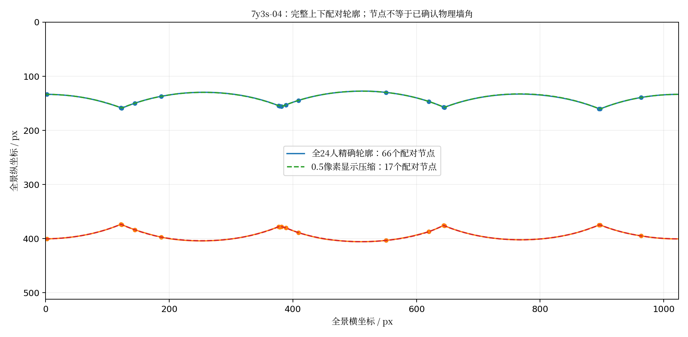
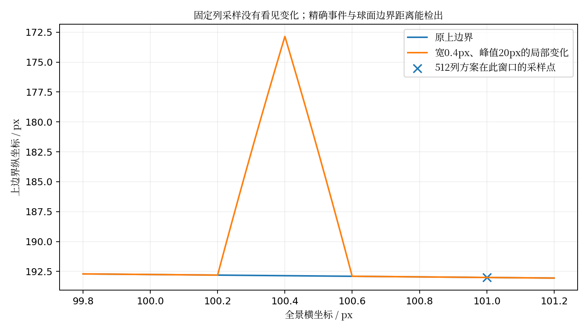

# 全景布局的连线、质量与全员完整共识

独立研究，2026-10-04。冻结仓库：`Sparkling-Flames/3D_Manhattan_label`，提交 `080949f5971000a32310d4e4ebf9028dab831a91`。

## 结论先行

本轮最值得接入下一步实施的结果，是一条**在明确适用域内，把全体人员区域投票转成完整上下点对的可复算桥接方法**。它不先给整份作答分簇，不选最大簇，不需要把不同人的角点先认作同一个物理角。输出包含上下配对坐标、闭合连接、每段曲线的人员／源边来源和未被采用的原始点残差。

这个进展不是“完整物理房间已经自动恢复”。新节点首先是投票轮廓的表示节点，可能是两条观测曲线的交点，也可能只是为同步上下边界而插入的分段点。新方法不会自动确定物理墙角、隐藏拓扑、天花内部或唯一正确范围。在原环非单值时，明确保留整个选中人员组的不适用状态。

三项可以暂定的实施判断是：

1. **连线**继续采用连续ERP坐标、既定源环和中心投影下的三维直边投影。环序、单边投影和可见性独立记录。实际图像拼接与调平误差尚需本地证据。
2. **质量**保留GT参照的地面IoU及遗漏／外扩，配合面积质心向量、上下分开的声明边界距离和明确模型下的高度／三维诊断。不把一个总分定为正式答案，也不把IoU相近视为全部细节相近。
3. **共识**先采用“精确区域／曲线证据＋有误差账本的编辑表示”两层输出。区域和点方法可继续并行；本轮并没有得到普遍更高的GT分数。

本轮新推导尤其指出：**ERP墙带的多数票与BEV地面的多数票不是同一目标；在偶数人数下，同名的≥50%规则会选到相反的中间下边界。**这不是舍入误差，也不是必须改掉Lee；它要求明确选择比较对象与平票约定。

## 1. 实际取得的材料与证据边界

四份指定文档均通过GitHub连接器读取。继续读取了当前方法合同、质量交接中的更新版地基文档、`research_round_20260929.py`、全员点融合核心、直接ERP原型和最新对应认证审查。此前交付ZIP中的原始Pro报告与`consensus_lab.py`也已读取。逐项来源和状态见 `SOURCES_ZH.md`。

存在一个不能忽略的文档版本差异：根目录9月30日地基文档仍将原始GT的C/P约定列作未知；质量交接副本及当前方法合同已记录10月1日的官方生产公式／259份逐值核验，确认原始GT为连续坐标C。当前记录应按C解释；明确原生模型P坐标与之同射线的关系是P=C−0.5。不能继续把原始GT的两种phase当成同等可能，也不能从这个软件约定推断实际图像已完成重力标定。[R2,R5,R6]

容器不能直接取得完整GitHub源包。阅读接口可返回指定片段和Git blob SHA；本轮使用了附带历史ZIP的可访问输入摘录，并从当前返回片段补齐24人的上下坐标。两份大型输入的当前Git blob仍分别为：

- `analysis_results/worker_profiles_20261003/input.json`：`5a174746730bb70e405680a3748663caf56dd51f`；
- `analysis_results/lee_expanded_20261003/input.json`：`faa118622c05b47c8edac1e04476282af08c97c5`。

这是源版本一致性的证据，不是容器已经拥有整个源文件字节的证据。24份底点投影与独立保存的BEV摘录逐值对照，最大差3.33×10⁻¹⁶ h；三人例也重新投影并参与算法／tile交叉检验。上端点来自可见片段的逐项转录，未声称对整个源文件进行了第二次独立字节级验证。`verify_local_inputs.py`可在本地完整仓库核对点、源索引、人员、环确认和资格字段；本轮没有在完整仓库上运行它。

|实际执行|范围|不能推出|
|---|---|---|
|全员完整输出|2t7WUuJeko7-06的全3人；7y3sRwLe3Va-04的全24人，共27份当前记录|不是137图或3152份的全量结果；也不是27名不同人员|
|复杂确认环适用性|rPc-06的R01518/P017与R01784/P001两份选中记录|不是该图全24人的完整融合效果|
|可变点数合成验证|40个已知相机星形输入组，人数2/3/4/5/8，个体点对数4/5/6/8，两规则共80状态|不是80张真人图；也不是全都满足严格Manhattan的房间|
|投影与误差核验|100个正深度投影控制；500个连续极值与稠密采样对照|不估计真实相机误差或人类误差发生率|
|针对性质量反例|窄顶部事件、上下耦合高度、相同墙顶边界不同内部顶面|只证明所述指标边界，不裁定真实图像|

7y3s-04的24份源环均为默认未审。原源还含两份历史未纳入记录，已作为非候选元数据保留，没有恢复资格。两张主实验图的选择出于可访问性与来源可核验性，不构成代表性抽样。没有原图、没有新增视觉GT、没有改变人员或难度。

## 2. 连线与空间表示：当前可暂用的层级

### 2.1 环序先于单条曲线

一份作答首先是带上下绑定的循环邻接。循环起点和整体反向可描述同一个环，其他排列一般不能直接视为等价。人工确认的邻接继续保留；默认共享x顺序只表示目前采用的输入顺序，不升级为物理正确性。[R1–R3]

单条边的中心投影不会回答它应当连接哪两个角，也不会确定被前景遮挡的部分是否属于本次声明范围。旧“按x排序再画墙带”的入口仍可作明确命名的敏感性对照，不能覆盖已确认环后再声称环序没有作用。

### 2.2 三维直边在ERP上的曲线基线

在中心投影、直边、正深度且不经过相机的条件下，边上所有射线处于同一过相机的平面。令θ=2πx/W、φ=π(1/2−y/H)，可在非奇异经度区间写成：

`tan φ(θ) = a sin θ + b cos θ`。

因此 `y(θ)=H[1/2−atan(a sin θ+b cos θ)/π]`。这给出了确定的投影曲线，而非为了贴近GT选择样条。源边和接缝分段保留，遇到零跨度、半周奇异或非单值情形，不静默穿越。[R7,R8；本轮公式推导]

新增核验：同一对端点射线，任意改变两个端点的正深度，三维线段仍扫过同一条小于半周的球面弧，改变的是参数化而非投影轨迹。100个控制、每边257点的最大纵坐标误差5.12×10⁻¹³ px。这个结果解释了为什么“直接射线平面”和“先用底点深度建上点代理再投影”在单边轨迹上可以一致；它不证明二者的三维深度、可见性或物理墙高已经得到观测。见 `positive_depth_projection.json`。

### 2.3 必须并列保留的四个对象

|对象|基线含义|可信范围／限制|
|---|---|---|
|源环及声明边|采用当前上下绑定与邻接连接全部边|未确认不等于错误，也不等于已确认；边可能表示范围停止而非实体墙|
|声明BEV足迹|下射线与共同地面Y=−1相交，按原环形成区域|衡量声明地面范围；不包含顶部，不以个人平移／缩放对齐GT|
|声明环首交列式墙带|按原底环对每列取最近正向射线交点，使用对应墙段上部代理|可处理部分非星形凹环，但丢掉首交之后的声明结构；不是一般真实可见面的无条件证明|
|单值完整ERP上下带|每个经度只有一条上界与下界，沿原环绕一周|本轮精确算法适用域；比“合法BEV”更窄|

HorizonNet的逐列表示本身将上下边界和墙角存在分开，三维恢复还使用结构假设；本轮借鉴“轮廓与角点身份不同”的表示区分，没有借用其神经网络或把其后处理当作本数据已满足的物理条件。[P1]

### 2.4 还不能暂定为事实的部分

当前图像实际的skybox采样、局部拼接warp、重力校正和尺度没有按图绑定验证。`image_rotation=0`和共享x并不完成这项验证。中心投影曲线可作为软件／几何基线，但对局部拼接错位的真实性仍需原图与上游记录。此处不重新生成图像、不反向移动点使其适配某种曲线。[R5,R6]

## 3. 新推导：ERP与BEV的票数阈值对偶

设第i份星形地面在方向θ上的最远边界半径为rᵢ>0，下边界ERP纵坐标为bᵢ。共同地面Y=−1下：

`bᵢ = H[1/2 + atan(1/rᵢ)/π]`，它对rᵢ严格递减。

BEV区域在该方向上是 `[0,rᵢ]`。至少s人覆盖的结果半径为第s大r，对应第s小b。

每份ERP墙带是跨越共同地平线的区间 `[aᵢ,bᵢ]`。至少t人覆盖时：

`上界 = 第t小 a；下界 = 第(n−t+1)小 b`。

这后一条区间公式在旧ERP原型中已经实现，本轮不将它重新称为新算法。新的桥接判断是：

**ERP的t票下界，回到地面后恰等于BEV的s=n−t+1票边界。**

|人数|ERP规则|回到地面对应的BEV规则|
|---|---|---|
|奇数n|多数，两规则相同|同一多数|
|偶数n=2m|ERP ≥50%，t=m|BEV >50%，s=m+1|
|偶数n=2m|ERP >50%，t=m+1|BEV ≥50%，s=m|

两名人员画相机中心相同、半边长分别1和2的正方形：BEV≥50%是面积16的大方形；ERP≥50%的下边界却回到面积4的小方形，二者IoU=0.25。这不是否定任何一种投票，而是二者分别在问“该地面点在区域内吗”和“该射线像素在墙带内吗”。见 `two_person_threshold_duality.json`。

所以本轮明确给出一种**Lee≥50%底面兼容的完整扩展**：奇数时采用ERP多数；偶数时采用ERP严格多数。上下轮廓都来自当前全员，但“为什么选该顶边”仍是一项声明的汇总政策，不是唯一物理结论。另一平票政策完整保留，不用GT二选一。两政策间的差只是一种规则敏感性，不是统计置信区间。

Lee原文支持tile与≥50%的区域聚合思想，研究的是普通对象分割，并非房间上下配对墙角。本文的BEV迁移及阈值对偶来自本项目的具体几何定义。[P2]

## 4. 新原型：有限事件、全员上下配对轮廓

### 4.1 构造步骤

对每人每条原边建立上／下两条正弦—余弦系数函数。收集原边端点，再求人员曲线在共同有效区间内的交点：

`Δa sin θ + Δb cos θ = 0`。

有限分段内的曲线顺序不变，因此相应的顺序统计量必然来自某条已观测边。取所有上界和下界的分段变化经度之并集，在每个经度输出一个上下点对。若某处只有上界转折，下端只增加用于序列化的分点，而非宣称那里存在新的地面墙角。

每段重新连接时仍用同一个直边投影公式。这使“选择的曲线”和“保存点后再画的曲线”能够直接交叉核验，不再用另一套更有利的角点匹配给输出背书。

原型没有读取参考文件，不进行整份作答分组、不选择代表者、不拟合Manhattan、不使用人权重。相同坐标仍由不同人员分别投票。显式拒绝混合图片、条件或真实／合成人口；某个当前选中成员不适用时，整个组保留失败，不悄悄变成一个更小组。

### 4.2 输出和来源含义

- `points`与`connections`：上下配对节点及闭合邻接；坐标C，1024×512。
- `knot_provenance`：该节点上／下曲线是否分别转折，左右原边供点来源，以及同经度原点号。**同经度不等于已经建立物理点对应。**
- `provenance_intervals`：每段上／下界来自哪些人员、原边和源端点索引；完全重合的边保存全部供点者。
- `source_pair_residuals`：所有原始角对与输出轮廓的差，不只是获选者；不把这些残差自动叫作人员错误。
- `top_xyz/bottom_xyz`：基于共同地面及竖直点对的墙带代理。`roof_interior=not_observed_not_assumed`。

24人例中，Lee≥50%兼容输出约97.03%的经度上，上界与下界由不同人员的曲线给出。**这不是97.03%的墙面不受支持，更不是错误率。**它只说明逐边分位聚合很常见地混合来源；不能把上、下独立的供点名单合称整墙共同支持。

### 4.3 实际验算

|完整人员池|ERP规则|原子区间|输出点对数|重画最大误差/px|与阈值对偶的独立BEV投票对称差/h²|
|---|---|---:|---:|---:|---:|
|2t7-06，3人|≥50%|33|25|5.68×10⁻¹⁴|8.22×10⁻¹⁶|
|2t7-06，3人|>50%|33|25|5.68×10⁻¹⁴|8.22×10⁻¹⁶|
|7y3s-04，24人|≥50%|703|68|1.14×10⁻¹³|数值上0|
|7y3s-04，24人|>50%|703|66|1.14×10⁻¹³|数值上0|

“数值上0”是这次Shapely浮点运算结果，不是任意环境的形式证明。40个合成组／80规则状态另作独立多边形tile对照，最大对称差1.12×10⁻¹⁴ h²；每状态4096个附加方向的最大上下曲线差1.14×10⁻¹³ px。全部合成失败记录文件为空，但它们本来就在事前定义的适用域中，不能将此当作全库成功率。见 `construction_checks.csv`、`synthetic_validation.csv`。

## 5. 节点太多怎么办：明确误差的二层压缩

精确量化结果往往比个人标注复杂；这不意味着它找出了66个真实房间墙角。保持精确结果为证据，另提供编辑表示压缩。压缩只作用于新输出，不修改任何源标注。

候选压缩边连接两个保留节点。把它与原精确轮廓的每段比较，上下最大纵向偏差都要满足ε。最大误差不仅检查固定列，而是检查区间端点和`atan`正弦曲线差的驻点；通过tan(θ/2)变换得到最高六次多项式的数值求根。动态规划在保留第一个精确节点的条件下最少化节点数，**不是整个循环起点、角点语义和Manhattan结构的全局最优搜索**。

此处的驻点求根是浮点数值验算，不是区间算术证书。500组与每区间5001点的独立稠密扫描对照未发现低估；这支持当前实现，但不升级为机器精度下永不低估的形式证明。

24人、Lee≥50%兼容结果：

|ε/px|表示点对数|验算最大曲线偏差/px|相对精确Lee底面变化/h²|
|---:|---:|---:|---:|
|0|66|0|0|
|0.25|28|0.239052|0.002197|
|0.5|17|0.497643|0.005047|
|1|10|0.995583|0.012068|
|2|5|1.795347|0.024572|

ε是工程试验网格，不是已校准的人类容差；没有按GT挑ε。1px的角度误差在地平线附近可能对应很大地面深度变化，所以同时保存BEV变化，不能以单一像素预算保证空间质量。`angular_to_depth_sensitivity.csv`给出这一敏感性：b=258px移到257px，距离几乎增加一倍。



这张图显示全部24人共同构成的精确轮廓与0.5px表示压缩。用于展示的均匀列采样不参与数值构造；交互页可逐节点查询原边。更少节点不等于更真实，也不等于原标注中没有被压缩掉的细节。

## 6. 质量评价：先解释差异，不先制造总分

|评价层|目前站得住的含义|不能单独识别／最小补充|
|---|---|---|
|GT-BEV IoU；遗漏、外扩|共同地面、相机坐标和声明环下的范围兼容|顶部、高度看不见；全局平均会稀释局部细节。保留方向分解而非只一个IoU|
|区域面积质心及dx/dz|范围整体偏移|同心缩放、对称遗漏等可同质心；不代表全部范围或局部细节。作为补充，不由低相关就加权|
|上／下声明球面边界距离|图像角度域内边线偏移和局部多余／遗漏，保留两方向|不自动给出角点身份、物理邻接或语义错误。保留均值、尾部与最大值，不只p95|
|同经度上下轮廓差|在单值适用域的直接轮廓残差|不能静默用于复杂多值环；固定列可能漏事件|
|点对派生的墙顶高度|共同地面、竖直点对、底点深度下的上部位置|依赖上下两端，不是独立顶部测量；世界尺度未知，不称米|
|墙向残差／平顶残差|相对于Manhattan或平顶模型的自洽性|几何规整后的零残差不能再自证质量；若使用三维拟合，应同时报告拟合前后及移动量|
|三维实体IoU|只在完整体积模型明确时有定义|仅上下边界不确定天花内部；平顶棱柱可作条件模型指标，不冒称真实实体|
|角点／连接差异|在一致且有来源的身份系统下解释增删与邻接变化|不能把本轮同步节点都当物理角；对应不唯一时输出未匹配／备选，不强合总分|

本轮新增的边界评价不是新造一个总损失。对每条声明上／下边，将球面小弧按弧长采样，求到参考相应边集的最短球面距离；反方向另算。所有声明边参加，不先取可见外包络，不按节点数等权采样。

距离到固定闭集的函数对球面弧长是1-Lipschitz。弧长中点网格最大步长δ时，平均距离的求积误差不超过δ/4；采样最大值到真实最大值的差不超过δ/2（忽略浮点求距误差）。本轮δ≤0.05°，对应平均数值界0.0125°、最大值漏差界0.025°。这些是**计算误差界，不是参考或人员的置信区间**。它也不检测“同一条几何边被重复走了几次”等图结构错误，需另保留序列化与连接诊断。

### 6.1 新反例：固定列与p95都可能漏掉局部顶部事件

以理想矩形为基底，保持底边不变，在x=100.2、100.4、100.6px添加已知局部上部变化，中点峰值20px。512列中心采样位置为奇数像素，完整变化落在相邻采样列之间。

- 固定512列最大上下差：5.68×10⁻¹⁴px，近似零；
- 解析峰值差：20px；
- BEV IoU：1；
- 弧长加权上界距离均值：0.13707°；
- p95：近似零；
- 最大球面距离位于[6.76723°,6.79222°]的数值区间；
- 精确输出7个点对，1px压缩仍保留7个；峰值没有被压掉。



这是分辨率／评价聚合的反例，不是证明真实0.4px结构必然重要，也不是把极大值等同语义错误。它证明：没有源事件检查，仅提高平均IoU或使用p95不能保证不漏局部角点变化。最小可落地修正是将原／参考端点和交点加入检查，再给连续边界采样误差预算，而不是无限增加一组固定列。见 `narrow_feature.json`。

### 6.2 新核验：高度含有上下耦合

已知相机高度单位1、地面Y=−1时，局部墙顶相机相对高度为：

`Y_top(θ) = −tan φ_top(θ) / tan φ_bottom(θ)`。

在同一个合成方形中：只将top_y移动−4px，BEV IoU仍为1，高度平均差为0.07880h；只将bottom_y移动−4px，top射线和上边界距离仍为零，但推导高度平均差为0.08394h，BEV IoU约0.8511。

所以“高度差大”不能直接归因于顶点不准。应同时看上界角度误差、下界角度／地面范围误差，再解释高度。当前输出的`height_proxy`是相对于相机的Y值；完整局部墙高要加1。见 `height_coupling.json`。

### 6.3 新反例：相同上下边界不能唯一确定体积

固定面积16h²、地面Y=−1、四周墙顶Y=1的同一圈点与墙面。内部屋顶可以是平面Y=1，也可以是边缘仍为1、中心高2h的四片帐篷顶。

前者体积32h³；后者42⅔h³；两个真实构造的体积IoU为0.75。但所有给定上下角点、声明边界和地面IoU完全相同。见 `roof_nonidentifiability.json`。

这只证明**仅凭周界点观测，未指定屋顶内部时，体积不可识别**。它不否定已经明确冻结的平顶棱柱模型，也不否定原图、深度或其他证据能够约束屋顶。实施时可以报告“平顶模型体积IoU＋平顶残差＋适用状态”；本轮没有为真实例子悄悄加顶盖。

## 7. GT评价结果：没有预设新方法优胜

全部候选在 `construction_freeze.json` 记录散列后，评价阶段才打开隔离参考文件。只用原参考，不按最高分选择压缩精度、投票政策或候选。全员点基线是依据当前代码关键数值步骤编写的独立复算：最大上下球面角距、同人不可并、complete linkage、周期x及上下y中位数、新x环；**不是原模块完整失败／并列诊断的逐字复现**。[R9]

|图片|输出|点对数|原GT-BEV IoU|上边界双向平均距离/°|下边界双向平均距离/°|
|---|---|---:|---:|---:|---:|
|2t7-06 / 全3人|5°点中心数值基线|4|0.851251|1.163097|1.829232|
|同上|精确全员弧，Lee≥兼容|25|0.831589|1.238522|2.126591|
|同上|0.5px表示压缩|15|0.831605|1.239273|2.126804|
|7y3s-04 / 全24人|5°点中心数值基线|4|0.958511|0.700005|0.557075|
|同上|精确全员弧，Lee≥兼容|66|0.956473|0.653958|0.588050|
|同上|0.5px表示压缩|17|0.957026|0.627781|0.580660|

三人例中，新路线对这版GT的底面和边界均不优。24人例中，点中心底面IoU略高，精确弧的上边界角度距离较小；排序依赖评价对象。差异不能被合成“新算法全面更好”的结论。

本轮算法的实质增量在于：阈值关系明确、全部成员同时参加、序列化能回到上下曲线、可以保留完整原边来源，并能量化将结果变成少量编辑节点的代价。**方法忠实于投票，不保证投票忠实于GT。**两张图不足以决定效果优胜，更不支持新难度或人员结论。完整数值见 `real_quality.csv` 和 `real_quality_details.json`。

## 8. 失败与已知问题追踪

### 8.1 真实确认环的域外状态

rPc-06的R01518/P017包含12对点，源环已人工确认，存在多处经度回退并保留`camera_visibility_unresolved`。底面有效；与R01784/P001作为两个明确选中成员输入时，新方法返回：

`unsupported_entire_selected_roster`，原因`source_ring_not_single_valued_one_turn`。

人数保持2，不用P001替代两人结果，不重新排序P017，不将几何不适用解释为人错或GT错。该例恰好说明适用域声明有实际作用。非星形范围的全员BEV仍可研究；但若将其变成一个单值上下环，必须说明舍弃了哪些隐藏声明，本轮不这样处理。

### 8.2 旧Pro认证缺陷不是新算法的有效性证明

当前独立审查已确认，旧锚点原型实际生成用的匹配与minimax证书可脱节；三人例实际同身份直径5.57944°却通过5°的条件式认证。审查补丁是保守拒绝，不是全员完整算法已完成。[R4,R10]

本轮未把这个已知反例重复列为新增发现，没有把旧`single`状态继续作为质量证书。新路线用同一批显式弧段生成和重画检查，避免拿另一套点匹配为结果认证，但仍不提供物理身份的正确概率。当前全员点原型的竞争身份／并列分区问题也没有因本路线绕开匹配而被“修复”。

### 8.3 保留的数值与工程限制

角度去重EPS=2×10⁻¹¹ rad、近重合系数容差是数值条件，不是人类角点容差。驻点多项式求根不是区间算术；边界距离求积界在理想球面／已声明边之内。初始实现曾因回绕区间端点的浮点差出现微小覆盖空隙，已改为复用同一个源端点，并增加精确节点回归。失败过程见 `logs/development_failures.json`，不把最初失败的程序说成一直正确。

## 9. 下一步如何实施，不要求先解决一般问题

建议仅推进一个小规模共同检查：选择既有完整源输入中，单值域可计算和非单值域各有代表性的图片，运行当前Lee、原全员点模块和本轮精确桥接。名单在看GT结果前固定，不按效果筛选。所有方法共享同一人员集合与同一固定参考版本。

单值域先看四件事：底面与规定阈值Lee是否等价；保存点重画是否一致；源事件是否全部在残差与来源账本中；压缩后哪些局部信息损失最大。只有发现具体的语义节点问题，才加入新的角点识别或受限连接改进，而不是先做复杂的全局模型。

非单值域保留Lee区域与完整声明环／未匹配证据。后续可以研究一般环上的边段图和路径选择，但不能把“尚无唯一拓扑”设为单值域继续实测的阻碍。也不应为让一般算法有答案，把已确认回退环改成最近墙或共享x包络。

## 10. 本地最小核验清单

|核验对象|本地应补充什么|本轮不代做什么|
|---|---|---|
|7y3s-04默认源环与新节点|叠加全24人、精确／0.5px结果，确认主要转折和哪些节点只是数值分段；检查细节是否被压缩|不把66个节点称66个物理角，不因可画3D就确认新环|
|2t7-06原3人及GT|查看造成明显外扩的源边／范围停止位置，以及GT与人员是否在表达同一对象|不依据0.8316对0.8513判原图中谁对|
|rPc-06确认复杂环|保持已确认邻接，标注首交可见部分与后方完整声明部分的关系|不为使本原型适用而改环、删人或换GT|
|高度／顶部目标|指出外围墙真正的wall–ceiling边、装饰／低顶、隐藏顶面哪些有证据|不由点对自动创造统一天花或真实体积|
|坐标来源与成像|运行本地输入核验；提供已知ERP生产、调平及初始化phase适配记录；检查接缝畸变|不重新把原GT的C/P问题当成未决，也不将C约定当成真实相机标定|

无需先全面重审GT或为全库增加一套新标签，先在这些指定对象上补证据即可。

## 11. 复算与交付说明

数值入口：

```bash
python -m unittest discover -s tests -v
python run_research.py --out /path/to/NEW_results --stage all
```

也可顺序运行`construct`、`evaluate`、`controls`、`synthetic`。构造阶段不打开隔离GT，评价前检验预测散列；原结果目录不会被该入口覆盖。

明确选中人员接口：

```bash
python run_local.py --input inputs/real24_points.json --out /path/to/NEW_output.json --epsilon 0.5
python verify_local_inputs.py --repo /path/to/full_repo --out /path/to/NEW_source_check.json
```

第二条是待本地完整仓库执行的源字段验收，不是本轮已完成事项。新输入接口要求图像、条件、人口类型和每名人员既有独立／共识资格明确；失败成员不静默移除。

32项回归通过，测试覆盖接缝、环反向／循环起点、人员改名／顺序、混合人口／条件拒绝、重复坐标独立票、域外确认环、窄事件和误差计算。另有两次完整新目录数值运行和逐工件比较，记录见验收文件。测试只支持相应实现性质，不代替视觉效度或全库成功率。

交互展示为单文件`EVIDENCE_VIEWER_ZH.html`，内嵌数据，无远程依赖，GT默认关闭，显示全员上下点对、BEV、无顶盖3D代理和点／边来源。系统Chromium通过两图切换、压缩选择、人员强调、GT开关、节点点击和对照来源隔离检查，页面错误为0；执行环境禁止file导航，因此检查使用相同HTML的`set_content`，未声称在用户浏览器测试。显示采样不是指标计算。

## 原始文献

[P1] Cheng Sun, Chi-Wei Hsiao, Min Sun, Hwann-Tzong Chen. 2019. **HorizonNet: Learning Room Layout With 1D Representation and Pano Stretch Data Augmentation.** *Proceedings of the IEEE/CVF Conference on Computer Vision and Pattern Recognition*, 1047–1056. [官方页面](https://openaccess.thecvf.com/content_CVPR_2019/html/Sun_HorizonNet_Learning_Room_Layout_With_1D_Representation_and_Pano_Stretch_CVPR_2019_paper.html)；[作者PDF](https://arxiv.org/pdf/1901.03861)。仅用来界定逐列表示及其结构恢复假设，不将其模型输出当GT。

[P2] Doris Jung-Lin Lee, Akash Das Sarma, Aditya Parameswaran. 2018. **Aggregating Crowdsourced Image Segmentations.** *HCOMP 2018 Works-in-Progress and Demonstrations*, CEUR Workshop Proceedings, Vol. 2173. [官方PDF](https://ceur-ws.org/Vol-2173/paper10.pdf)。本文使用tile／≥50%定义，不沿用“只保留最大簇”的目标，不将普通对象实验结果外推为全景多数正确。

[P3] Yu-Ju Tsai, Jin-Cheng Jhang, Jingjing Zheng, Wei Wang, Albert Y. C. Chen, Min Sun, Cheng-Hao Kuo, Ming-Hsuan Yang. 2024. **No More Ambiguity in 360deg Room Layout via Bi-Layout Estimation.** *Proceedings of the IEEE/CVF Conference on Computer Vision and Pattern Recognition*, 28056–28065. [官方页面](https://openaccess.thecvf.com/content/CVPR2024/html/Tsai_No_More_Ambiguity_in_360deg_Room_Layout_via_Bi-Layout_Estimation_CVPR_2024_paper.html)；[作者PDF](https://arxiv.org/pdf/2404.09993)。它支持将范围解释与定位误差分开，但不证明本轮具体人员的任何范围一定合理，也不授权按GT挑融合结果。

文献PDF文本可读，截图接口返回cache miss；本轮文献判断限定为文字／定义，没有声称核验不可见的图表。仓库原件与历史返回为内部研究证据，详见同包来源表。
