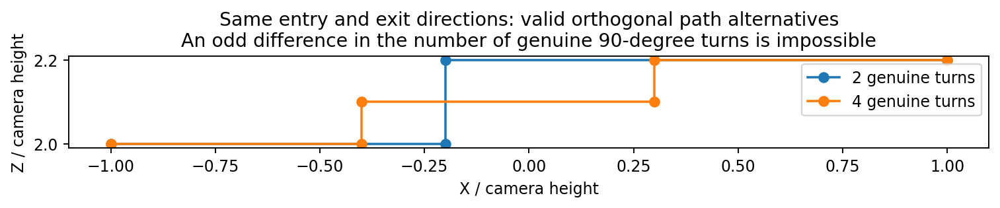
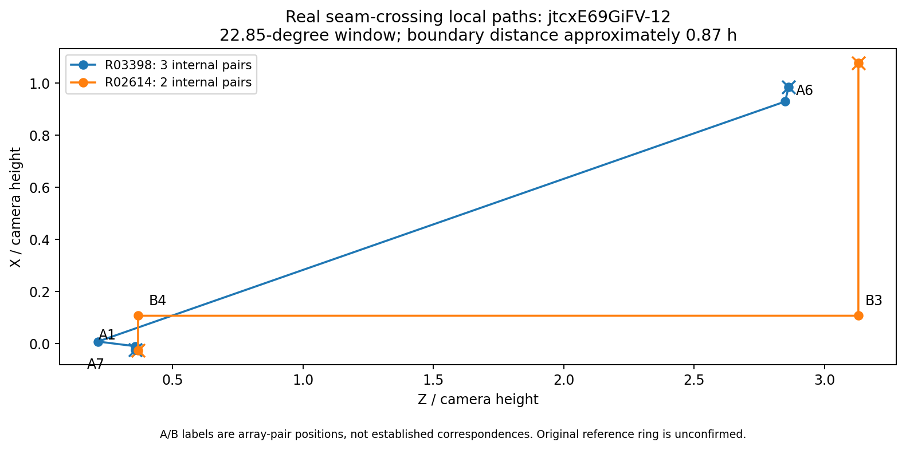
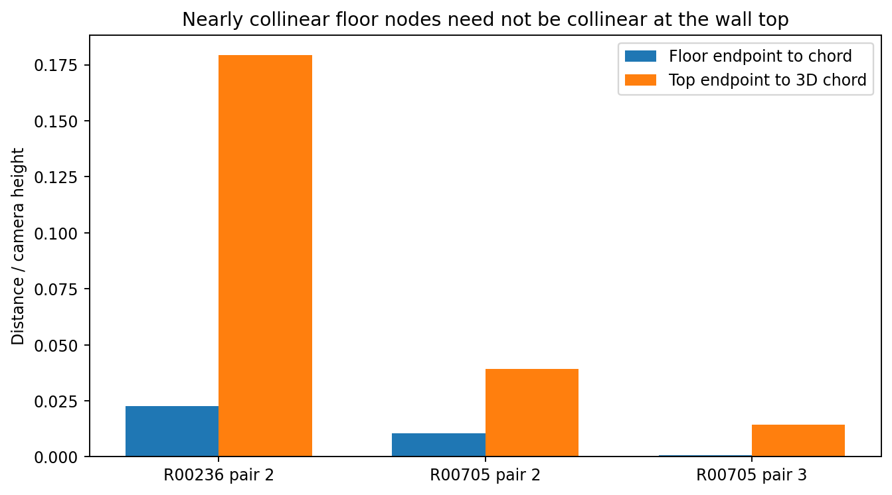
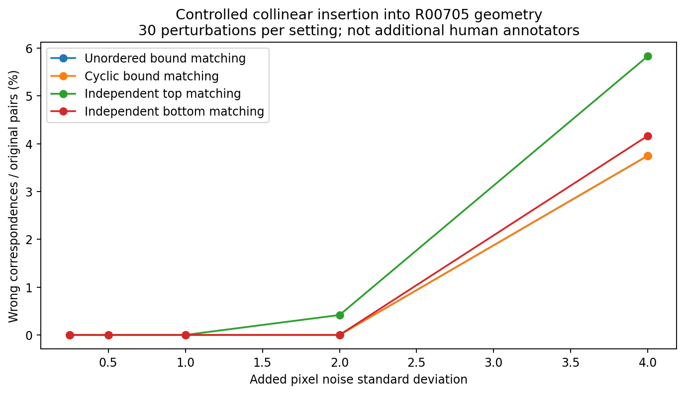
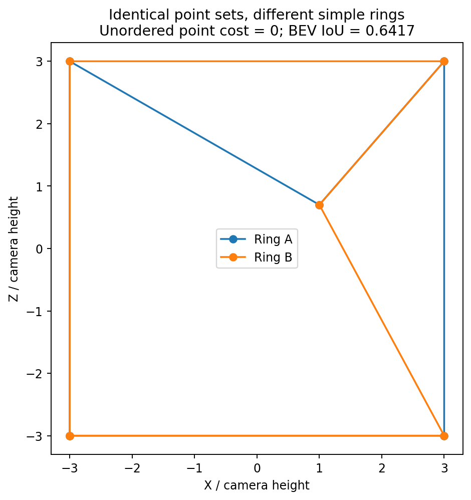
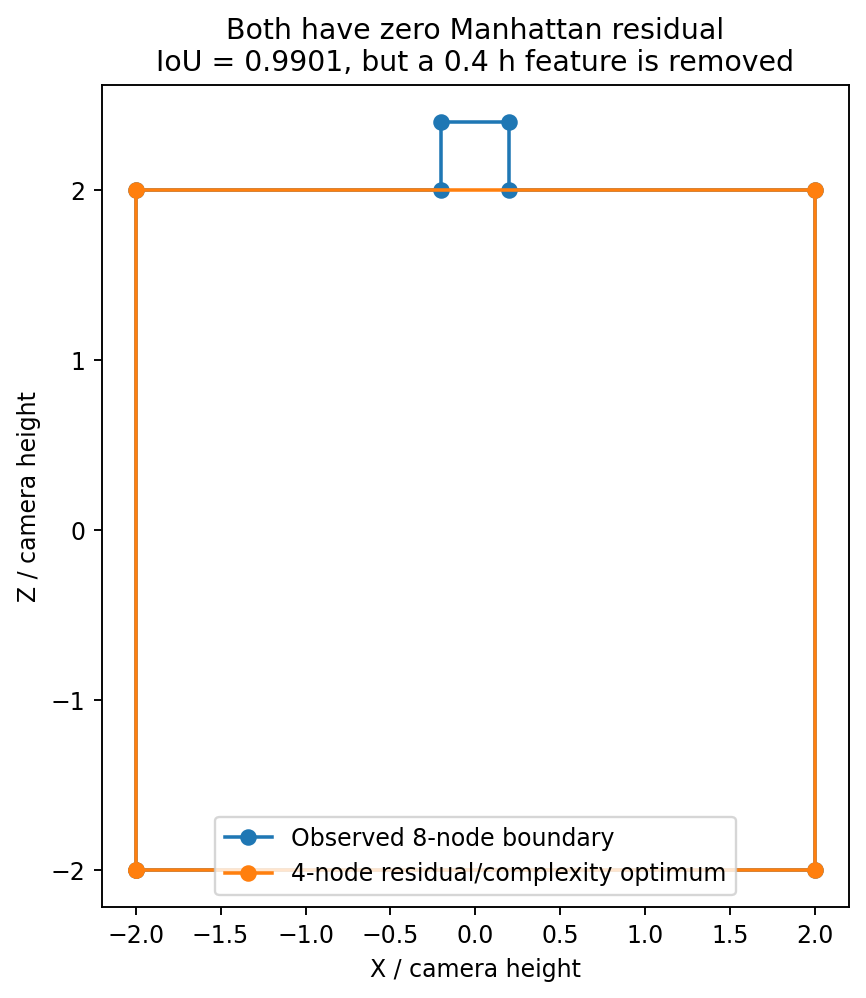
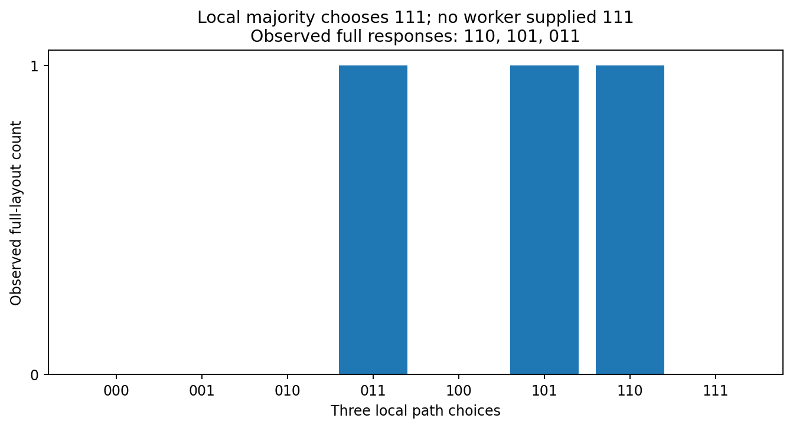

# 全景 layout：从指标响应到局部路径、空间候选与多人研究

研究对象：`research/pro_layout_metric_response_20261001`。固定提交：`10a0fe54608f62668f73d705d6a0cf50a9179f21`。

## 核心判断

优先推荐的不是给 IoU、质心和残差寻找一组通用权重，而是把“空间几何”“标注表达”“观测支持”“单个结构自洽”拆成不同输出。空间比较以声明 BEV 足迹和带方向的边界/局部路径差异为主，ERP 列式墙带保持投影对照。点对身份与物理环序留在主数据结构中；几何等价不等于节点表达相同。

减法有工程价值，但“删除顶点直到残差降低”不构成充分的方法，也没有独立创新性证据。更值得发展的是：保留来源、互斥局部路径与细节约束的多候选构造。它可以使用删除作为操作，但目标应是有观测依据的空间集合，不是简单房间或最多人支持的房间。

本轮最有信息量的新发现，是实际跨接缝的两对/三对路径并非简单加点；拆分 top/bottom 可能产生不兼容配对；同时，保序算法在新增的加点噪声试验中并没有自动优于无序匹配。推荐方案需要据此限制自己的适用范围。

## 1. 已经实际执行什么，尚未执行什么

执行容器不能解析 GitHub 下载域名。GitHub 阅读接口可以读取文件，但完整目录没有进入容器。因此，本包是依据实际读取的当前生成规则、公式和坐标制作的**独立实现与输入摘录**，不是原快照的逐字节副本。

本轮实际执行：74 个参数化合成对照的主要空间指标独立计算；3 张真实图、3 个原始参考比较的坐标复算；45 组真实匹配参数设置；2 份真实几何上构造的 300 组“共线加点＋像素噪声”对照，4 种输出共 1200 行；一个 8 节点房间的 61 个有效且严格含相机的删点子环枚举；局部路径、正交转向奇偶性、局部多数与完整作答支持的反例。输出 7 张独立图。

未执行：原 `verify_layout_metric_snapshot_20261001`、原快照测试全集、所有 15 个真实参考比较的完整字段校验、9 条缺参考记录的逐字段复算、真实多人分簇/融合/质量模型、STAPLE 或 MACCHIatO 原实现。没有原图，没有新增真人数据，没有把模拟样本当成真人。独立实现有意只复算本轮使用的字段，不承诺替代原资格、清洗或错误状态协议。

3 个真实比较的 BEV IoU 与嵌入结果差不超过 3.4×10⁻¹⁶，1024 列式墙带 IoU 与差异像素计数完全一致。74 个合成比较已运行；抽核报告中的对称扩展、隐藏范围、小凸起、近邻尖凸、普通/近地平线定位数值相符，不等同于全部字段的原验证器通过。

当前快照已把原始 GT 来源确定为连续 C 坐标；已分离足迹和墙带适用状态；已将渲染命名为列式代理；已停止在活动指标响应中使用顶点中位高度棱柱。不能把上一轮针对旧实现的这些批评重新说成当前尚未修正的缺陷。[S1–S3]

## 2. 指标需要分工，不宜先加权求和

### 2.1 推荐的输出对象

空间输出向量可先取：

`D_space(A,B) = [1−IoU_BEV, coverage_A, coverage_B, Δcentroid, directed_boundary_mean, boundary_tail, local_path_differences]`。

其中 coverage 主要帮助解释谁包含谁，而非提供独立新证据。另报 `IoU_column_ERP`，有需要时增加同一投影区域的球面立体角加权 IoU。没有可信封闭屋顶时不计算“真实体积 IoU”。

表达输出另取：可靠对应端点的角度误差、匹配覆盖率、未匹配原始点对、未解释路径、可靠转向序列差异、top/bottom 对应冲突。单结构输出另取 Manhattan 方向残差、高度一致性及几何适用状态。三个输出向量不能冒充同一含义的距离。

BEV IoU 回答范围交叠；质心回答分布的一阶矩位移；无对应边界距离回答哪里离开了另一条边界；有对应点误差回答假定同一位置的端点有多远；单结构残差回答结构是否符合特定几何模型。后两者都不能单独表示整个空间差异。

### 2.2 哪些量是冗余的？

设 I 为交集面积，a=I/|A|，b=I/|B|。只要交集非空：

`IoU = 1 / (1/a + 1/b − 1)`。

因此 IoU 与两个 coverage 的联系是代数关系，不应把三个值作为三份独立证据加权。它们一起报告，是为了区分遗漏范围和额外范围。

进一步，在边界光滑或分段规则、位移足够小、拓扑不变的条件下，设法向扰动为 δ(s)，周长为 L，面积为 S。忽略高阶项：

`|A Δ B| ≈ ∫ |δ(s)| ds`；
`1−IoU ≈ (1/S)∫ |δ(s)| ds ≈ (L/S)·mean_boundary_distance`。

所以小范围定位变化时，IoU 损失与平均边界距离可以高度重复。对于新增分支、隐藏范围、断裂、较大位移，这个一阶近似不成立，不能泛化为“二者永远冗余”。

质心变化则近似为：

`Δc ≈ (1/S)∫ (x−c) δ(s) ds`。

带符号贡献可以抵消；对称扩展即使面积变化很大也可以完全不移动质心。质心是解释性补充，不是发现一切范围差异的兜底量。

### 2.3 边界尾部与局部结构

每边界固定 512 个样本会产生分辨率依赖。当前报告对此解释正确。本轮保留所有原顶点，并将每段再细分到最大步长 Δ。到另一条连续折线的距离是 1-Lipschitz，因此可给出：

`sampled_max ≤ H_continuous ≤ sampled_max + Δ/2`。

这个区间只是给定几何上的数值误差保证，不是标注/相机误差的统计置信区间。不同照片的 BEV 不能不经已知外参就直接叠加；本轮所有空间比较限定在同一相机坐标中。均值和 p95 会有意忽略稀少的大偏移；p95=0 可以只是受影响边长不足 5%，并不证明没有细节。

本轮三角形尖凸重新计算：512 点最大值 0.037999600h，8192 点 0.049779302h；保留原尖顶、Δ=0.01h 时得到区间 [0.050,0.055]h。该几何的真实尖顶偏移就是 0.05h。不能把“全局 IoU 接近 1”当成这一尖凸不存在。

对局部路径优先比较连续曲线，而不是对原顶点数组直接使用离散 Fréchet 距离。后者会受同一条边的采样密度影响。本包先细分线段，报告离散估计及保守连续区间。连续 Fréchet 距离要求两条路径按其顺序向前走，Hausdorff 则不检查顺序；两者用途不同。[2]

### 2.4 增加什么表示值得做？

目前最有价值的增量不是再加一个总体分数，而是保留：有符号占据范围、完整带来源的边图、局部路径及双向覆盖。纯无序点匹配即便允许基数惩罚，也没有自动编码邻接；密集边界最近邻可以多对一吸收不同结构。原点集之外可以使用按弧长而非顶点数加权的边界表示，但必须与原始点身份并存。

正交方向残差尤其不能替代上述表示。不同大小、不同停止范围的矩形都可以残差为零；删除一个真实凸起后，残差仍可以为零。

### 2.5 几何无法识别的原因

只要两个生成过程给出相同坐标、环序和高度假设，任何只读取这些信息的算法都会给出相同结果。“有意选小范围”与“误把墙点点击到这个位置”不能仅凭几何区分。图像条件、明确审核标签、任务说明、重复点击或多视角证据才可能区分原因；未记录标签不当负例。

近地平线使用同样像素误差会引起更大 BEV 深度变化：`r=h·cot(α)`，`dr/dα=−h·csc²(α)`。应同时报告角度误差与空间后果，不能把空间后果全部计成人员能力，也不应因不确定性大就把真实范围差异“折扣到没有”。

## 3. 两对/三对问题：先确定路径，而非先确定点数

### 3.1 一个决定实验设计的奇偶性条件

如果局部 Manhattan 路径的入口、出口方向固定，所有真正转角均为 ±90°，记转向符号为 τₖ∈{−1,+1}，则：

`Σ τₖ ≡ exit_direction − entry_direction (mod 4)`。

取模 2 后，真正转角的数量奇偶性必须相同。因此，在共同入口/出口方向下，**两处真正正交转角与三处真正正交转角，不能仅仅作为等价的局部替代**。两对/三对实际记录完全可能存在，因为其中可能有 180° 采样点、路径的入口/出口不同、窗口截断了邻角、结构非正交，或配对不同。

这个条件不能用来批量判错真人；它是核查“局部范围是否定义对了”的方法。新对照补入了共同入口出口下的两转角/四转角正交路径，与两节点/三共线节点分别测试。

### 3.2 真实两对/三对窗口

`jtcxE69GiFV-12`：R03398 与 R02614 在跨接缝窗口 `x∈[970,1035]` 中，各自保留物理环并与窗口边界射线相交。窗口宽 22.8515625°，得到一条含 3 个内部原点对的路径和一条含 2 个内部原点对的路径。

这一局部比较的 Hausdorff 区间为 [0.868916,0.871416]h；路径 Fréchet 区间为 [0.863916,0.868916]h。全局列式 IoU 却为 0.958261，BEV IoU 为 0.828051。它不是同一墙边中间多加一个节点。

窗口由本轮观察坐标后选定，仅是诊断案例；参考原环未人工确认，不能用此裁决 GT 或人谁符合照片。两个窗口切点是派生边交点，不写回原标注。**相同经度窗口也不保证物理入口、出口切向相同，因此不能直接把奇偶性命题套到该真实对照。**

### 3.3 近 180° 也不能只检查 bottom

R00236 的第 2 对底点相邻转向约 1.943°，到底部弦的距离 0.021430h；对应顶点到三维顶边弦的距离为 0.129373h。R00705 第 3 对的底部转向只有 −0.055°，底部弦距约 0.000607h，但顶部弦距约 0.014450h。

所以“底边几乎共线”不是同时消除 top/bottom 的充分条件。即使上下都几何共线，该点仍可能是另一个停止区域的观测端点。建议把它标为几何采样等价候选，但保留原点身份、出处、局部路径和停止语义。

## 4. 匹配与分簇的实施路线

### 4.1 简单周期保序部分匹配

对原物理环的点对序列 A、B，建立端点球面角距离。绑定成本使用：

`cᵢⱼ = 0.5·[(θ_top/σ_top)² + (θ_bottom/σ_bottom)²]`。

对 B 的循环起点和反向遍历取候选。动态规划：

`D(i,j)=min{D(i−1,j−1)+cᵢⱼ, D(i−1,j)+g_A, D(i,j−1)+g_B}`。

此基线一对一、保序、允许未匹配。循环起点和反向表示同一个环，不将其当差异；更换物理邻接则保留区别。返回匹配表、两个方向覆盖率、未匹配原点、并列最佳映射和已匹配端点误差。不要只报条件 RMSE。

参数 `σ` 暂以原域像素相当角距作控制；本轮真实敏感性取 1、2、4、8、16px，gap 取 0.5、2、8。二者共同决定接受距离，不能当独立物理参数：匹配成本超过两次 gap 时，DP 会偏好两端未匹配。很小 σ 可能产生“低误差但几乎无覆盖”的结果。

### 4.2 绑定、拆分、混合

绑定点对能保护已有配对关系，但 top 很差时可能连同正确 bottom 一起舍弃。完全拆分能发现“只有一端相似”，却可能用不同的对应关系解释同一物理角点，不能直接拼回一个合法墙片。

本轮 45 组真实参数组合有 6 组出现共同参考点对的 top、bottom 来自不同人员点对的冲突。比如 R00705 在 σ=8px、gap=2 时，top 将其第 4 对匹配到参考第 6 对；bottom 却把第 3 对匹配到同一参考第 6 对。这 6/45 是诊断网格计数，不是总体人员错误率。

推荐混合：以点对和邻接为骨架；top、bottom 残差分别保留；允许“仅 top 支持/仅 bottom 支持/整对支持/配对冲突”四种观测状态；局部节点数不同进入整段路径替代比较。局部形状接近并不抹去未匹配节点，单端支持不自动给另一端补票。

### 4.3 怎样确定局部范围

先用宽松周期匹配获得候选锚点；选择在参数变化中稳定且相邻边方向可比较的两侧支撑边。沿原物理环裁切完整不一致区间，并至少检查相邻支撑边，避免把应属于同一次转向变化的节点切成多个事件。angular window 可用作定位索引，但不能代替物理路径。

如果一个窗口有多个进入/离开分量，应返回多个路径或“范围未解决”，不能按 x 合并。截取到的每个切点记录边 ID 与插值参数。多个人之间的公共块必须在当前可用人员内形成；人数重放不能预先利用未来人的点全集来定义块。

本包已实现：保持物理环的角窗裁切、所有连通路径返回、切点来源、路径距离与几何接近/不同/数值分辨率未决三态判定。**自动可靠锚点选择、跨人公共块对齐和最终分簇还没有得到本轮验证。**

### 4.4 不把密集细节合并掉

每个局部块同时保留 geometry 与 expression 两层。例如：两节点/三共线节点可以 geometry=相同，expression=多一个原点；两转角/四转角的路径可以在很小空间内接近，但转向序列和局部路径类型仍不同。不要用“点数不同必分”或“距离近必合”覆盖这两层。

可以用 complete-link 兼容性作为第一版聚类：一个簇内任意两条路径须满足设定的局部路径距离、可靠方向/转向与配对兼容条件。它避免单连接通过一串近邻逐步把不同结构连成一簇，但依然有阈值、并列和多模态问题；不保证这种簇就是语义上的一种房间。

纯 Hausdorff/边界距离是便宜的筛选，不承担语义对应。Fréchet 对顺序敏感，但也对局部离群尖点敏感；应保留完整路径差异，同时允许带明确跳过成本的部分匹配，而不是无限制忽略“难匹配的尖点”。[2,3]

## 5. 补做试验没有证明复杂方法必然更好

在 R00236、R00705 各选一条真实三维边，精确插入同时位于 floor 和 wall-top 线段上的新点对。之后对 target 加共享 x 噪声及两端独立 y 噪声，标准差为 0.25、0.5、1、2、4px，每种 30 次。共 300 个对照，已知原点身份；这是几何控制试验，不是模拟人员能力的已验证模型。此像素扰动分布没有用真人重复点击拟合，球面匹配成本也不声称是该像素噪声的精确最大似然。

无序绑定匹配与周期绑定匹配，在这两个加点族的全部设置中给出相同的正确/错误计数。在 R00705、4px 噪声时，二者正确身份覆盖率均为 96.25%。没有证据据此声称保序“全面更准”。

同一 R00705 的 4px 条件中，独立 top/bottom 产生互相冲突的点对映射比例为 36.7%（11/30 次）。不能把低单端误差自动转换为合法点对对应。

另外固定同一组顶点，只改变两个均合法、含相机的简单环：无序点成本为 0，而 BEV IoU=0.641667，列式 IoU≈0.712。周期匹配能暴露邻接变化，边界路径比较也能发现空间变化。这里保序的价值是“不丢掉结构信息”，并不是对任意定位噪声都提供额外优势。

## 6. 减法设想：保留，但改成带观测约束的多候选问题

### 6.1 实际反例

8 节点房间包含宽 0.4h、深 0.4h 的正交凸起。枚举所有保序删点子环后，219 个原始子序列中，195 个是正面积简单多边形，61 个严格包含相机，其中 5 个满足本实验已知的正交轴残差近零；这 5 个只有 2 种不同区域，其余区别是共线节点的保留方式。

以“正交残差优先、再最少点”为规则，选择 4 节点矩形。两者残差都为零，BEV IoU=0.990099，但 0.4h 深的完整凸起被删除。所有点原本都是该对照给定的有据观测，没有理由仅因简洁而去掉它。

若只计算保留下来的匹配点 RMSE，被删除部分不进入损失，算法更容易自证改进。因此保真必须覆盖完整原路径或显式记录被舍弃的路径，而非删除后的幸存点。

### 6.2 数学上合理的目标

令 L 由可追溯局部路径构成，G 是几何约束，E_obs 是对所选兼容观测的解释成本，E_edit 是移动/新增/删除的成本，E_loss 是有证据细节的损失。建议先输出可行集或 Pareto 集：

`F = { L: simple/closed, compatible gates, G(L)≤τ, E_obs(L)≤ε, unsupported_length(L)≤η }`；

在 F 中比较 `(E_edit, E_loss, unexplained_alternatives)`，不把人数作为几何目标函数的必选项。

具体限制是：每个候选局部块必须来自一个完整的观测路径，或者是其受限编辑；不能从互斥作答中各捡一个最近点来构造“每点都有来源”的假兼容路径。切换来源只允许在兼容支撑边/门控位置发生；候选新增的无观测墙段要单列长度与理由。

原始不同停止范围可以各生成候选，不要求一个候选同时拟合互斥边界。未采用的替代观测保留为其他解释，不直接按其人数增加惩罚，否则又变成多数共识。原始整模式人数、兼容人数、逐块支持人数分别报告，不能相加为完整房间支持。

方向残差建议同时报告固定共同轴下每边角度与按观测误差尺度归一化的横向偏离。短边不能和长边用同一个固定角度淘汰规则。优化后零残差必须连同原残差、移动量、删改范围一起报告。地面平面由重建假设强制满足，本身不能算成从数据验证出的“高质量”。

### 6.3 与其他做法的本质区别

最佳完整作答只在原有候选中选，不会凭空新增结构，适合作为保守 baseline。单一原环减法只产生该环的子序列，不能恢复所有缺失观察。共同点加法往往先缩到交集，可能抹掉少数结构或丢掉兼容环。多来源局部重组才允许产生没有任何一个人完整画出的候选，但新增的来源转换、冲突与支持范围必须透明。

在**相同有限候选集合、相同目标且穷举**的条件下，从空集添加或从全集删除会得到相同最优集合。有限启发式出现差别，是可达候选与搜索偏好的区别，不能据此宣称减法在数学上天然更保细节。

已有曲线 shortcut/子路径替换、部分 Fréchet 和图路径搜索与这一思路有直接关系，Driemel 与 Har-Peled 的研究已经明确讨论用直段替换局部曲线、噪声和跳过预算。[3] 因此“减法”本身缺乏独立创新依据。潜在贡献在于全景上下配对、范围互斥、局部来源、共同几何约束及多解证据的联合处理；需要和这些简单基线比较后才谈创新。

本包完成的是小房间的穷举删点与保真预算原型，不是已实现的全量多来源图求解器。

## 7. 共识与人员质量分开研究

### 7.1 共识方法比较

Lee 等人的 tile 是多人分割叠加后的最小不重叠单元；MV、EM、greedy 是 tile 上不同的选择规则。[1] 同投票域、同阈值、同划分下，tile MV 与逐像素 MV 的结果相同。这是表示与聚合规则的分工，不是“Lee 方法与 MV”两个完全并列对象。

连续 BEV 多边形叠加生成 tile，可以避免固定像素格漏掉细小区域；每个人对每块仍只能投一票，tile 面积是区域损失的测度，不是人数。局部细节的语义重要性不能仅靠面积决定。

Lee 文中的最大簇预处理目标是减少语义错误；直接照搬会把本研究要保留的范围解释和少数模式去掉。因此全体等权 MV、严格多数 MV、原作答 medoid 应保留，最大簇聚合只能作为附加对照，不是先验正确程序。[1]

STAPLE 联合估计潜在分割和来源表现；二值模型区分 sensitivity/specificity，不等同于自定义单正确率 EM。[4] 它适合在相对明确的单潜在目标下作比较，但低多数一致性不能自动解释为本题中选择另一合理范围的人员“不可靠”。

MACCHIatO 以掩码距离的 Fréchet 均值构造共识，并讨论 STAPLE 对背景大小与先验的敏感性。[5] 这里的“Fréchet 均值”是度量空间中的统计中心，**不是**本报告的“曲线 Fréchet 距离”。它可以作为 Jaccard 型区域聚合对照，但不自动保证全景周期处理、合法角点环、稀少结构保留或识别人员能力。本轮没有运行上述原实现。

### 7.2 局部整体投票仍须保留联合支持

三人完整作答的局部选择分别是 `110、101、011`，逐块多数会产生 `111`。每块都有 2/3 支持，但 `111` 的完整作答支持为 0。它可能是合理的新空间候选，也可能是错误组合；单看边际支持无法知道。

因此建议同时输出每块的路径类型分布、完整已观测模式的分布、合成候选及来源。路径整体投票有助于避免把同一局部结构的两三个点拆散投票，但不能自动解决不同块之间的相关性。

全部人员都省略同一细节时，MV 可以随人数稳定而始终省略；这并不是共识算法的收敛“成功证明”。评价应分开人数增长后的结果变化、同人数换成员变化、少数模式覆盖、参考差距。完整相同人员集合的最终结果相同是确定性算法的性质，不是群体真值证据。

### 7.3 当前小面板不能识别人员效应

这 12 图每图只有一个选出的人员作答，15 次比较来自部分图片多了参考版本，不能当成多了 3 份独立人员观测。在模型 `y_wi=α_w+β_i+error` 中，可以把某人的效应加 Δ，同时给其各图效应减 Δ，拟合值完全不变。

本包构造的示范设计有 12 图、5 个示例人员、17 个固定效应列，矩阵秩只有 12；重新分配人员/图片效应后预测变化为 0。5 个身份是说明秩问题的示例，不声称是完整历史数据库的真实人员图。

完整跨人跨图数据在人员—图片图连通、存在充分共同任务及条件覆盖的前提下，可以估计调整后的平均人员差异。但没有同人同图重复作答时，人员×图片交互、瞬时点击波动与部分范围选择不能无假设地完全拆开。每图固定效应还会吸收所有图级固定特征，不能同时无约束估计那些特征的独立系数。多维人员/图片属性模型已有先例，但模型复杂并不会改变当前面板的识别限制。[6]

### 7.4 建议的人员输出而非总分

分别建模：可靠共同结构上的角度定位误差及匹配覆盖；未匹配/替代路径率；固定参考的一致性；几何自洽残差；有明确审核分母的排除记录。GT 版本和既有问题标记保留，不能挑更近的一版当真值。未对应部分不能从人员结果中消失，否则“只会匹配简单部分”会得到假高分。

审核是定向选样时，排除/已审比例不能称全体真实错误率；需要同时报告总作答、审核覆盖与原因。范围选择的差异更适合作为行为倾向，除非任务语义明确且已有裁决，不直接记成能力损失。

需要使用完整交叉数据，按建筑或房间留出校准；目标图 GT、未来加入人员、未来结构不能参与其前缀方法定义。像素、排列次数和重复参考不是独立人员样本。

## 8. 三版可实施方案

### A：透明的简单基线

输入：同图当前点对、物理环、条件/来源与资格；不要求先有可靠对应。

计算：声明 BEV IoU、方向 coverage、质心、双向边界均值与带数值界的尾部；周期绑定 DP 只作点位表达的基线；ERP 列式 IoU 为对照。人员融合用全体等权 MV（≥50% 与 >50%）及原作答 medoid。合理候选先保留合法完整作答，不进行自动修正。

输出：几何向量、点对部分匹配和未匹配、原始聚合 mask、合法完整作答列表；缺参考保持缺失。

参数：边界最大步长与数值误差界；DP 的 σ 与 gap 按上述网格，不先固定唯一最优。先看误配/覆盖权衡，不用 GT IoU 最大来选匹配参数。

适用：迅速建立可解释对照；几何和元数据可靠的普通图。失败：无序边界不能给语义对应，点 gap 惩罚不具有共线细分不变性，MV 可产生不合法或无完整支持的组合。

### B：优先推荐——点对骨架＋局部路径＋分层证据

输入：A 的数据，加当前可确认的局部支撑边/候选锚点；保留不确定而非强行配对。

计算：周期部分匹配提供骨架；独立 top/bottom 只诊断支持与冲突；在物理环上扩展完整不一致路径；双向边界与顺序敏感 Fréchet 比较；geometry/expression 双标签；局部路径整体计票。比较向量而非一条通用加权距离。

数学形式：仅当路径距离及配对/方向兼容条件同时满足时，建立局部兼容关系。采用三态数值界：上界≤ε 才确认接近，下界>ε 确认不同，其他保留未决。先使用 complete-link 或有限兼容图，不用单连接吞并密集细节。

参数：匹配 σ 和 gap 由独立定位重复/合成扰动与留出人工对应标记比较；局部 ε 候选可先比较 0.005、0.01、0.02、0.05、0.1h，同时保留原域角度尺度。它们不是普适“可忽略细节大小”。边界/路径离散步长不超过判定容差的适当小比例；真转向是否可靠由端点误差与边长决定，不统一固定角阈值删除。

输出：带来源的路径候选、每端支持、匹配与未解释区间、几何/表达分簇、局部与完整联合支持；不能自动命名为语义空间类型。

适用：局部两对/三对、细节密集、停止点及多范围。失败：没有可靠两侧支撑、遮挡造成多个窗口分量、拓扑完全不同、近地平线误差大时可能无法判定；应返回更大块或未决。

代码状态：周期匹配、窗口裁切、局部路径比较和三态判定可运行；完整多人自动分块与最终簇协议尚未验证。当前推荐来自反例能区分研究对象，不是全量效果已经领先。

### C：探索方案——带来源的多空间候选搜索

输入：B 的局部替代路径及原始完整环；声明几何模型与共同尺度/轴向。

计算：用候选路径作为图中的宏边，记录可用入口/出口与来源；候选选择形成合法闭环；对局部替换、少量删除或几何拟合建立预算，保留 Pareto 解。小图枚举，较大图可做受限 beam/MILP 搜索；换求解器不等于方法创新。

参数：`τ_geo`、逐块 `ε_obs`、新增边长预算 `η` 和最大源切换次数。先采用约束预算曲线，不强行给残差、面积和点数指定一个权重。若必须用加权启发式，各项先按独立误差尺度无量纲化，取 0.25、1、4 等敏感性倍率，报告候选改变而不是宣布某组权重正确。

输出：多个几何合理但未必视觉正确的 layout，全部来源、修改与未解释观察；逐块支持和完整模式支持分别报告。人员重复或同人多版本不能给局部几何证据重复增票。

失败：观测不能支撑的隐藏范围、跨块互斥、错误共同轴、闭环不足和数据不支持的屋顶；允许无可行候选。禁止无声明地跨门洞补墙来获得封闭体积。

代码状态：本包实现删点穷举与保真预算示范，不声称完成全量跨来源求解器。将其作为 B 之后的研究分支，不先替代工人共识。

## 9. 下一轮最值得实施的一项实验

**同图多人局部路径的留出匹配试验**，而不是再调总体 IoU 权重。

从完整历史池按事先确定的类别抽取一批局部块：两对/三对、同墙加点、真实短凸凹、停止范围改变、跨接缝/经度回退、只有 top 或 bottom 接近。以当前真实案例作调试例，但不再把它们当独立测试样本。工程试点可先取约 40 个块，这不是统计功效计算出的样本数；每块保留该图可用的全部独立人员。

由审核明确局部支撑边、可靠对应、互斥路径和未知项，不以“更接近 GT”定义答案。按建筑留出；同一块全部人员与派生扰动必须在同一侧。比较 A、B 以及无对应边界基线，输出误配率—覆盖曲线、真实细节被错误合并的比例、共线加点被错误拆簇的比例、top/bottom 冲突、未决率和邻接错误检出。

只有确认 B 在留出真实块中降低误合并/误配，而且不是靠把大量作答标成未匹配来获得优势，才值得把它接入正式共识、人员评价和多来源候选生成。这项实验直接检验本轮最缺的证据：真实局部对应与路径等价，而不是再验证已经清楚的面积盲点。

## 参考文献与来源

[1] Doris Jung-Lin Lee, Akash Das Sarma, Aditya Parameswaran. 2018. *Aggregating Crowdsourced Image Segmentations*. HCOMP 2018 Works in Progress and Demonstration Papers, CEUR Workshop Proceedings, Vol. 2173. [会议官方 PDF](https://ceur-ws.org/Vol-2173/paper10.pdf)。本文核对的是此会议短文，不声称完整重现其另行引用的技术报告。

[2] Karl Bringmann, Marvin Künnemann, André Nusser. 2021. *Walking the dog fast in practice: Algorithm engineering of the Fréchet distance*. Journal of Computational Geometry, 12(1):70–108. DOI:10.20382/jocg.v12i1a4. [期刊 PDF 入口](https://jocg.org/index.php/jocg/article/view/3154/2976)。本包采用有界离散近似，不声称复现其认证连续求解器。

[3] Anne Driemel, Sariel Har-Peled. 2013. *Jaywalking Your Dog: Computing the Fréchet Distance with Shortcuts*. SIAM Journal on Computing, 42(5):1830–1866. DOI:10.1137/120865112. [作者提供的期刊 PDF](https://sarielhp.org/p/12/shortcut/86511.pdf)。

[4] Simon K. Warfield, Kelly H. Zou, William M. Wells. 2004. *Simultaneous Truth and Performance Level Estimation (STAPLE): An Algorithm for the Validation of Image Segmentation*. IEEE Transactions on Medical Imaging, 23(7):903–921. DOI:10.1109/TMI.2004.828354. [官方文献记录/开放稿入口](https://pubmed.ncbi.nlm.nih.gov/15250643/)。本环境该官方入口有访问拦截，内容另核对作者上传的原稿；本包不包含其论文文件。

[5] Dimitri Hamzaoui, Sarah Montagne, Raphaële Renard-Penna, Nicholas Ayache, Hervé Delingette. 2023. *Morphologically-Aware Consensus Computation via Heuristics-based IterATive Optimization (MACCHIatO)*. Journal of Machine Learning for Biomedical Imaging, 2023:013, pp.361–389. [作者存档的发表版 PDF](https://arxiv.org/pdf/2309.08066)。

[6] Peter Welinder, Steve Branson, Serge Belongie, Pietro Perona. 2010. *The Multidimensional Wisdom of Crowds*. Advances in Neural Information Processing Systems 23. [会议官方 PDF](https://papers.nips.cc/paper_files/paper/2010/file/0f9cafd014db7a619ddb4276af0d692c-Paper.pdf)。

[S1] Sparkling-Flames/3D_Manhattan_label. 2026. *2026-10-01 指标响应最小研究快照 README*，提交10a0fe54608f62668f73d705d6a0cf50a9179f21，`research/pro_layout_metric_response_20261001/README.md`。

[S2] 同一提交同一目录，`analysis_results/layout_metric_response_20261001/REPORT.md`、`results.json`、`field_contract.json`、`docs/thesis_main/PAPER_A_METHOD_CONTRACT_CURRENT.json`。

[S3] 同一提交同一目录，`tools/thesis_main/analysis/layout_metric_response_20261001.py`、`research_round_20260929.py`、`layout_metric_probe_20260926.py`、`tools/label_studio/panorama_studio/geometry.py`。源码函数和真实坐标通过 GitHub 阅读接口读取；完整文件未下载到执行容器。

所有新数值的依据是本包 `results/` 与运行代码；它们不是引文中的已发表实验结果。未自动修订原数据，未提交 GitHub，未改变用户的 GT、人员资格或审核裁决。
