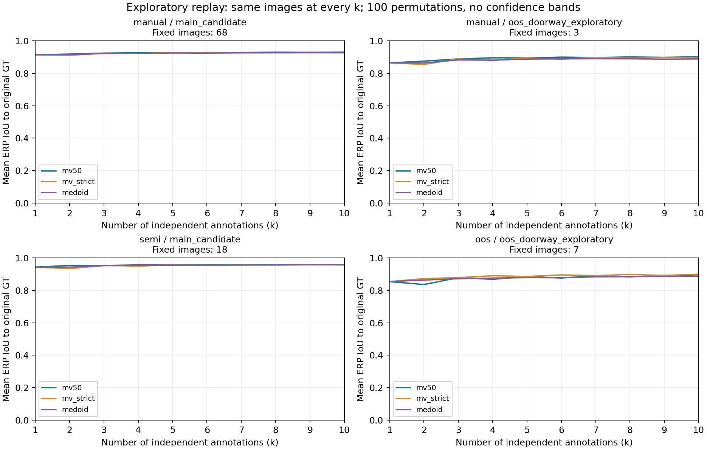

# 9/29 全量复核后第一轮数值基线

本轮实际执行完成。输入为接入线程核验后的快照：3152 份历史人员记录、259 张人员研究图、2 张仅 GT 参考图、27 个历史人员别名、22 栋建筑。原始 GT 259 份、人工修订 GT 30 份。2923 份保留、11 份待定保留、85 份复核排除、133 份历史不接受；独立共识可用资格 2909 份，其中主候选2395、OOS/门洞探索485、稳定非正交单列29。方法能否计算仍需另判。

运行：512×256 栅格，100 次固定种子随机人员排列。原始/修订 GT 并列；GT 没有进入共识生成。全部产生 10455 条参考比较、3684 条端点记录、10365 条重放摘要。记录数不是独立样本量。

## GT 相对差异

以下仅取上游主质量候选、独立人员且该指标可计算的记录。分母随方法和 GT 版本变化；不是配对的方法优劣检验，不可直接把 manual 与 semi 的差异当条件因果效应或人员能力差。

| reference | representation | condition | count | mean | median |
| --- | --- | --- | --- | --- | --- |
| manual_revision | bev_and_prism_proxy | manual | 223 | 0.7188 | 0.8185 |
| manual_revision | bev_and_prism_proxy | semi | 142 | 0.8475 | 0.8983 |
| manual_revision | explicit_visible | manual | 223 | 0.9134 | 0.9438 |
| manual_revision | explicit_visible | semi | 142 | 0.9411 | 0.9661 |
| manual_revision | legacy_x_envelope | manual | 223 | 0.9004 | 0.9293 |
| manual_revision | legacy_x_envelope | semi | 142 | 0.9402 | 0.9652 |
| original | bev_and_prism_proxy | manual | 1533 | 0.7687 | 0.8188 |
| original | bev_and_prism_proxy | semi | 491 | 0.8398 | 0.8742 |
| original | explicit_visible | manual | 1531 | 0.9131 | 0.9402 |
| original | explicit_visible | semi | 491 | 0.9467 | 0.9628 |
| original | legacy_x_envelope | manual | 1530 | 0.9044 | 0.937 |
| original | legacy_x_envelope | semi | 491 | 0.941 | 0.9619 |

ERP 墙带和 BEV 不是同一个评价对象。原始 GT 比较中有 161 条保留/待定记录同时出现显式可见 ERP IoU>0.95、BEV IoU<0.8。下面列数值反例，不裁决标注或 GT 哪个正确，也不把这些全部解释为遮挡效应。

| image | id | bev_and_prism_proxy | explicit_visible | legacy_x_envelope |
| --- | --- | --- | --- | --- |
| B6ByNegPMKs-22 | R00695 | 0.3416 | 0.956 | 0.9479 |
| 7y3sRwLe3Va-13 | R01357 | 0.4133 | 0.9595 | 0.9601 |
| UwV83HsGsw3-16 | R02273 | 0.4476 | 0.9519 | 0.9083 |
| yqstnuAEVhm-25 | R01637 | 0.5635 | 0.9531 | 0.9528 |
| uNb9QFRL6hY-55 | R03154 | 0.5846 | 0.9556 | 0.9465 |
| yqstnuAEVhm-24 | R01160 | 0.5959 | 0.959 | 0.9593 |

## 共识比较

下表仅为主共识候选、原始 GT、显式可见表示的图片等权端点描述；包括本来就只有少数人的图。跨方法均值没有建筑层置信区间，不声称显著胜出。各场景/条件/GT 的完整表见 consensus_group_summary.csv。

| reference | representation | stratum | condition | method | count | mean | median |
| --- | --- | --- | --- | --- | --- | --- | --- |
| original | explicit_visible | main_candidate | manual | em_correct_probability | 197 | 0.9275 | 0.9514 |
| original | explicit_visible | main_candidate | manual | greedy_empirical | 197 | 0.9286 | 0.9518 |
| original | explicit_visible | main_candidate | manual | medoid | 197 | 0.9253 | 0.9496 |
| original | explicit_visible | main_candidate | manual | mv50 | 197 | 0.9284 | 0.9521 |
| original | explicit_visible | main_candidate | manual | mv_strict | 197 | 0.9259 | 0.9488 |
| original | explicit_visible | main_candidate | semi | em_correct_probability | 41 | 0.969 | 0.9766 |
| original | explicit_visible | main_candidate | semi | greedy_empirical | 41 | 0.9692 | 0.9798 |
| original | explicit_visible | main_candidate | semi | medoid | 41 | 0.9688 | 0.9766 |
| original | explicit_visible | main_candidate | semi | mv50 | 41 | 0.9692 | 0.9798 |
| original | explicit_visible | main_candidate | semi | mv_strict | 41 | 0.9663 | 0.9766 |

图中每层仅保留独立人数>=10、所有投票可渲染且原始 GT 可计算的固定图片，k=1…10 始终同一批图；清单见 fixed_panel_selection.csv。这是可计算完整案例子集，不能代表被排除的图片。先在每图内平均100次排列，再对图片等权平均；无置信带。各算法是否接近GT与结果是否稳定是两条问题，输出变化另见 fixed_panel_curves.csv。曲线不用于反过来定义简单/困难。

## 失败和解释边界

- STAPLE 本地缺少 SimpleITK，全部明确 unavailable；没有声称跑过。其余五种是两个 MV、medoid、单正确率 EM 适配和经验 greedy 适配，后两者不是论文完整复现。
- 显式与旧包络各有 44 与 48 个对象无法渲染；具体原因在 representation_failures.csv。相机不在所标多边形内不自动等于标错，可能涉及空间范围或表示假设。GT 无法计算会影响多份比较，不能将比较失败数当异常人员数。
- 新旧表示还使用不同像素约定，这轮差异不能全部归于顺序；严格控制变量留给下一轮。任何低 resultant 圆周/球面中心都可能不稳定，尚未选可靠性阈值，不据此给人员评级。
- BEV 长度以相机高度1归一化；棱柱指标采用中位高度，只是代理。近地平线深度放大、边界采样误差仍需敏感性分析。
- 近180°中间节点完整保留。共线点可能是停止分支，角度残差不能裁决其语义。当前共识仍是mask基线，未得到点对融合、多个有效房间或自由删点搜索结果。
- 主质量资格2030份不等于最终可评分2030份；借用点不作为独立完整投票。原始/修订GT覆盖不平衡，不做择优参考，也不把不同覆盖均值解释成修订效果。

## 下一步与当前判断

最值得先推进的是明确几何表示和参考差异，再比较结构约束融合与多模式候选。当前证据支持把IoU、质心、边界差异和几何诊断分开报告；尚不足以验证一种总分或声称分离人员/图片噪声。多数支持是行为共识证据，几何一致是模型证据，两者均不能代替缺失的视觉证据。

上述为当时数值探索，未完成点级融合或自由删点搜索。当前研究方向已更新为先核验连线与表示，再分阶段研究指标与算法；提示词由对话提供，旧任务文件已移除。本报告数值不因方向更新而追改。

本轮不修改原始坐标、GT、配对、确认环序、清洗裁决或正式协议。新增源码做定向不变量测试；本包单独验证输入和依赖。文档索引与项目地图只登记探索入口，没有升格为正式方法。
