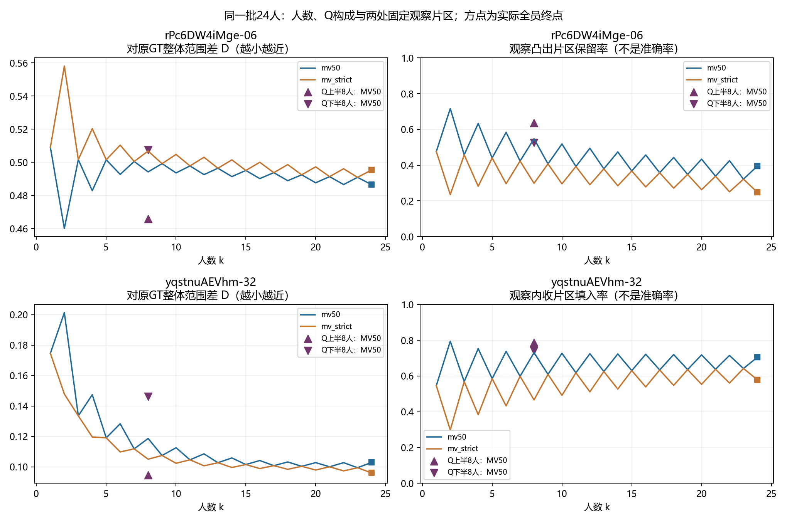

# Pro返回与本地人员／人数结果：综合分析

2026-10-06。本页是对本轮返回的独立取舍和新增连接结果。Pro原件保存在[pro_original](pro_original/REPORT_ZH.md)，聊天返回保存在[pro_message.txt](pro_message.txt)。来源为用户提供的Downloads目录；原件未改写。研究定义以[统一模型](../../docs/thesis_main/研究模型_人员图片与融合不确定性_20261006.md)为准。

**主要判断：现有Q构成能改善整体参考范围，但“一致、近GT、保留具体细节”不能合并成一种能力或同一条收敛结论。特殊场景标签也不能预定融合成败。** 本地新增的两处局部人数／构成结果，把这点从概念区别推进到了同图、同池、同规则的实际对照。

同日续审已完成[实际边界对照与来源追踪](../../analysis_results/consensus_response_20261006/boundary_followup/README.md)，用户已补充rPc外侧较标准／内侧同样合理、yq同结构偏差／简化的具体判断。**共识体现纳入人员观察，不保证必须像GT。** 第6节原先列出的两个局部补充已收束；[共同24人十图分项矩阵](../../analysis_results/consensus_response_20261006/worker_image/README.md)已接回主线，uNb上游方位原因仍未定。

后续[dot审核原件](dot_original/独立判断_最新研究进度_20261006.md)完整归档41个文件，来源为用户指定的`Downloads/local_research_independent_review_20261006`，未改写或作为本地补丁执行。本地针对性复算确认P017对跨图排序关联影响明显、外扩平方和分配依赖面积尺度；已在共同面板报告与统一模型收紧解释。保留全部人员、GT归一化主指标和现有逐图构成结果。成员平均误差与融合终点连接已于2026-10-07[完成](../../analysis_results/consensus_response_20261006/member_fusion/REPORT.md)，不把其恒等分解当作空间互补证明。六图完整复核与逐一删图／建筑诊断属于dot交付，本地本轮未重复运行。

## 1. 两边证据怎样连接

| 已完成的工作 | 回答的问题 | 范围 |
|---|---|---|
| [本地原作答、人数与全员结果](../../analysis_results/consensus_response_20261006/REPORT.md) | 原来差多少；增人后参考差与换组差怎样变；最终实际输出是什么 | 39 Manual＋18 Semi，57池；114份实际全员底面 |
| [本地构成结果](../../analysis_results/consensus_response_20261006/composition/REPORT.md) | 楼外Q画像选哪些人，能否改善R、D、V | 39 Manual；其中共同24人×10图；不含Semi构成 |
| Pro特殊场景 | 非正交可标、可标门洞是否一定失败；参考差来自什么 | 4图：x8-01／09、uNb-47、jtcx-12 |
| Pro细节案例 | 实际全员结果怎样处理既有局部结构观察 | rPc-06、yq-32；全员底面复用本地输出，新增原图解释和局部测量 |
| [本地本轮新增](../../analysis_results/consensus_response_20261006/local_patches/README.md) | Pro选定片区在增人和Q构成下怎样变化 | 两图各24人，随机k=1…24；同k=8三种构成，两规则与两种已有校准政策 |

Pro六个实际案例纳入109份作答，来自24名人员；不是109名人员。两张细节图已经在本地主面板内，不作为新增独立样本。x8两个视角同房G231；不能把5人与24人的差异解释为人数效应。

R是原作答两两区域差，D是对指定GT的遗漏加外扩，V是同人数换组输出差。R、V用固定全池并集归一化，D用GT面积归一化。每个具体团队仍只形成一个区域。

## 2. 原有人员结论仍成立，但其含义更具体了

同图8人、原GT校准与评价、MV50：39图中上半组相对下半组30图D较低，平均差−0.03533；原作答R与换组V均只有23图较低。共同十图分别为9／7／5图。**当前画像对参考范围的收益，比对一致性的收益更明确。**

rPc就是例子：上半8人D=0.4659，低于下半8人的0.5076；但R由0.1380升至0.2355，V由0.0349升至0.0424。其参考改善主要来自遗漏下降（0.4589→0.4170），外扩几乎未变（0.04870→0.04885）。这与“低分人员更分散、高分人员更整齐”的简单解释不符。

全员结果必须继续保留：原GT、MV50下，39 Manual中38图全员D低于单人D均值；但不保证全员超过有依据的少人构成，更不保证各局部结构都改善。它是实际产物的平均参考收益，不是逐人胜率或单调增人规律。

## 3. 新增连接：人数增加和换构成，作用并不相同

下表来自本轮新增解析计算。局部片区沿用Pro已经选定的坐标，没有为了得到某个方向重选；总体D读取现有结果。

| 图片／对象 | 随机8人 | 随机16人 | 实际全员24人 |
|---|---:|---:|---:|
| rPc：整体D，原GT | 0.4942 | 0.4902 | 0.4865 |
| rPc：观察凸出片区保留率 | 54.8% | 45.7% | 39.5% |
| yq：整体D，原GT | 0.1186 | 0.1041 | 0.1028 |
| yq：观察内收片区填入率 | 73.1% | 72.2% | 70.5% |

rPc增人后的整体改善，与该处观察凸出的减少同时发生。相对单人均值，全员遗漏反而从43.97%升至44.92%，外扩从6.94%降至3.74%；D由0.5091降至0.4865主要依靠减少外扩。不能据此写成细节也被修复。

yq却不是“人越多、细节越差”：8→24人的填入率略降，方向上更接近所选内收观察，但全员仍填入70.5%。全人数曲线还有奇偶门槛起伏，不能把连线当平滑的连续收敛规律。

同k=8再换构成，原GT校准、原GT评价、MV50：

| 图片 | 下半组D → 上半组D | 对同一个观察片区的变化 |
|---|---:|---|
| rPc | 0.5076 → 0.4659 | 凸出保留52.6% → 63.6%，更像该观察 |
| yq | 0.1462 → 0.0946 | 内收填入74.3% → 78.7%，更偏离该观察 |

所以，“增人”和“按跨图参考表现选人”不能互代；“参考表现更好”和“保留这处具体观察”也不能互代。yq的高Q组主要减少全局外扩（0.1011→0.0492），同时局部内收却更被填入；局部与全局并不矛盾。

还需保留一个会改变解释的敏感性结果：**改用已有的修订优先校准后，两处局部构成对照方向均反转，而对原GT的整体D仍是上半较低。** rPc保留率变成下半69.6%／上半40.4%；yq填入率变成下半80.9%／上半73.4%。rPc只交换了上、下半中的一名成员，便有这种变化。这里改变的是目标建筑外的校准参考和随之而来的分组，目标图作答、片区及评价参考均保持不变。这说明当前Q二分尚不能当成稳定的细节能力类型；本轮不据此重选更好看的分组。

## 4. Pro的细节证据有增量，但还不是细节真值

yq必须区分两处：**壁炉的大轮廓已经被两种全员规则保留；右侧门前的小内收被部分填入。** 不能概括为“融合把壁炉删掉了”。原／修GT本身都填入该小片区约99.1%，所以更近GT与更像这份局部观察完全可以反向。

rPc的片区在来源作答内部，减少它是相对该观察的局部遗漏；yq片区在来源作答外部，填入它是相对该观察的局部外扩。两者都叫“细节被简化”可以，但在面积意义上方向不同。

当前两处片区分别由R01557、R02256的短路径与端点直连围成，来源都是P023。它们是事后选择的具体观察，**不是新局部GT、不是两名人员的独立复现，也不是一个已验证的自动细节分数**。原图支持确有这些结构判断问题，但遮挡与边界目标仍限制精确位置裁决。此次测量回答“这份观察如何被保留／填入”，没有把“更像它”改名为“更正确”。

Pro路径距离还比较了沿路径采样点到另一边界的距离。这与片区面积覆盖不是同一件事：区域可以覆盖片区，边界却在较远处。不能要求二者数值同向，也不能把512点采样最大值叫作已知对应角点误差或精确Hausdorff距离。

## 5. 特殊场景的结论应落在可标性、分歧与参考上

| 图及现有分类 | 人员两两IoU中位数 | 全员MV50 IoU：原GT／修订GT | 本轮支持的解释 |
|---|---:|---:|---|
| x8-01：非正交可标，5人 | 0.848 | 0.912／无 | 非正交并没有阻止形成贴近该参考的区域 |
| x8-09：同房另一视角，24人 | 0.856 | 0.875／0.908 | 与上一图共同提供一个房间的可行案例 |
| uNb-47：可标门洞，23人 | 0.753 | 0.410／0.884 | 大范围选择较统一，边界位置仍有差异；参考版本影响巨大 |
| jtcx-12：可标门洞，9人 | 0.620 | 0.581／无 | 可标仍可能出现明显范围分歧与参考遗漏 |

Lee区域投票本来不强制墙角正交，因此x8的意义是验证这些实际输入可用，而不是发现算法突破了原有正交限制。相机高度、地面反投影等表示条件仍存在。特殊场景继续独立解释，不恢复其主人员质量资格，也不把四图混入39图平均数。

uNb-47存在值得单点处理的方位线索：Pro把原参考绕相机旋转90°后，与修订参考的IoU由0.388升至0.868，与全员区域由0.410升至0.873。**这支持检查原参考与全景的方位映射，尚不证明原GT文件错误，也不授权改参考。** 不将旋转后的高分纳入主结果。

本轮没有覆盖明确不可标门洞或高度／曲面表达受限OOS；四个可标案例不能说明这些类别也没有困难。已有“难标”不改写成不可标。

## 6. 对统一模型的实际推进

目前可以形成一条具体证据链：**图片条件与既有人员表现 → 原作答的范围／边界差异 → 固定团队的一份融合 → 整体参考差、换人变化、实际全员区域及局部观察的保留。** 它是连接可测对象的模型，尚未识别独立的图片噪声、人员噪声或真实细节能力。

接下来按以下小范围推进，不重新铺参数网格：

1. 人员／人数主结果继续使用现有39 Manual与18 Semi，报告D时直接带O／E；把本轮两例接作“同一种整体收益可对应不同局部变化”的解释。Q分组作为预测参考范围的基线，保留原／修校准敏感性，不冻结为人员类型。
2. 细节路线先利用Pro已展示的其它具体作答，在这两个固定局部窗口内判断上述现象是否只依赖P023的一条路径。完成一个能支持或否定该局部解释的小对照后，再考虑扩图或用于人员评分；不需要全图逐角认证。
3. 对uNb-47只核对原参考到全景的方位来源。这一步会改变“人员远离参考”的解释，值得做；不重开其它已通过的GT审核。之后再从既有模型资料选择一个图片响应预测目标，不把本轮六图当训练充分的难度分类数据。

## 7. 本轮完成范围与复算入口

新增只重建rPc、yq两池必要tile，用既有有限池概率积分固定片区；原39图构成和57池全局数值直接复用。输出180行是规则、参考、人数／构成的结果行，不是新增人员样本。实际全员片区值与Pro端点一致，k=1也与逐人覆盖均值一致。

- 代码：[local_patch_response_20261006.py](../../tools/thesis_main/analysis/local_patch_response_20261006.py)。命令：`python -m tools.thesis_main.analysis.local_patch_response_20261006`。
- 数据、定义及检查：[local_patches](../../analysis_results/consensus_response_20261006/local_patches/README.md)。三个相关测试通过；新增测试检查片区只切过部分tile、并包含无人覆盖区域的情况。pytest缓存目录无写权限的警告不影响测试执行。
- 未重跑Pro全部几何、57池原始重建或全仓测试；特殊场景数值注明来自Pro返回，其代码与关键原图已核读。新增图是研究结果，不是临时截图；本轮没有产生需清理的截图。
- 已同步研究模型、术语、数据说明、README索引与项目地图。人员池、投票规则、参考文件、既有人工裁决及研究合同均未改变。
