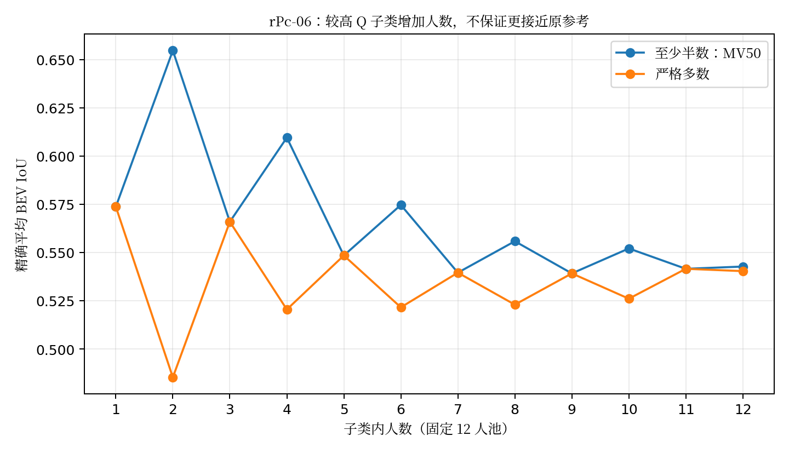
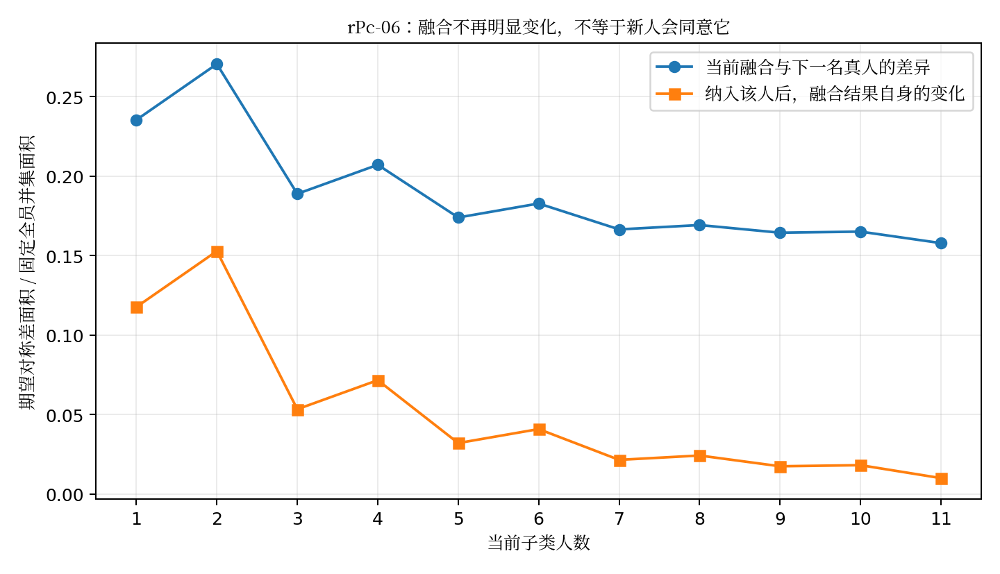

# 人员粗分类、子类内部稳定性与真实人员组合：独立数值研究

2026-10-04｜探索性研究，不是最终分类或部署政策验收  
冻结仓库：`Sparkling-Flames/3D_Manhattan_label`  
冻结提交：`ad12d64d3567235e5691f9142d045df63b38b4e4`

## 核心结论

**数据支持“人员的参考表现存在可利用的差异”，但不支持把这种差异直接解释成稳定的天然类型，更不支持“较高质量子类一定更稳定”。** 本轮新增的嵌套留建筑预测、真实六人组合枚举、联合抽样过程和名单不确定性传播，给出了以下可复算结果。

第一，已知这24名人员在其他建筑上的表现，能为留出建筑中的**图内相对参考分数**提供部分信息。模型只在内层挑选时，外层总平方误差相对“不区分人员”降低10.7054%／10.9005%（原参考／有修订处用修订）。两种政策都只在4/8栋建筑改善，不是普遍的跨图优势，也不是共识IoU提高约10个百分点。

第二，不强行均分的Ward二分，往往得到1—3人的较高分小组与其余人员。修订参考政策下，重叠很大的8个留建筑训练集得到相同的较高分二人组；但用完全不重叠的4+4栋建筑独立校准时，Ward二分的ARI中位数仅0.3195，较高组Jaccard中位数仅1/3。**部分重叠训练下名单相同，不等于在独立证据下类型已经稳定。**

第三，两个当前真实24人案例中，“较高Q”子类都不是原参考政策下原始作答更一致的那一半。rPc-06中，较高Q组的平均两两`1−IoU`为0.3628，较低Q组为0.2944；不过较高Q组的共识通常更接近原参考。相近程度和参考兼容度是不同变量。

第四，rPc-06的较高Q组在MV50下，4／6／8／12人的精确平均参考IoU依次为0.6095／0.5746／0.5558／0.5427。同人数抽组形状波动却从4人的0.1314下降到12人的0。**融合变得稳定，可能伴随对这版参考的偏离增加。** 这张图已有`reference_concern`与`gt_detail_omission_mark`，不能把这个下降判成真实视觉质量变差。

第五，对两图分别枚举全部134,596个真实六人集合后，原参考Q二分的“较高人员数量”只解释MV50参考IoU方差的0.7009%和6.4962%；同构成内具体成员仍分别解释99.2991%和93.5038%。不过六人全来自较高组的平均IoU，又确实高于全来自较低组。**平均构成效应存在，但构成标签远不能替代真实成员。**

第六，换校准建筑也会改变“较高Q六人组”的结果。目标图与人员几何不变，仅从其余7栋建筑中取4栋校准，rPc-06得到23份不同的较高人员名单；其条件平均IoU落在0.5150—0.5875。名单不确定性必须继续传播到后面的共识结果，而不能在名单定好后消失。

**本轮实际的新数值研究集中于当前Q轴、名单传播、BEV子类与真实组合。当前T/S/B没有完成逐作答来源重绑定，因此本报告不声称完成四轴的新验证。** 历史T/S/B是有价值的已执行研究，不是不存在；但旧标签、旧几何和旧scope口径不能冒充当前独立验证。

---

## 1. 实际取得、核验及运行的资料

### 1.1 三层证据严格分开

**仓库材料核查。** 阅读了当前人员交接、粗分类溯源、推进台账、24×10画像、旧四人组合和返回复核、S2全量盘点、历史四块探索与时间日志来源审计。当前规范以冻结提交的材料为准，不用项目中更早的Scope讨论覆盖本轮资格。

**本轮重新计算。** 使用两份完整24×10评分矩阵、两张图各24份完整候选地面多边形，以及73条高人数台账摘录。代码与新结果均在本包内，未改仓库。

**仍未取得或未执行。** 没有原图；未完整取得并运行大型当前输入包；没有重跑44张可计算高人数Manual或17张Semi的所有几何；没有完成当前T/S/B日志与作答绑定，也没有新增视觉或GT裁决。因此，以下两图的效应不能当作44图总体发生率。

### 1.2 输入真实性核查

`inputs/matrix_original_iou.csv`与`inputs/matrix_revised_where_available_iou.csv`分别完整恢复，Git blob散列与仓库一致：

```text
原参考矩阵：85a4f601dc32ca9a93b9668223acd401190b49d0
有修订处用修订矩阵：493173aa20638ee9fb9c25b81e9a01080350fafe
```

`inputs/one_image_geometry.json`来自已归档的完整单图数值摘录，blob为`d435129575849339e264867e2f9c797084b31a26`。它内部保留旧提交号`405f3041…`，没有改写；对应的当前大输入blob仍为`5a174746730bb70e405680a3748663caf56dd51f`。因此这是来源不变的已保存数值输入，不是本轮新采样。

`inputs/rpc_geometry.json`为本轮从当前输入恢复的**地面数值摘录**，不是完整输入的字节副本。两图共48份地面多边形重新计算的单人参考IoU，均与完整评分矩阵一致，误差小于5×10⁻¹⁶。这个检查支持数值传递正确，不证明图像、人工语义或参考绝对正确。

两图为：

|图片|人员|用途与来源边界|
|---|---:|---|
|7y3sRwLe3Va-04|24|沿用可完整核验的既有单图摘录；粗难度未记录；原环为默认未人工确认状态，未改序|
|rPc6DW4iMge-06|24|有目的选择的范围／参考解释案例；粗难度未记录；24份人员环保留人工确认，原GT保留来源环与`camera_visibility_unresolved`提示|

第二例的选择利用了已有研究线索，不是盲选验证集。两图都有原参考；本轮几何实验固定原参考，**改变Q校准参考政策时不改变目标几何或替每个组合挑参考。**

### 1.3 独立人员与缺失

没有按坐标去重。原来标记为独立的重复坐标仍各计一人一票。没有恢复P013/P016等不在当前候选池的历史记录，也不把借用点、未绑定点、未审状态或失败当成新增独立观察。

本轮使用冻结地面几何；不重新共享x，不补点、不改变确认环、不强制Manhattan、不修复自交。BEV分析不覆盖上角点、墙高或完整三维体积，不能命名为完整layout质量。

证据入口：[当前人员报告](https://github.com/Sparkling-Flames/3D_Manhattan_label/blob/ad12d64d3567235e5691f9142d045df63b38b4e4/analysis_results/worker_profiles_20261003/REPORT.md)、[当前人员输入](https://github.com/Sparkling-Flames/3D_Manhattan_label/blob/ad12d64d3567235e5691f9142d045df63b38b4e4/analysis_results/worker_profiles_20261003/input.json)。本轮核验见`results/input_audit.json`与`input_geometry_crosscheck.csv`。

## 2. 47、44、33与17分别表示什么

以下是**重新读取台账后的计数**，不是重新执行全量几何所得成功率。

|条件和用途|池数|当前独立候选记录数|应怎样使用|
|---|---:|---:|---|
|Manual，主候选、整池BEV可计算、参考质量兼容|33|750|现有GT参照人数主线；仍需保留具体参考解释|
|Manual，主候选、整池可计算、参考质量不兼容|6|142|可以研究成员／融合／分布差异；不能恢复为参考质量评分|
|Manual，门洞/OOS探索层、整池可计算|4|94|独立探索，不混入GT质量主分母|
|Manual，稳定非正交独立层、整池可计算|1|24|保留该层含义，不因BEV可计算就宣称满足Manhattan|
|Manual，整池失败|3|64|保存失败及其进入人数过程的影响，不删坏人制造成功池|
|Semi，主候选、整池可计算、参考兼容|17|402|条件内单独研究；不与Manual合票|
|OOS条件，门洞/OOS探索层、整池可计算|9|210|额外的独立条件，不算在47张Manual或17张Semi中|

因此，47张Manual中44张整池可算；44中33张进入GT参照主线，另外11张包含**6张仍是主共识候选、只是参考不适用的图**，并非11张全是OOS。

三个失败池是S9hNv5qa7GM-01（20人、1份失败）、pRbA3pwrgk9-11（20人、3份失败）、rPc6DW4iMge-22（24人、1份失败）。台账分别保留配对不可用和越出画布等原因；本轮未重新裁定这些人应否清洗。

17张Semi中13张各24人、来自6栋建筑。这与当前“24人×13图Semi”后续面板相符。**本摘录的高人数Manual47与Semi17没有同图交集。** 这不表示全库不存在Manual/Semi同图数据，而是说明直接比较这两个高人数面板的平均稳定性，不能识别半自动处理的因果效应。

33张GT主线的粗标签为简单4、中等3、困难4、未记录21、未定1。44张可计算Manual则为简单6、中等5、困难4、未记录28、未定1。未知不归为简单。当前两张数值案例均未记录粗难度；本轮没有建立模型难度。

依据：[S2报告](https://github.com/Sparkling-Flames/3D_Manhattan_label/blob/ad12d64d3567235e5691f9142d045df63b38b4e4/analysis_results/research_panel_inventory_20261003/REPORT.md)、[groups.csv](https://github.com/Sparkling-Flames/3D_Manhattan_label/blob/ad12d64d3567235e5691f9142d045df63b38b4e4/analysis_results/research_panel_inventory_20261003/groups.csv)。本轮摘录与汇总：`inputs/high_support_inventory_excerpt.csv`、`results/high_support_scope_summary.csv`。

## 3. 历史Q/T/S/B保留什么，不迁移什么

Q历史主量包含OSPA和任务调整，不等于当前BEV参考IoU。T历史确实核对过冻结active-time日志，不是只有lead_time。S历史是“误拒可评分”和“误收不可评分”的两类判断，不等于偏好enclosed或extended。B需要实际展示的模型初始化及后续修改，不能拿另一个模型输出替代。

历史还做过15种非空特征块组合、不同分型数量、具名子类回放，并非只做过一个质量高低名单。已读来源审计显示历史日志核对有实际结果；但这不能证明当前每条作答已与正确日志、scope终审和初始化完成重绑定。[粗分类溯源](https://github.com/Sparkling-Flames/3D_Manhattan_label/blob/ad12d64d3567235e5691f9142d045df63b38b4e4/docs/thesis_main/%E4%BA%BA%E5%91%98%E7%B2%97%E5%88%86%E7%B1%BB%E5%8E%9F%E6%84%8F%E4%B8%8E%E6%97%A2%E6%9C%89%E8%AF%81%E6%8D%AE_20261003.md)、[历史四块研究](https://github.com/Sparkling-Flames/3D_Manhattan_label/blob/ad12d64d3567235e5691f9142d045df63b38b4e4/analysis_results/worker_four_block_exploration_20260910_v1/README_ZH.md)、[历史日志来源审计](https://github.com/Sparkling-Flames/3D_Manhattan_label/blob/ad12d64d3567235e5691f9142d045df63b38b4e4/analysis_results/worker_four_block_exploration_20260910_v1/SOURCE_AUDIT.json)。

本轮没有做以下错误替代：

- `review.scope_annotation=false`不解释为工人scope判断正确或S=0。
- `model_edit_status=not_checked_non_semi`、`trap_status=unknown`不解释为B=0。
- 缺时间不等于零耗时，耗时较长不自动等于认真，较快也不自动等于高效。
- 当前图像参考不适用，不反向将相关人员判为低质量。

Q的新实验回答“同一批已知人员的参考表现可否迁移”；T/S/B的新验证仍是未完成项。本文没有用一套人为四类替代原设想。

## 4. 分开定义五种稳定性

1. **名单稳定性**：换校准图片／建筑，人员是否仍属于同一类。用ARI和有语义顺序的较高组Jaccard，不能只看大组人数不变。
2. **原始作答离散度**：同类不同人的实际区域差异，如平均两两`1−IoU`。这不是参考分数方差。
3. **经验分布估计稳定性**：不同种子集合对同类作答分布的估计差异。允许分布宽、含多个模式。
4. **融合输出稳定性**：同k换成员、固定构成换成员、增一人、增两人、交换一人，各自不同。
5. **参考一致性**：融合对固定原／修订参考的分数或遗漏／外扩。不能从前四项直接推出。

本轮用固定全24人并集面积`U`作为同图共同评价分母：

```text
d_U(A,B) = Area(A △ B) / U
```

其中`△`是对称差。它不是`1−IoU`，也不是米²。U只用在离线评价和积分，不为当前融合提供未来票、候选或停止阈值。实际部署不能把未来人员并集作为已知信息。

同k独立抽两组，每组内部不放回，但两组之间允许有共同成员。不重叠抽组则强制两组成员完全不同，仅在每类`2k_g ≤ N_g`时计算。不能把不可能形成不重叠组时的值填成0。

## 5. 当前Q：有迁移信号，不等于天然类型

### 5.1 设计

每图先减去该图24人平均参考IoU，得到图内相对分数。在外层完整留出一栋建筑，其余建筑的图像等权平均构成人员Q画像。模型预测留出建筑中的相对分数，目标图平均值只用于定义评价残差，不输入预测。

比较不区分人员、每人连续画像、中位数二分、Ward二／三／四分。中位数二分是人为等人数对照，不宣称发现两类。Ward允许不均等小类，其类别数仍是候选设置，不是自然界结论。中位数处遇到平局就记不可确定，不用人员编号决定谁高谁低。

随后增加嵌套设计：外层目标建筑完全隔离；内层在其余建筑中选择上述固定模型菜单，使用建筑等权MSE。没有按目标图IoU选模型、选类别或选人员。

### 5.2 结果

|模型|原参考：相对基线平方误差降低|有修订处用修订：降低|
|---|---:|---:|
|连续人员画像|13.7020%|6.6842%|
|中位数二分|3.3721%|0.5625%|
|Ward二分|8.9214%|11.8166%|
|Ward三分|9.4668%|9.3529%|
|Ward四分|13.0947%|7.1537%|
|内层选模型、外层评价|**10.7054%**|**10.9005%**|

连续画像的已有结果是复算锚点，不列为本轮首次发现。新增的是粗分对照、训练建筑数过程、嵌套模型选择及后续形状传播。

两种政策的嵌套预测都只在UwV、e9z、q9v、rPc四栋改善，在7y3s、X7、wc2、yqst四栋变差。总体改善不表示每栋都有效。8个外层训练集重叠，不把各折当独立实验做朴素t检验，也不把240格当240名独立参与者。

这些材料已经反复探索过；外层隔离避免本次直接泄漏，但不使整个历史数据变成全新盲测。它支持已知人员的条件性迁移，尚不支持新人员泛化、真实质量总分或某类具有稳定专长。

### 5.3 不强制均分会发生什么

原参考Ward二分的较高组为1—3人：多数折为P002/P017，UwV留出时为P017一人，rPc留出时加入P023。修订政策下8折均为P002/P017两人。

这可能是连续分数的一段较高尾部，不是两个潜在人群的证明。尤其是**二人小类只能研究1→2人，不能为了画到12人曲线而复制成员或强行把别人加入该类**。人数不够是该分类方案的实际适用范围，而不是不允许探索不均等类型。

数值：`profile_prediction_summary.csv`、`nested_summary.csv`、`nested_method_choices.csv`、`profile_assignments.csv`。

## 6. 名单稳定性：重叠训练与独立校准并不等价

对8栋建筑，枚举互不重叠的m+m栋校准集合，m=1、2、3、4。所有参数固定，每个集合独立形成名单。同一分割共享人员，不将它们作为独立真人试验。总计4424个“政策×分割×方法”记录，包含平局不可确定状态。

m=4时共有35个4+4分割：

|Q政策／方法|可计算分割|ARI中位数|较高组Jaccard中位数|
|---|---:|---:|---:|
|原参考，中位数二分|34/35|0.0707|0.4559|
|修订政策，中位数二分|34/35|−0.0164|0.4118|
|原参考，Ward二分|35/35|0.4172|0.3333|
|修订政策，Ward二分|35/35|0.3195|0.3333|

ARI的零附近表示与随机分区校正基线相近，不等于没有人员差异。较高组Jaccard关注真正被命名的小类；不让其余大多数人员同属一个大组掩盖小类不稳定。

已有4+4的连续排名／中位数名单对照不是本轮首次提出；新增Ward与m=1—4过程显示：**用一两栋建筑强分类型尤其不稳，而增加校准建筑也没有把名单问题完全解决。** 本轮没有据此宣布“必须4栋”或“再加几栋一定稳定”。

数值：`disjoint_calibration_learning.csv`、`disjoint_learning_summary.csv`。

## 7. 精确有限池方法：同时研究构成与进入过程

### 7.1 为什么不必在每个k都穷举2²⁴个状态

将原始BEV区域边界叠加，形成不重叠tile。每人对每块tile只有覆盖／不覆盖一票，GT不参与切tile。设第g类总人数`N_g`，某tile的支持人数`c_g`，抽取该类`k_g`人，则抽到支持票数满足：

```text
P(J_g=j) = C(c_g,j) C(N_g−c_g,k_g−j) / C(N_g,k_g)
```

各类的抽组设计独立，合并总票数，计算MV50或严格多数的tile入选概率`q`。这利用的是**固定人员池的抽样随机性**，不假定工人的真实行为是独立同分布，也不假定各tile互相独立。

面积是线性积分，所以可以准确求`E[Area]`、`E[Area(△)]`。IoU是随机比值，本轮没有用期望面积的比值冒充`E[IoU]`；报告的六人IoU与可行的纯子类人数IoU来自完整实际集合枚举。

### 7.2 新增的联合过程

旧的边际`q`和`R=B+V`分析不能直接给出嵌套增人变化。本轮按条件支持票`J_g`进一步计算：

```text
剩余池人数       N_g − k_g
剩余支持票人数   c_g − J_g
```

由此求增一人、同类增两人、不重叠第二组、同类换一人、跨类换一人的联合分布。换人时新人必须来自原集合外，不允许把刚移出的同一个人加回充当新观察。

这一实现保留旧Lee等权投票，不新增人员权重、不调融合容差。技术增量在**联合抽样、名单传播和逐层解释**，不是把超几何分布本身宣称为新方法，也不是把已有边际分解再次命名为新发现。

共形成2022条固定构成面积结果、12864条联合过程结果和294条精确纯类IoU记录。这些不是2022或12864个独立样本。

代码：`src/finite_pool.py`、`shape_experiments.py`。字段详见`FIELD_GUIDE_ZH.md`。

## 8. 子类内人数增加：稳定、偏离参考与新人分歧可以同时存在

本节的“高／低”均是**目标建筑以外校准得到的Q中位数二分**，每组12名不同真人，票权全为1。

### 8.1 同k抽组，较高Q也可能更不一致

原参考政策、k=4、MV50：

|图像／组|平均参考IoU|两组独立抽取的形状差 d_U|两组完全不重叠的形状差 d_U|
|---|---:|---:|---:|
|7y3s-04，低Q|0.943515|0.022828|0.029176|
|7y3s-04，高Q|0.946395|0.030225|0.038342|
|rPc-06，低Q|0.516605|0.060143|0.077466|
|rPc-06，高Q|0.609541|0.131436|0.168520|

两个案例中，高Q共识更接近原参考，但更依赖具体成员。不重叠抽组通常给出更大的变动，因为普通独立抽组允许成员重叠。在固定12人池内，两组各6人平均共享3人；不能将这个重叠自动解释成真正的新人员稳定性。

这些结果不是“低Q总更稳定”的全库结论。切换Q校准参考政策、分型方式或投票规则，组的几何性质会改变；详见原始表。

### 8.2 同为偶数，参考兼容度也能随增人下降

rPc-06高Q组、原参考政策、MV50：

|人数|精确平均参考IoU|同k独立抽组形状差 d_U|
|---:|---:|---:|
|1|0.573713|0.215830|
|4|0.609541|0.131436|
|6|0.574642|0.076786|
|8|0.555824|0.042414|
|12|0.542706|0|

4→6→8→12均为偶数，因此不能把全部趋势解释成奇偶锯齿。不过改用严格多数会得到另一条参考曲线：4人的0.520452、6人的0.521557、8人的0.522958、12人的0.540335。**人数结论与具体投票规则相依。** 本轮没有因为哪条曲线更好看就选哪条。

12人时唯一集合保证同名单、同k输出差为0。它不保证与参考一致、不保证另一份校准名单相同，也不保证未来新人员会同意。



### 8.3 融合变化很小，不等于下一名原始作答接近它

同一高Q组下，本轮直接区分：

```text
A = E[d_U(当前融合, 纳入下一人后的融合)]
B = E[d_U(当前融合, 下一名尚未进入者自己的标注)]
```

rPc-06中，k=11时，A=0.010044，而B=0.157922，约为A的15.7倍。当前融合可以几乎不动，却持续不能代表下一名真人的全部空间选择。这里“下一名”仍来自已知固定12人池，不是对新招募人员的预测。



这也不是要求B必须降到零才允许停止。若目标是稳定的多解分布，B可以保持较大；真正需要检验的是保留的分布能否覆盖和校准后续作答，而不是只看单结果是否继续移动。

### 8.4 原始作答的多样性与经验分布精度

对同一固定子类不放回抽k人，抽组内平均两两距离的期望等于全子类平均两两距离；增加k主要降低这个均值的估计波动，不会自动减少人群本来的分歧。rPc-06低／高Q的原始平均两两`1−IoU`分别为0.294421／0.362803。

本轮另外以`L(A,B)=sqrt(d_U(A,B))`构成经验分布的能量距离，推导并在小型枚举上验证：若全子类N人不同成员的平均L为μ，两个独立均匀k人子集的期望经验能量距离为`2μ(1/k−1/N)`。这是有限池V统计定义下的精确恒等式，不是语义模式数、不是真实难度，也不表示分布已经变单峰。

因此，“同类作答仍宽”与“我们更稳定地估计了这个宽分布”可以同时成立。代码同时计算种子对未进入人员的最近几何覆盖，不用生成或复制人员来凑人数。

数值：两图的`*_raw_dispersion.csv`、`*_annotation_vs_fusion.csv`、`*_area.csv`、`*_transitions.csv`、`*_exact_pure_iou.csv`。

## 9. 真实六人组合：平均配比有影响，具体成员影响更大

每图枚举`C(24,6)=134596`个实际成员集合，二图共269192个；同一集合分别采用两票规。原／修订Q分类与Ward分类都只是对同一批集合的重新分层，不生成虚构人员，不重复计算成新增样本。

原参考Q二分、MV50：

|六人中高Q人数|7y3s-04平均IoU|rPc-06平均IoU|
|---:|---:|---:|
|0|0.947437|0.515634|
|1|0.948110|0.520220|
|2|0.948773|0.524576|
|3|0.949475|0.530939|
|4|0.950261|0.540713|
|5|0.951144|0.554934|
|6|0.952136|0.574642|

这确实支持在这两个固定池内，较高校准Q的比例与平均参考结果有关；并非一无所获。但是用固定构成c分解所有六人集合Y的参考IoU方差：

```text
Var(Y) = Var_c(E[Y|c]) + E_c(Var[Y|c])
```

构成按均匀抽取六人集合自然出现的频率加权，不把0高和3高两种构成人为等权。

|图片／规则|配比间方差占比|同配比具体成员方差占比|
|---|---:|---:|
|7y3s-04，MV50|0.7009%|99.2991%|
|7y3s-04，严格多数|1.9349%|98.0651%|
|rPc-06，MV50|6.4962%|93.5038%|
|rPc-06，严格多数|4.0821%|95.9179%|

rPc-06的3高+3低有48400个真实集合，MV50的5%—95%分位为0.481190—0.574876，最小／最大为0.471023／0.800056。极值是事后诊断，不是部署选优；完整人员ID在机器表内。

Ward等不同分组能解释更多比例，但也同时改变了“构成”的语义与小组容量。例如修订Q的Ward二分在rPc-06解释MV50方差的33.6049%，仍有66.3951%留在同构成成员差异。不能据此在目标图上选Ward或挑P002/P017作为最优人员政策。

这里的方差份额是当前固定池的描述，不是因果贡献率，也不是跨图片泛化R²。两个案例不足以估计所有建筑或人员类别的组合规律。

数值：`*_six_person_compositions.csv`、`*_six_person_variance.csv`、`*_six_person_all_sets.npz`；极值单列为`*_six_person_extrema_diagnostic.csv`。

## 10. 名单不确定性如何继续传播到输出

固定目标图和所有24人几何，从目标之外7栋建筑中穷举取4栋校准，共35种训练集合。每次独立生成中位数高Q12人名单，再枚举其中所有六人组。目标图和它的参考不参与名单生成。

|图像／原参考政策|35种校准得到的不同高Q名单|高Q六人MV50条件平均IoU范围|
|---|---:|---:|
|7y3s-04|26|0.947082—0.957429|
|rPc-06|23|0.515019—0.587450|

将校准集合当作一个明确的有限随机实验，可以再次分解输出波动：先固定名单抽成员的波动，加上改变名单后的波动。原参考政策下，名单变化占总形状差的11.10%／9.99%（两图）；修订政策下为11.56%／12.61%。这些是本次指定“均匀选4栋校准”的描述，**不是校准不确定性的通用置信区间**。

它说明至少两件事：只报固定名单后的稳定性低估了整个分类→抽组→融合流程的变动；但名单不稳定也不必然完全破坏输出，必须实际传播和计算，不能只看ARI猜其影响。

另一个敏感性例子：rPc-06原Q的Ward高组是P002/P017/P023，修订政策变成P002/P017。该高组原始两两`1−IoU`从0.415991变成0.187238，目标图本身没变。这不能作人数不相等组的优胜比较，却清楚显示“某子类很稳定”的说法依赖类别定义。

数值：`calibration_propagation_details.csv`、`calibration_propagation_summary.csv`。

## 11. 失败成员会怎样影响人数曲线的覆盖

设已冻结池有N名候选，其中b名在该方法下不可计算。随机取k名不同人员，且任何失败成员使该集合不可计算，则：

```text
P(集合可计算) = C(N−b,k) / C(N,k)
```

这是已有个体BEV失败状态下的覆盖计算；没有排除这些人，也不保证不存在别的聚合失败。

pRb-11有20人、3份失败，k=4时可计算概率49.1228%，k=8时19.2982%，k=12时4.9123%，全员为0。若先删去三人再绘图，就把20人候选池问题改成了另一个17人成功池问题。

固定47张Manual图、不按k换图，k=1／4／8／12／16／20的期望BEV可计算比例为99.4858%／98.1374%／96.7227%／95.6364%／94.7592%／93.9716%。最后一项不是44/47，因为rPc22在20/24人时还有可能未抽到失败成员；每图到自身全员端点后才是44/47。

**如果只在成功集合上计算分数，样本分布会随人数改变。** 不能把逐渐变窄的成功子集分布当作没有条件的人员稳定性。也不能为得到单一总分，将失败直接填IoU=0；那会引入另一种交付效用定义，需另行声明，本轮未采用。

数值：`method_coverage_by_k.csv`、`fixed47_coverage_by_k.csv`。

## 12. 原设想得到什么支持

|设想|当前判断|证据强度与范围|
|---|---|---|
|人员存在不同参考质量特征|部分支持|24名已知人员、8栋建筑的条件性相对分数迁移；非视觉质量认证|
|存在稳定的天然离散类型|尚未支持|可以量化分组，但不均等小类、独立校准不稳，连续轴也能解释部分现象|
|某些子类较早产生稳定融合|局部支持，必须注明定义|两图固定池中可比较，但规则、同k抽组耦合、成员池容量改变结论|
|高Q一定更稳定|不支持普遍命题|两图原Q中位数分组有明确反例；非所有图高Q都更差|
|稳定意味着更接近参考|不支持|rPc偶数人数过程反例；参考本身有解释限制|
|不同人员比例会影响平均共识|在两例支持|真实六人集合均值随高Q人数增加而上升；非因果和全局最优配比|
|相同比例足以预测具体结果|不支持|原Q二分的大部分六人结果变异仍在同配比的具体成员间|
|更快／更慢的T子类有当前稳定性差异|当前未完成新验证|历史有实际实验；本轮缺当前日志逐行绑定与留建筑重算|
|S判断特征可以解释空间分歧|值得测，但未建立当前效度|不能把S误收／误拒与enclosed/extended直接混成一轴|
|Semi行为B能解释稳定或质量|当前未完成新验证|需实际初始化、编辑与结果来源；高人数两条件不同图不能替代条件效应|
|模型难度已能解释人员组合|没有建立|保持历史人工粗标签及未知，未训练模型难度|

最可行的工作对象不是一套永久工人类型，而是**带来源、校准范围、名单不确定性和目标适用域的条件性子类**。用连续画像、粗分和不分型基线并行比较，不要求一定冻结某个类数。

## 13. 本地继续实测的具体事项

### 13.1 T/S/B接入必须补哪些内容

|轴|必要输入|必要原因|
|---|---|---|
|T|当前作答ID→原任务/人员→冻结session/log；有效active time、统计规则、条件/阶段、缺失原因|防止把lead_time、重复session、无效操作或缺失混成速度；随后才做同任务调整与楼外分类|
|S|原始scope回答、当前明确任务裁决、裁决版本、可评分/不可评分分母、待定标志|误收与误拒的意义不同；未决图不能自动当阴性；场景取舍偏好应另加轴，不覆盖S原意|
|B|当时实际展示的初始化ID与几何、最终作答ID、编辑日志及条件、独立来源、参考适用状态|编辑幅度与纠错效果不同；Manual不是B=0；没有真实初始化不能拿通用模型补上|
|Q与多轴组合|固定参考政策、当前资格、校准建筑、逐轴有效支持量|不根据目标图效果定阈值；多个分量不能因量纲或维数更多而获得隐含更高权重|

先对同24人的共同13张Semi逐条绑定，再分别做T、S、B单项。组合轴使用同一覆盖人群的单项对照，缺失单列；不要仅为凑出某构成删除未知人员。未知可作为明确的未分型层研究，但不能命名为某行为类型。

### 13.2 几何与参考观察

rPc-06应回到原图，核对不同范围、额外点、GT省略细节标记及来源环；确认哪些分歧是合理取舍、哪些是执行偏差。7y3s-04应保留其未人工确认环状态，不因多边形有效就升级。此次只有下部足迹，需另外核对顶部差异会否改变人员评价。

对6张主候选但参考不适用图，优先做无需GT的成员／分布过程；对4张Manual探索图、1张稳定非正交图、9张OOS条件图分别保留层，不借重新排序或过滤使其进入质量池。可先复用本包精确过程，再审解释，不需要等待完整新layout算法。

### 13.3 验证优先级

优先扩大到同一固定图片面板，同时保留两票规、同k重叠／不重叠抽组、同构成换成员、增一人和增两人。并列报告失败覆盖、原始作答离散度、分布覆盖、融合变化、参考分数；不从一个总分推断其余全部。

当前材料已被多轮探索。形成工作方案后，再预先冻结后续图片／建筑审核范围。没有新外部测试时，继续称探索，不以更高计算精度替代统计独立性。

## 14. 可复算交付、验证和限制

新增代码仅依赖NumPy、SciPy、pandas、Shapely和scikit-learn。已测环境：Python3.13.5、NumPy2.3.5、SciPy1.17.0、pandas2.2.3、Shapely2.1.2、scikit-learn1.8.0。

**35项测试通过。** 包含超几何概率对照、全部可行的小池增一／增二、同类／跨类替换、不重叠组、新人原作答、GT不参与切tile、当前子集重切等价、失败不修复、独立同坐标保留、原输入不改，以及48个单人分数与矩阵交叉核验。

核心数值阶段均在第二个新目录重新运行，**41个结果工件匹配，CSV数值最大差为0**。一次性包装命令曾在环境200秒时限中断于第二图形状阶段，随后剩余步骤逐项完成；没有把那次一口气执行说成成功。运行日志与逐文件比较在`logs/`。另有真实24人本地入口烟测通过。未运行完整仓库回归测试，不声明全仓库验收。

复算：

```bash
python -m pip install -r requirements.txt
python -m unittest discover -s tests -v
python run_all.py --out /path/to/NEW_worker_reproduction
```

`run_all.py`拒绝已存在目录；完整计算可能需要数分钟。单阶段可设置`WORKER_RESEARCH_ROOT`指向已有新目录后执行源码，适合有执行时限的环境；不要指向仓库旧结果目录。

本地接入已冻结人员分类：

```bash
python src/run_local.py \
  --input inputs/one_image_geometry.json \
  --classes example_classes.json \
  --out /path/to/NEW_local_result
```

入口支持本包紧凑格式及当前`images/annotations`格式；必须明确目标、条件、实际成员和校准来源，目标建筑不得进入校准。它不自动学习T/S/B，不替本地签发来源正确性，也不会因GT分数决定分组或票权。当前原型限制至4类、最多10000种构成，超预算明确失败。

所有统计是固定历史池的重放或已有矩阵的交叉校准。核心人数／构成面积量及六人枚举没有Monte Carlo误差，但仍有数据、参考、几何、类别和外推不确定性。**精算不等于真值，也不等于增加了真人。**

## 15. 文献与方法定位

1. **Doris Jung-Lin Lee, Akash Das Sarma, Aditya Parameswaran. 2018. “Aggregating Crowdsourced Image Segmentations.” Proceedings of the HCOMP 2018 Works in Progress and Demonstration Papers, CEUR Workshop Proceedings, Vol.2173.** [官方PDF](https://ceur-ws.org/Vol-2173/paper10.pdf)。沿用区域tile及等权多数思想；BEV是本项目迁移，不把普通对象任务的最大簇解释照搬为全景多数正确。本文联合有限池过程不是原论文已经证明的结论。

2. **Joe H. Ward Jr. 1963. “Hierarchical Grouping to Optimize an Objective Function.” Journal of the American Statistical Association, 58(301):236–244. DOI:10.1080/01621459.1963.10500845.** [出版社记录与阅读入口](https://www.tandfonline.com/doi/abs/10.1080/01621459.1963.10500845)。只作为分组算法出处；本轮通过出版社检索记录及期刊目录核对元数据，未取得可公开下载的完整PDF，不冒称全文核验。

3. **Yoshua Bengio, Yves Grandvalet. 2004. “No Unbiased Estimator of the Variance of K-Fold Cross-Validation.” Journal of Machine Learning Research, 5:1089–1105.** [官方PDF](https://www.jmlr.org/papers/volume5/grandvalet04a/grandvalet04a.pdf)。支持不能忽略重叠训练导致的误差相关性；本轮没有为8个重叠外层折制造朴素独立置信区间。

Lee PDF文字可读取，但截图服务返回缓存错误；Bengio–Grandvalet PDF文字与首页截图可读取。本文没有基于未读图表作结论。

本轮有限池覆盖、联合抽样和总方差分解的公式由所声明的抽样设计直接推导并用枚举测试；不伪造一个针对本项目已经存在的理论来源。仓库报告是内部研究材料，出处按上文固定提交链接记录，不伪装为外部论文。
